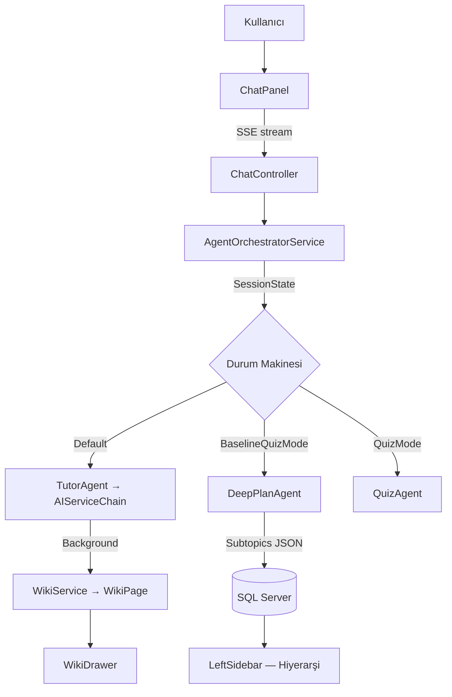

## Hedef
8 kritik bug'ı düzelt, Plan → Quiz → Wiki akışını uçtan uca çalışır hale getir, sol sidebar hiyerarşisini onar ve UX'i modernize et.

---

## Mimari Özet



---

## Faz 1 — Kritik Bug Düzeltmeleri (Backend)

### B1 · AgentOrchestratorService — State Machine Sırası Düzeltmesi
**Dosya:** `Orka.Infrastructure/Services/AgentOrchestratorService.cs`

**Sorun:** `isAlbertMode: true` bayrağı, `BaselineQuizMode` / `QuizMode` durum kontrollerinden **önce** kontrol ediliyor. Quiz cevabı gönderildiğinde sistemin quiz değerlendirmesi yapması gerekirken Albert akışını tekrar tetikliyor.

**Düzeltme:** `ProcessMessageStreamAsync` içinde routing sırası:
```
1. session.CurrentState == BaselineQuizMode  → HandleBaselineQuizModeAsync()
2. session.CurrentState == QuizMode          → HandleQuizModeAsync()
3. session.CurrentState == AwaitingChoice    → HandleAwaitingChoiceAsync()
4. isAlbertMode == true                      → HandleAlbertModeAsync()  [son sıra]
5. default                                   → TutorAgent stream
```

**Ek:** `HandleAlbertModeAsync` içindeki tekrar `SaveUserMessage` çağrısını kaldır (satır ~864–869) — zaten yukarıda bir kez kaydediliyor.

**Ek:** Albert modu yanıtı stream'de dönüyor ama `SaveAiMessage()` hiç çağrılmıyor → chat geçmişi DB'ye düşmüyor. Sync yanıt döndükten sonra `await SaveAiMessage(session, userId, syncResponse)` ekle.

---

### B2 · QuizController — Eksik `POST /quiz/attempt` Endpoint'i
**Dosya:** `Orka.API/Controllers/QuizController.cs`

Frontend `QuizAPI.recordAttempt()` → `POST /api/quiz/attempt` çağrısı yapıyor ama bu endpoint yok → sessiz 404.

**Eklenecek endpoint:**
```
POST /api/quiz/attempt
Body: { topicId, sessionId, question, selectedOption, isCorrect, explanation }
→ QuizAttempt entity DB'ye kaydedilir, 200 OK döner
```

**Not:** `QuizAttempt.SessionId` / `TopicId` FK constraint varsa nullable yapılması için EF migration gerekebilir.

---

### B3 · ChatController — SSE Header'larına Token/Maliyet Yazma
**Dosya:** `Orka.API/Controllers/ChatController.cs`

Frontend `X-Orka-Tokens` ve `X-Orka-Cost` header'larını okuyor ama backend hiç yazmıyor. SSE stream başlamadan önce (header yazılabilir olduğu an):
```csharp
Response.Headers["X-Orka-Tokens"] = session.TotalTokensUsed.ToString();
Response.Headers["X-Orka-Cost"] = session.TotalCostUSD.ToString("F6");
```

---

### B4 · AIServiceChain — Erişilemeyen Kod Temizliği
**Dosya:** `Orka.Infrastructure/Services/AIServiceChain.cs`

`IsUsableResponse()` içindeki ikinci `return true;` satırını sil.

---

## Faz 2 — Kritik Bug Düzeltmeleri (Frontend)

### F1 · WikiDrawer — Yanlış Token Anahtarı (401 Hatası)
**Dosya:** `Orka-Front/src/components/WikiDrawer.tsx` satır 113

```diff
- localStorage.getItem("token")
+ localStorage.getItem("orka_token")
```

Tercih: `api.ts`'deki `TOKEN_KEY` sabitini import edip kullanmak.

---

### F2 · ChatMessage — Typewriter Animasyon Çakışması
**Dosya:** `Orka-Front/src/components/ChatMessage.tsx`  
**Dosya:** `Orka-Front/src/lib/types.ts`

**Sorun:** SSE stream zaten karakter karakter içerik ekliyor. Üstüne typewriter `setInterval` çalışınca görsel titreme oluşuyor.

**Düzeltme:**
- `types.ts` içinde `ChatMessage` tipine `isStreaming?: boolean` ekle
- `ChatMessage.tsx` içinde: `if (message.isStreaming) return;` ile typewriter effect'i devre dışı bırak
- ChatPanel, aktif olarak stream'lenen mesajı `isStreaming: true` olarak işaretle, stream bitince `false` yap

---

### F3 · LeftSidebar — Plan Hiyerarşisi Açılmıyor
**Dosya:** `Orka-Front/src/components/LeftSidebar.tsx`

**Sorun:** Yeni plan oluşturulduğunda sidebar yenileniyor ama parent node otomatik açılmıyor.

**Düzeltme:**
- `refreshTrigger` effect'inde plan kategorisindeki topic'ler geldiğinde `setExpandedPlans` ile otomatik `true` set et
- Toggle mantığını sadeleştir: `setExpandedPlans(prev => ({ ...prev, [planId]: !prev[planId] }))`

---

### F4 · Home.tsx — Topic Click Routing Düzeltmesi
**Dosya:** `Orka-Front/src/pages/Home.tsx` satır 106–113

**Sorun:** Plan parent topic'e tıklanınca sadece Wiki açılıyor, chat navigasyonu olmuyor.

**Düzeltme:**
- Parent plan topic tıkla → chat session'a yönlendir, active topic set et
- Child subtopic tıkla → wiki drawer aç + parent'ı active topic olarak set et

---

## Faz 3 — UX Modernizasyon

### U1 · ChatPanel — Aktif Konu Göstergesi
Mesaj alanı üstüne breadcrumb/badge ekle:
```
📚 C# Temelleri > Değişkenler ve Veri Tipleri   [%60 ████░░]
```
`currentTopic` ve `currentSubtopic`, Home.tsx'te `useMemo` ile topics listesinden hesaplanıp ChatPanel'e prop olarak geçilecek.

### U2 · Plan Akışı Görsel Feedback
- `[PLAN_READY]` token'ında: konfeti/pulse animasyon + "Müfredatın hazır! Sidebar'ı kontrol et" toast'u
- Baseline quiz başladığında: "Seviyeni belirliyoruz..." başlıklı özel QuizCard UI (normal quiz'den farklı stil)
- Wiki güncellendiğinde: sol sidebar'da Wiki bölümüne pulse/badge animasyon

### U3 · QuizCard — Akış İyileştirmesi
- Cevap gönderildikten sonra: "Cevabın gönderildi — AI değerlendiriyor..." confirmation state
- Slide transition ile değerlendirme sonucu göster
- Doğru: yeşil pulse + confetti; Yanlış: kırmızı shake + açıklama vurgusu

### U4 · LeftSidebar — Gelişmiş Hiyerarşi Görünümü
- Alt konular için: tamamlanan ✓ (emerald), aktif → (beyaz), bekleyen ○ (gri)
- Progress bar her subtopic satırında mini versiyon olarak göster
- Hover'da "Devam Et" butonu smooth slide-in ile açılsın

### U5 · WikiDrawer — Erişilebilirlik ve Görünüm
- Wiki içerik bloklarını kart yapısına çevir (her `WikiBlock` ayrı kart)
- Reinforcement sorularını collapsible accordion olarak göster
- "Bu konuyu bitirdim" tamamlama butonu ekle

---

## Doğrulama / Definition of Done

| # | Test | Beklenen Sonuç |
|---|------|----------------|
| B1 | Plan modu aç → quiz cevapla → bir daha cevapla | Her mesajda doğru durum: quiz değerlendirmesi, sonra müfredat |
| B2 | Quiz cevapla → Network tab | `POST /api/quiz/attempt` → 200 |
| B3 | SSE stream → Network tab Headers | `X-Orka-Tokens` ve `X-Orka-Cost` görünür |
| B4 | `AIServiceChain.cs` kod incelemesi | Tek `return true;` |
| F1 | WikiDrawer mini-chat mesajı gönder | 200 OK, yanıt gelir |
| F2 | Stream sırasında chat izle | Titreyerek değil, akıcı akış |
| F3 | Plan oluştur → sidebar'a bak | Plan anında açık, subtopicler görünür |
| F4 | Sidebar'da plan topic'e tıkla | Chat açılır, wiki kapanır |
| U1 | Chat sırasında | Üstte breadcrumb ve progress görünür |
| U2 | Plan modu sonrası | Toast + sidebar animasyonu tetiklenir |

---

## Uygulama Sırası

```
Faz 1 (Backend) → Faz 2 (Frontend) → Faz 3 (UX)
       ↓                   ↓                ↓
  B4 (kolay)         F1 (kolay)        U1, U2, U3
  B2 (endpoint)      F2 (streaming)    U4, U5
  B3 (headers)       F3 (sidebar)
  B1 (state machine) F4 (routing)
```

**Toplam etkilenen dosya sayısı:** ~12 dosya  
**EF Migration gereksinimi:** `QuizAttempt` FK nullable ise 1 migration
