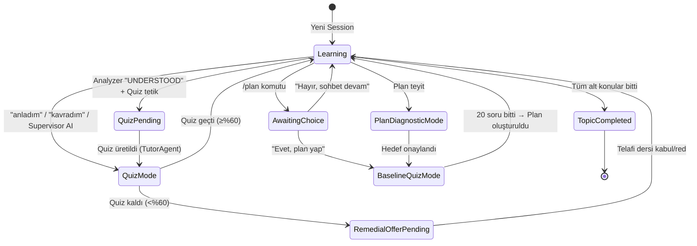
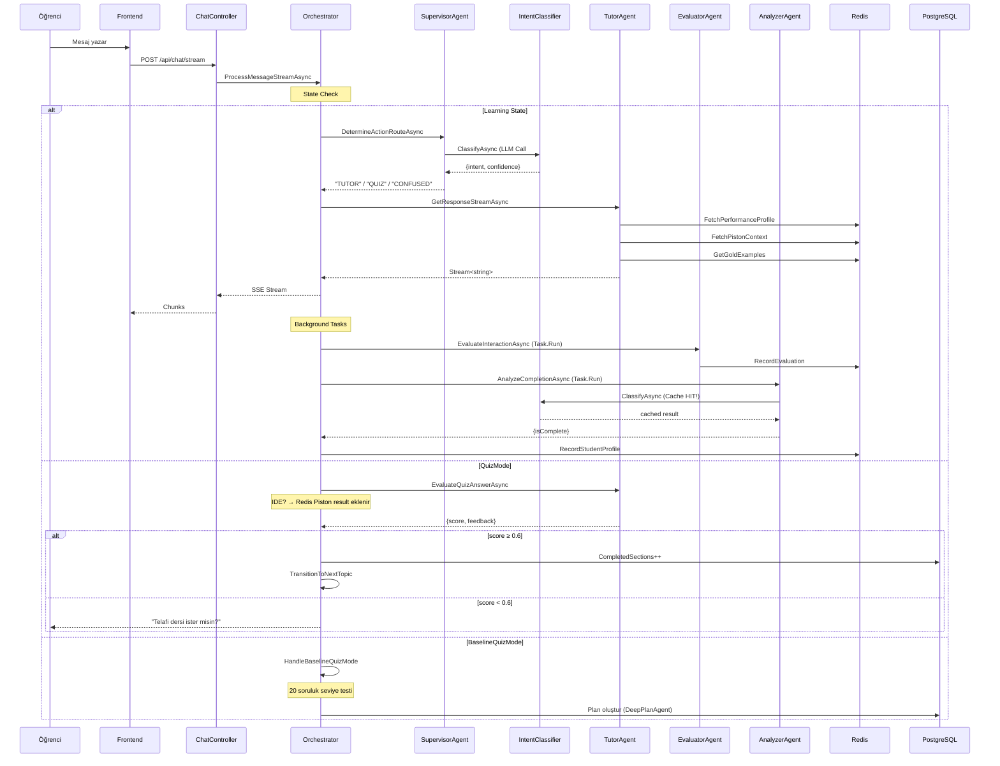
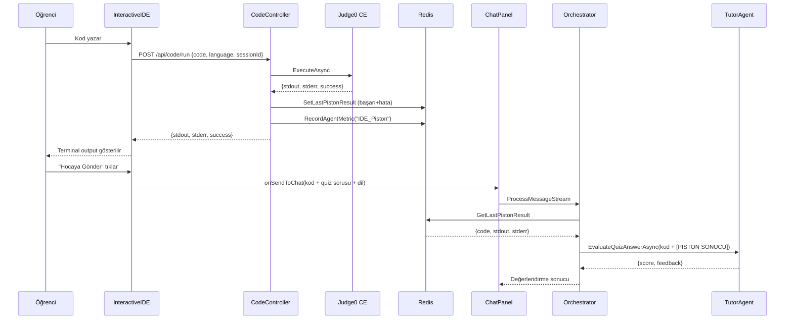
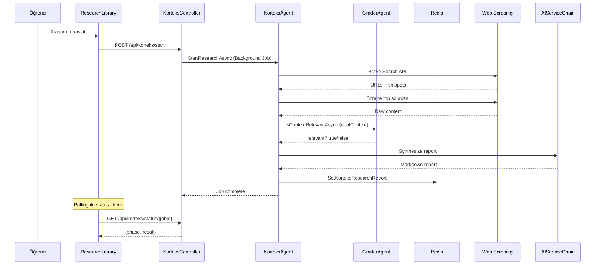
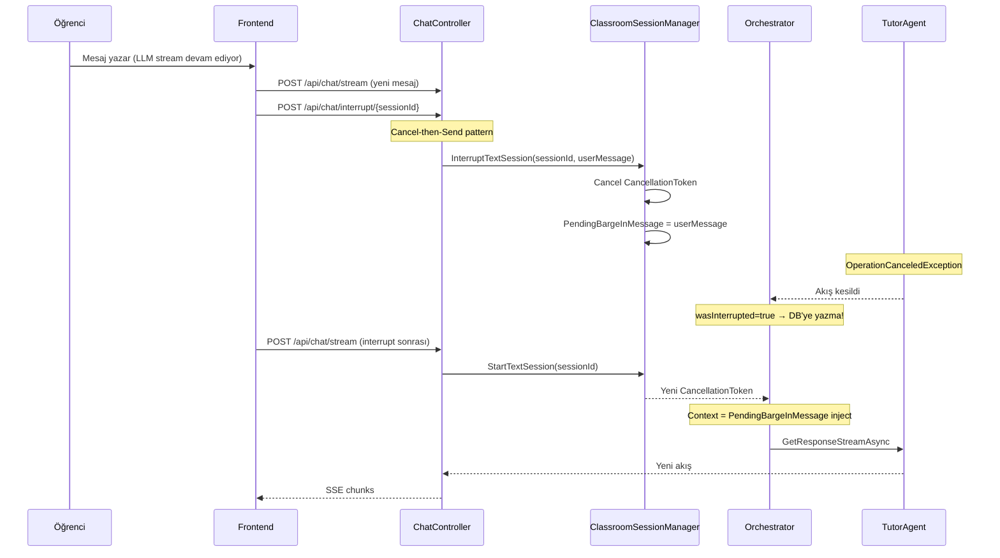
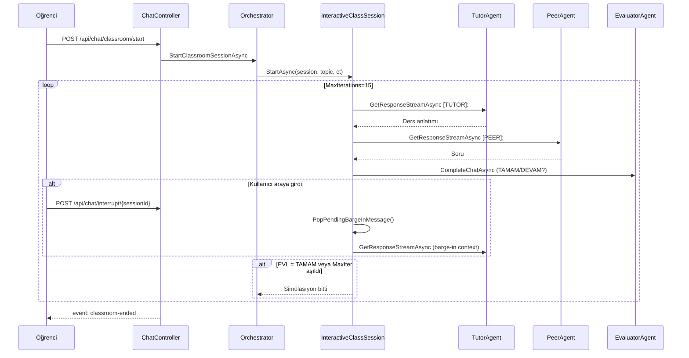
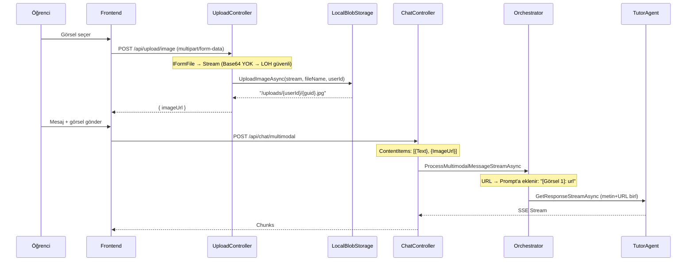
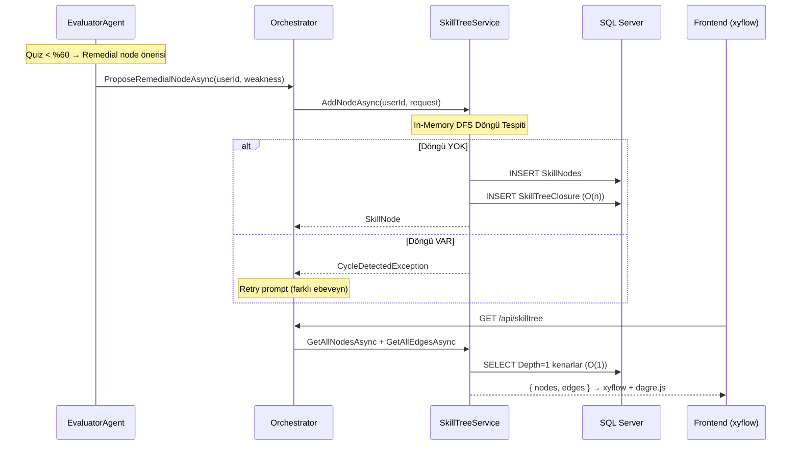
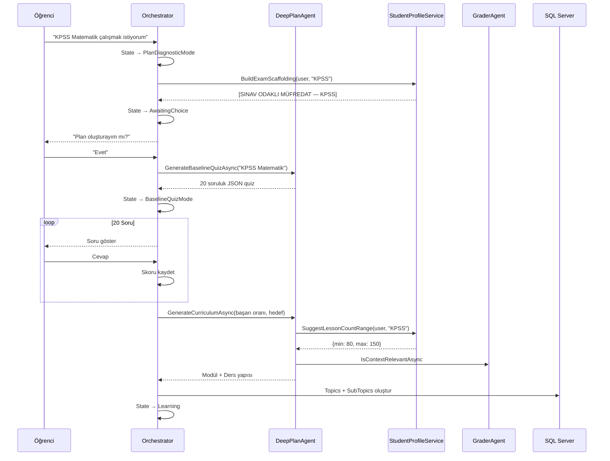

# Orka AI — Kapsamlı Sistem UML Diyagramı & Kopukluk Analizi

> **Son Güncelleme:** Nisan 2026 — Faz 1-4 Mimari Evrim dahil edildi
> **Derleme:** ✅ `Build succeeded. 0 Error` — `AddSkillTreeFaz4` migration uygulandı

---

## 1. Sistem Bileşen Diyagramı (Component Diagram)

```mermaid
graph TB
    subgraph Frontend["🖥️ Frontend (React + Vite)"]
        UI_Chat["ChatPanel"]
        UI_IDE["InteractiveIDE"]
        UI_Wiki["WikiMainPanel"]
        UI_Dashboard["DashboardPanel"]
        UI_Sidebar["LeftSidebar"]
        UI_Korteks["ResearchLibraryPanel"]
        UI_Settings["SettingsPanel"]
    end

    subgraph API["🌐 API Layer (ASP.NET Core)"]
        ChatCtrl["ChatController /api/chat\n+interrupt\n+classroom/start\n+multimodal"]
        UploadCtrl["UploadController /api/upload"]
        CodeCtrl["CodeController /api/code"]
        WikiCtrl["WikiController /api/wiki"]
        KorteksCtrl["KorteksController /api/korteks"]
        TopicCtrl["TopicController /api/topics"]
        DashCtrl["DashboardController /api/dashboard"]
        QuizCtrl["QuizController /api/quiz"]
        AuthCtrl["AuthController /api/auth"]
        SkillCtrl["SkillTreeController /api/skilltree"]
    end

    subgraph Orchestrator["🧠 Orchestrator (Hybrid: State Machine + LLM Strategy)"]
        AGO["AgentOrchestratorService"]
        CSM["ClassroomSessionManager\n(Barge-in Token Registry)"]
        ICS["InteractiveClassSession\n(Tutor⟷Peer Loop)"]    
    end

    subgraph Agents["🤖 Agent Swarm (14 Ajan)"]
        direction LR
        TUTOR["TutorAgent"]
        PEER["PeerAgent ★NEW"]
        SUPERVISOR["SupervisorAgent"]
        INTENT["IntentClassifierAgent"]
        ANALYZER["AnalyzerAgent"]
        EVALUATOR["EvaluatorAgent"]
        GRADER["GraderAgent"]
        DEEPPLAN["DeepPlanAgent"]
        WIKI["WikiAgent"]
        SUMMARIZER["SummarizerAgent"]
        KORTEKS["KorteksAgent"]
        QUIZ["QuizAgent"]
        PROFILE["StudentProfileService"]
        SKILLTREE["SkillTreeService ★NEW"]
    end

    subgraph LLM["☁️ LLM Provider Chain"]
        CHAIN["AIServiceChain"]
        FACTORY["AIAgentFactory"]
        ROUTER["RouterService"]
        GH["GitHubModels"]
        GROQ["Groq"]
        GEMINI["Gemini"]
    end

    subgraph Data["💾 Data Stores"]
        DB["SQL Server (EF Core)"]
        REDIS["Redis"]
        PISTON["Judge0 CE (Sandbox)"]
        BLOB["LocalBlobStorage ★NEW\n(wwwroot/uploads)"]    
    end

    subgraph SkillGraph["🗺️ Skill Tree (DAG)"]
        SNODES["SkillNodes Table"]
        SCLOSURE["SkillTreeClosure\n(Closure Table)"]
    end

    UI_Chat --> ChatCtrl
    UI_IDE --> CodeCtrl
    UI_Wiki --> WikiCtrl
    UI_Korteks --> KorteksCtrl
    UI_Dashboard --> DashCtrl

    ChatCtrl --> AGO
    ChatCtrl --> CSM
    ChatCtrl --> UploadCtrl
    UploadCtrl --> BLOB
    CodeCtrl --> PISTON
    CodeCtrl --> REDIS
    SkillCtrl --> SKILLTREE

    AGO --> SUPERVISOR
    AGO --> TUTOR
    AGO --> DEEPPLAN
    AGO --> EVALUATOR
    AGO --> SUMMARIZER
    AGO --> ANALYZER
    AGO --> ICS
    AGO --> SKILLTREE

    ICS --> TUTOR
    ICS --> PEER
    CSM --> AGO

    SUPERVISOR --> INTENT
    ANALYZER --> INTENT
    TUTOR --> GRADER
    TUTOR --> REDIS
    DEEPPLAN --> GRADER
    KORTEKS --> GRADER
    EVALUATOR --> SKILLTREE

    INTENT --> FACTORY
    TUTOR --> CHAIN
    PEER --> FACTORY
    EVALUATOR --> FACTORY
    GRADER --> FACTORY
    DEEPPLAN --> FACTORY
    SUMMARIZER --> FACTORY
    KORTEKS --> CHAIN

    CHAIN --> ROUTER
    ROUTER --> GH
    ROUTER --> GROQ
    ROUTER --> GEMINI

    AGO --> DB
    WIKI --> DB
    EVALUATOR --> REDIS
    TUTOR --> REDIS
    AGO --> REDIS
    SKILLTREE --> SNODES
    SNODES --> SCLOSURE
```

---

## 2. Session State Machine (Durum Makinesi)

---

## 3. Ana Mesaj Akışı (Sequence Diagram)

---

## 4. IDE + Piston Akışı

---

## 5. Korteks Araştırma Akışı

---

## 6A. ★ FAZ 1: Metin Barge-In Akışı (Yeni)

---

## 6B. ★ FAZ 2: Otonom Sınıf Simülasıyonu (Yeni)

---

## 6C. ★ FAZ 3: Multimodal Görsel İşleme (Yeni)

---

## 6D. ★ FAZ 4: DAG Skill Tree (Yeni)

## 6E. Plan Mode (Deep Plan) Akışı

---

## 7. Ajan Bağımlılık Matrisi

| Ajan | Tüketilen Ajanlar | Data Store | Tetiklenme |
|---|---|---|---|
| **SupervisorAgent** | IntentClassifier | — | Her mesaj (Learning state) |
| **IntentClassifierAgent** | — | — (cache: ConcurrentDict) | Supervisor + Analyzer |
| **TutorAgent** | GraderAgent | Redis (perf, piston, gold, profile) | Her Learning mesajı |
| **PeerAgent** ★ | — | — | InteractiveClassSession (Tutor⟺ turn) |
| **EvaluatorAgent** | — | Redis + **SkillTreeService** ★ | Background task |
| **AnalyzerAgent** | IntentClassifier | — | Background task |
| **GraderAgent** | — | — | Tutor, DeepPlan, Korteks |
| **DeepPlanAgent** | GraderAgent | DB (Topics) | Plan mode |
| **WikiAgent** | — | DB (WikiPages) | Summarizer tetiklemesi |
| **SummarizerAgent** | — | DB (Messages, WikiPages) | Topic complete |
| **KorteksAgent** | GraderAgent | Redis (research report) | Kullanıcı araştırma |
| **QuizAgent** | — | DB (QuizAttempts) | Frontend quiz kayıt |
| **StudentProfileService** | — | DB (Users) | Tutor, DeepPlan |
| **SkillTreeService** ★ | — | DB (SkillNodes, SkillTreeClosure) | EvaluatorAgent + API |

---

## 8. UML Kopukluk Analizi (Güncel)

### ✅ Faz 1-4 ile Çözülen Kopukluklar

| # | Kopukluk | Çözüm | Dosya |
|---|---|---|---|
| ✅ 1 | IntentClassifier çift LLM call | Session-scoped cache | IntentClassifierAgent.cs |
| ✅ 2 | Supervisor CONFUSED sinyali iletilmiyor | supervisorHint | AgentOrchestratorService.cs |
| ✅ 3 | Quiz weakness context yok | Adaptive Quiz (Redis) | TutorAgent.cs |
| ✅ 4 | Konu geçişi salt string-match | AI + String hibrit | AgentOrchestratorService.cs |
| ✅ 5 | IDE sessionId gönderilmiyor | Frontend → Backend zinciri | api.ts, InteractiveIDE.tsx |
| ✅ 6 | IDE quiz Piston sonucu dahil değil | Redis'ten enrichment | AgentOrchestratorService.cs |
| ✅ 7 | EvaluatorAgent kodlama metriği yok | Kod-özel değerlendirme | EvaluatorAgent.cs |
| ✅ 8 | IDE dil bağlamı kopuyor | Dil metadata eklendi | InteractiveIDE.tsx |
| ✅ 9 | IDE sonuçları profile kaydedilmiyor | Metrik + hata kayıt | CodeController.cs |
| ✅ 10 | Metin stream’i kesilemiyor (Barge-in) | CancellationToken + CSM | ClassroomSessionManager.cs |
| ✅ 11 | Tek ajan monologu (no peer) | PeerAgent + InteractiveClassSession | PeerAgent.cs |
| ✅ 12 | Multimodal görsel desteği yok | IBlobStorageService + UploadCtrl | LocalBlobStorageService.cs |
| ✅ 13 | Curriculum Tree (tek ebeveyn) | DAG + Closure Table | SkillTreeService.cs |

---

### 🟡 Açık Kopukluklar (Hala Geçerli)

#### Kopukluk 1: Korteks Raporu → Quiz'e Dahil Değil
**UML İzi:** `KorteksAgent` araştırma raporu Redis'e yazıyor. TutorAgent bunu ders anlatımında okuyor **AMA** `GenerateTopicQuizAsync` çağrısında `researchContext` parametresine geçirilmiyor.
**Etki:** Korteks'in bulduğu güncel bilgiler quizlere yansmakıyor.
**Önerilen Çözüm:** Quiz üretiminden önce `redis.GetKorteksResearchReportAsync()` çekip `researchContext`'e geçir.

#### Kopukluk 2: QuizAgent vs TutorAgent — Çift Quiz Üretimi
**Problem:** İki farklı quiz yolu var (Orkestratör + MediatR Event). Farklı prompt ve kalite kuralları kullanıyorlar.
**Risk:** Race condition — `session.PendingQuiz` birbirini ezebilir.

#### Kopukluk 3: TopicDetectorService Dead Code
**Durum:** `ITopicDetectorService` ve `TopicDetectorService` hiçbir yerden çağrılmıyor. Orkestratör kendi AI logic’i ile konu tespiti yapıyor.
**Öneri:** Silinebilir veya orkestratöre entegre edilebilir.

#### Kopukluk 4: PeerAgent AgentRole.Peer Yok
**Durum:** `PeerAgent` `AgentRole.Tutor` kullanıyor (ajan çakışması). `AgentRole` enum’a `Peer` eklenmeli, `appsettings.json`’a PeerAgent model ataması yapılmalı.

#### Kopukluk 5: EvaluatorAgent → SkillTreeService Bağlantısı Eksik
**Durum:** EvaluatorAgent quiz çıkışında `SkillTreeService.AddNodeAsync` çağırmıyor. Bu bağ el ile kurulmalı.

---

## 9. Açık Aksiyonlar Özeti

| Öncelik | Kopukluk | Karmaşıklık | Tahmini Etki |
|---|---|---|---|
| 🟡 Orta | Korteks raporu quiz'e dahil değil | Düşük | Quizler güncel kaynaklardan soru soramıyor |
| 🟡 Orta | QuizAgent/TutorAgent çift quiz | Orta (mimari karar) | Race condition + tutarsız kalite |
| 🟡 Düşük | TopicDetectorService dead code | Çok düşük | Kod karmaşıklığı |
| 🟡 Orta | PeerAgent AgentRole.Peer eksik | Düşük | AI model ataması yanlış | 
| 🟡 Yüksek | EvaluatorAgent → SkillTree bağı yok | Orta | Skill Tree otonom büymüyor |

UML diyagramlarını izleyerek tespit ettiğim **hala mevcut potansiyel kopukluklar**:

### 🟡 Potansiyel Kopukluk 1: SummarizerAgent → WikiAgent Tek Yönlü

**UML İzi:** SummarizerAgent modül bittiğinde (`IsMastered = true`) wiki özeti oluşturuyor ama WikiAgent'ın çıktısı TutorAgent'a geri beslenmiyor. Öğrenci aynı konuya geri dönerse Tutor wiki özetinden habersiz kalabilir.

**Durum:** `FetchWikiContextAsync` zaten var — bu kısmen çözülmüş. **Riski düşük.**

---

### 🟡 Potansiyel Kopukluk 2: Korteks Raporu → Quiz Entegrasyonu Yok

**UML İzi:** KorteksAgent araştırma raporu oluşturuyor ve Redis'e yazıyor. TutorAgent `GetKorteksResearchReportAsync` ile bu raporu okuyor ve ders anlatımına dahil ediyor. **AMA** quiz üretiminde `researchContext` parametresine bu rapor **otomatik olarak geçirilmiyor** — orkestratörde `GenerateTopicQuizAsync` çağrısında `researchContext` yok.

**Etki:** Korteks'in bulduğu güncel bilgiler ders anlatımına giriyor ama quizlere yansımıyor. Öğrenci güncel bilgiden soru görmüyor.

**Önerilen Çözüm:** Quiz üretiminden önce `redis.GetKorteksResearchReportAsync()` ile raporu çekip `researchContext` parametresine geçirmek.

---

### 🟡 Potansiyel Kopukluk 3: QuizAgent vs TutorAgent — Çift Yollu Quiz Üretimi

**UML İzi:** İki farklı quiz üretim yolu var:
1. **Orkestratör yolu:** `_tutorAgent.GenerateTopicQuizAsync()` — aktif akışta kullanılıyor (satır 990)
2. **Event yolu:** `TopicCompletedHandler` → `_quizAgent.GeneratePendingQuizAsync()` — MediatR event ile tetikleniyor

**Problem:** İki ajan farklı prompt'lar, farklı kurallar ve farklı kalite kontrolü kullanıyor:
- TutorAgent: `weaknessContext` + `pastQuestionsWarning` + `goalContext` → Adaptive
- QuizAgent: OpenTrivia DB + Grader peer review → Daha geniş ama adaptif değil

**Risk:** Race condition — ikisi aynı anda quiz üretirse `session.PendingQuiz` birbirini ezebilir.

---

### 🟡 Potansiyel Kopukluk 4: TopicDetectorService → Orkestratöre Bağlı Değil

**UML İzi:** `TopicDetectorService` DI'da kayıtlı (`Program.cs:95`) ama ne orkestratörde ne de herhangi bir Controller'da kullanılıyor. Bu servis null-topic modunda kullanıcının ilk mesajından konu tespit etmek için tasarlanmış ancak orkestratör kendi iç mantığıyla konu belirliyor.

**Durum:** Gerçek dead code. DI'dan kaldırılabilir veya orkestratöre entegre edilebilir.

---

### 🟢 Doğrulandı: SkillMasteryService Aktif

`SkillMasteryService` orkestratörde aktif olarak kullanılıyor (satır 1129): quiz geçildikten sonra `RecordMasteryAsync(userId, subTopicId, title, score)` çağrılıyor. **Kopukluk yok.**

---

### 🟢 Çözülmüş Kopukluklar (Bu Oturumda)

| # | Kopukluk | Çözüm | Dosya |
|---|---|---|---|
| ✅ 1 | IntentClassifier çift LLM call | Session-scoped cache | IntentClassifierAgent.cs |
| ✅ 2 | Supervisor CONFUSED sinyali iletilmiyor | supervisorHint | AgentOrchestratorService.cs |
| ✅ 3 | Quiz weakness context yok | Adaptive Quiz (Redis) | TutorAgent.cs, AgentOrchestratorService.cs |
| ✅ 4 | Konu geçişi salt string-match | AI + String hibrit | AgentOrchestratorService.cs |
| ✅ 5 | IDE sessionId gönderilmiyor | Frontend → Backend zinciri | api.ts, InteractiveIDE.tsx, Home.tsx |
| ✅ 6 | IDE quiz Piston sonucu dahil değil | Redis'ten enrichment | AgentOrchestratorService.cs |
| ✅ 7 | EvaluatorAgent kodlama metriği yok | Kod-özel değerlendirme | EvaluatorAgent.cs |
| ✅ 8 | IDE dil bağlamı kopuyor | Dil metadata eklendi | InteractiveIDE.tsx |
| ✅ 9 | IDE sonuçları profile kaydedilmiyor | Metrik + hata kayıt | CodeController.cs |

---

## 9. Kalan Aksiyonlar Özeti

| Öncelik | Kopukluk | Karmaşıklık | Tahmini Etki |
|---|---|---|---|
| 🟡 Orta | Korteks raporu quiz'e dahil değil | Düşük (tek satır ekleme) | Quizler güncel kaynaklardan soru soramıyor |
| 🟡 Orta | QuizAgent/TutorAgent çift quiz üretimi | Orta (mimari karar) | Race condition riski + tutarsız quiz kalitesi |
| 🟡 Düşük | TopicDetectorService dead code | Çok düşük (temizlik) | Kod karmaşıklığı |

