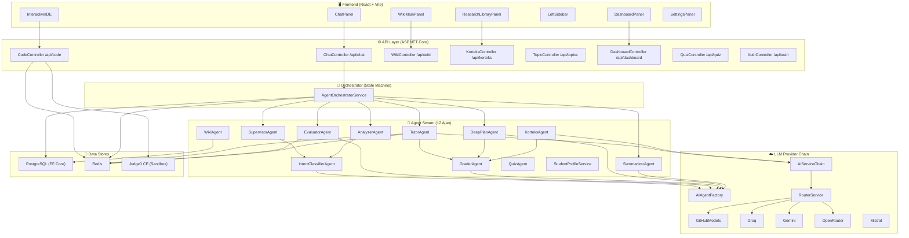
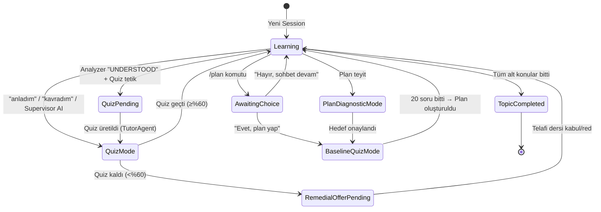
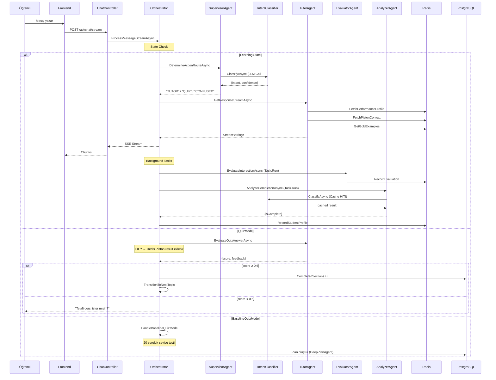
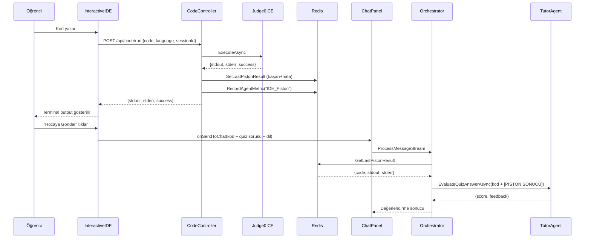
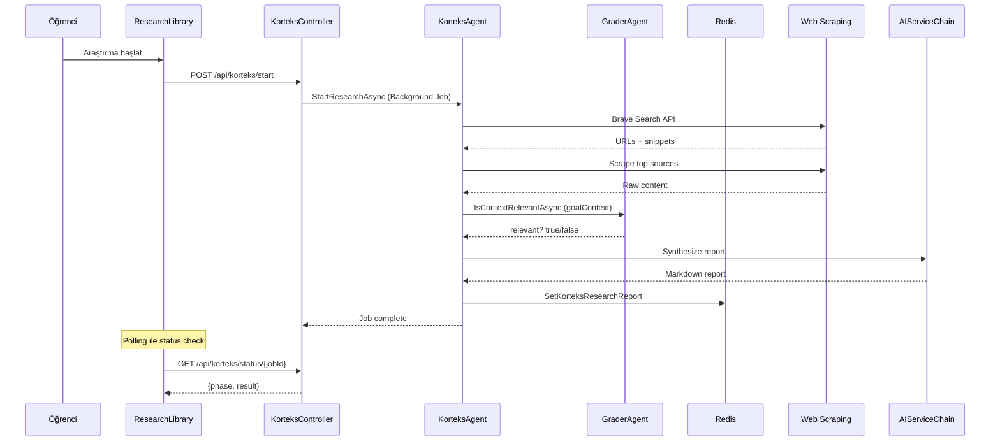
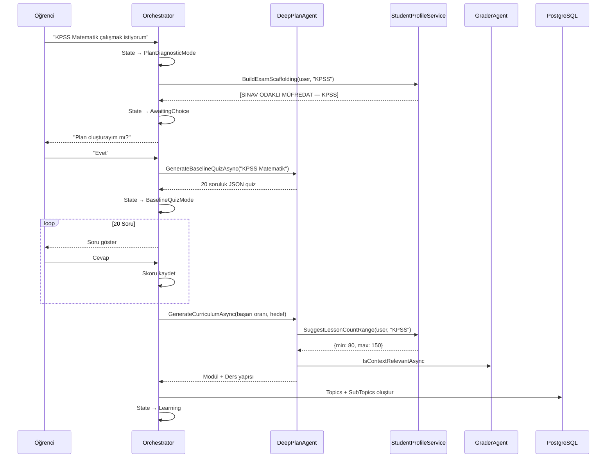

# Orka AI — Kapsamlı Sistem UML Diyagramı & Kopukluk Analizi

---

## 1. Sistem Bileşen Diyagramı (Component Diagram)

---

## 2. Session State Machine (Durum Makinesi)

---

## 3. Ana Mesaj Akışı (Sequence Diagram)

---

## 4. IDE + Piston Akışı

---

## 5. Korteks Araştırma Akışı

---

## 6. Plan Mode (Deep Plan) Akışı

---

## 7. Ajan Bağımlılık Matrisi

| Ajan | Tükettiği Ajanlar | Kullandığı Data Store | Tetiklenme Zamanı |
|---|---|---|---|
| **SupervisorAgent** | IntentClassifier | — | Her mesaj (Learning state) |
| **IntentClassifierAgent** | — | — (cache: ConcurrentDict) | Supervisor + Analyzer çağrısı |
| **TutorAgent** | GraderAgent | Redis (perf, piston, gold, profile) | Her Learning mesajı |
| **EvaluatorAgent** | — | Redis (eval, topic_score, gold) | Background task (her mesaj) |
| **AnalyzerAgent** | IntentClassifier | — | Background task (her mesaj) |
| **GraderAgent** | — | — | TutorAgent, DeepPlanAgent, KorteksAgent |
| **DeepPlanAgent** | GraderAgent | DB (Topics) | Plan mode tetiklendiğinde |
| **WikiAgent** | — | DB (WikiPages, WikiBlocks) | Summarizer tetiklemesiyle |
| **SummarizerAgent** | — | DB (Messages, WikiPages) | Background task (topic complete) |
| **KorteksAgent** | GraderAgent | Redis (research report) | Kullanıcı araştırma başlattığında |
| **QuizAgent** | — | DB (QuizAttempts) | Frontend quiz kayıt |
| **StudentProfileService** | — | DB (Users) | TutorAgent, DeepPlanAgent |

---

## 8. UML Tabanlı Kopukluk Analizi

UML diyagramlarını izleyerek tespit ettiğim **hala mevcut potansiyel kopukluklar**:

### 🟡 Potansiyel Kopukluk 1: SummarizerAgent → WikiAgent Tek Yönlü

**UML İzi:** SummarizerAgent modül bittiğinde (`IsMastered = true`) wiki özeti oluşturuyor ama WikiAgent'ın çıktısı TutorAgent'a geri beslenmiyor. Öğrenci aynı konuya geri dönerse Tutor wiki özetinden habersiz kalabilir.

**Durum:** `FetchWikiContextAsync` zaten var — bu kısmen çözülmüş. **Riski düşük.**

---

### 🟡 Potansiyel Kopukluk 2: Korteks Raporu → Quiz Entegrasyonu Yok

**UML İzi:** KorteksAgent araştırma raporu oluşturuyor ve Redis'e yazıyor. TutorAgent `GetKorteksResearchReportAsync` ile bu raporu okuyor ve ders anlatımına dahil ediyor. **AMA** quiz üretiminde `researchContext` parametresine bu rapor **otomatik olarak geçirilmiyor** — orkestratörde `GenerateTopicQuizAsync` çağrısında `researchContext` yok.

**Etki:** Korteks'in bulduğu güncel bilgiler ders anlatımına giriyor ama quizlere yansımıyor. Öğrenci güncel bilgiden soru görmüyor.

**Önerilen Çözüm:** Quiz üretiminden önce `redis.GetKorteksResearchReportAsync()` ile raporu çekip `researchContext` parametresine geçirmek.

---

### 🟡 Potansiyel Kopukluk 3: QuizAgent vs TutorAgent — Çift Yollu Quiz Üretimi

**UML İzi:** İki farklı quiz üretim yolu var:
1. **Orkestratör yolu:** `_tutorAgent.GenerateTopicQuizAsync()` — aktif akışta kullanılıyor (satır 990)
2. **Event yolu:** `TopicCompletedHandler` → `_quizAgent.GeneratePendingQuizAsync()` — MediatR event ile tetikleniyor

**Problem:** İki ajan farklı prompt'lar, farklı kurallar ve farklı kalite kontrolü kullanıyor:
- TutorAgent: `weaknessContext` + `pastQuestionsWarning` + `goalContext` → Adaptive
- QuizAgent: OpenTrivia DB + Grader peer review → Daha geniş ama adaptif değil

**Risk:** Race condition — ikisi aynı anda quiz üretirse `session.PendingQuiz` birbirini ezebilir.

---

### 🟡 Potansiyel Kopukluk 4: TopicDetectorService → Orkestratöre Bağlı Değil

**UML İzi:** `TopicDetectorService` DI'da kayıtlı (`Program.cs:95`) ama ne orkestratörde ne de herhangi bir Controller'da kullanılıyor. Bu servis null-topic modunda kullanıcının ilk mesajından konu tespit etmek için tasarlanmış ancak orkestratör kendi iç mantığıyla konu belirliyor.

**Durum:** Gerçek dead code. DI'dan kaldırılabilir veya orkestratöre entegre edilebilir.

---

### 🟢 Doğrulandı: SkillMasteryService Aktif

`SkillMasteryService` orkestratörde aktif olarak kullanılıyor (satır 1129): quiz geçildikten sonra `RecordMasteryAsync(userId, subTopicId, title, score)` çağrılıyor. **Kopukluk yok.**

---

### 🟢 Çözülmüş Kopukluklar (Bu Oturumda)

| # | Kopukluk | Çözüm | Dosya |
|---|---|---|---|
| ✅ 1 | IntentClassifier çift LLM call | Session-scoped cache | IntentClassifierAgent.cs |
| ✅ 2 | Supervisor CONFUSED sinyali iletilmiyor | supervisorHint | AgentOrchestratorService.cs |
| ✅ 3 | Quiz weakness context yok | Adaptive Quiz (Redis) | TutorAgent.cs, AgentOrchestratorService.cs |
| ✅ 4 | Konu geçişi salt string-match | AI + String hibrit | AgentOrchestratorService.cs |
| ✅ 5 | IDE sessionId gönderilmiyor | Frontend → Backend zinciri | api.ts, InteractiveIDE.tsx, Home.tsx |
| ✅ 6 | IDE quiz Piston sonucu dahil değil | Redis'ten enrichment | AgentOrchestratorService.cs |
| ✅ 7 | EvaluatorAgent kodlama metriği yok | Kod-özel değerlendirme | EvaluatorAgent.cs |
| ✅ 8 | IDE dil bağlamı kopuyor | Dil metadata eklendi | InteractiveIDE.tsx |
| ✅ 9 | IDE sonuçları profile kaydedilmiyor | Metrik + hata kayıt | CodeController.cs |

---

## 9. Kalan Aksiyonlar Özeti

| Öncelik | Kopukluk | Karmaşıklık | Tahmini Etki |
|---|---|---|---|
| 🟡 Orta | Korteks raporu quiz'e dahil değil | Düşük (tek satır ekleme) | Quizler güncel kaynaklardan soru soramıyor |
| 🟡 Orta | QuizAgent/TutorAgent çift quiz üretimi | Orta (mimari karar) | Race condition riski + tutarsız quiz kalitesi |
| 🟡 Düşük | TopicDetectorService dead code | Çok düşük (temizlik) | Kod karmaşıklığı |

