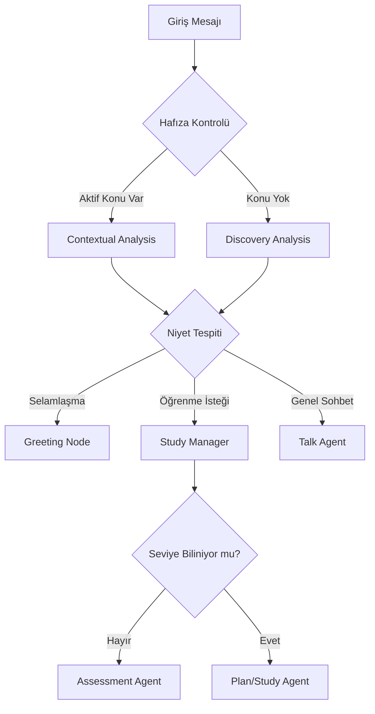

# docs/ai-router.md — Orka Diyalog ve Niyet Yönetimi (Beyin)

Bu doküman, Orka'nın "Diyalog Yöneticisi" (Dialogue Manager) olan `ChatService`'in nasıl düşündüğünü ve niyetleri (intent) nasıl karara bağladığını tanımlayan teknik yasadır.

---

## 🏗️ Diyalog Döngüsü (Dialogue Cycle)

Sistem her mesajda şu döngüyü işletmek zorundadır:

---

## 🎯 Niyet ve Bağlam Kuralları (Context Rules)

AI, kullanıcının niyetini okurken aşağıdaki yasalarla hareket eder:

1.  **Dinamik Niyet Arama (Intent Discovery):** Sadece "C#" kelimesine bakmaz. "C# çalışmak istiyorum" mesajını aldığında; eğer bu konu DB'de varsa "Önceden çalıştığımız C# konusuna devam mı?" diye sorar. Yoksa "Yeni bir çalışma mı yoksa sadece sohbet mi?" diye niyet belirginleştirir.
2.  **Seviye Analizi (Assessment) Yasası:** Yeni bir çalışma planı üretilmeden önce AI, kullanıcıya mutlaka "Seviyeni ölçerek sana özel bir plan hazırlayayım mı?" teklifini götürmelidir.
3.  **Hatalı Filtre Engelleme:** "sa", "as" gibi kısa selamlar, eğer kullanıcı bir cümle içinde kullanıyorsa (Örn: "Osmanlı tarihinde sa...") asla `greeting` sanılmaz. LLM, mesajın bütünsel anlamına bakar.

---

## 🤖 Ajan Görev Dağılımı

| Ajan | Görev | Model |
|------|-------|-------|
| **Orchestrator** | Diyaloğu yönetir, bir sonraki adımı seçer. | Gemini 2.0 Flash |
| **Assessor** | 3-5 soruyla seviye ölçer ve analiz eder. | OpenRouter Llama 3.3 |
| **Planner** | Seviye verisine göre Wiki taslağını oluşturur. | Gemini 2.0 Flash |
| **Tutor** | Konuyu anlatır ve Wiki'yi interaktif sorularla besler. | Gemini 2.0 Flash / Llama 70B |
| **Curator** | Arka planda özet çıkarır ve Wiki'yi düzenlar. Her ders sonu QuizBlock ekler. | Mistral (Background) |

---

## 🛠️ State Machine (Durum Yönetimi)

`Topic.Metadata` içinde tutulan durumlar (Kodla senkronize):
- `is_awaiting_mode_selection`: Kullanıcın "Plan" mı yoksa "Sohbet" mi istediği bekleniyor.
- `is_awaiting_assessment_approval`: Seviye testi için onay bekleniyor.
- `is_awaiting_switch_confirmation`: Konu değişimi için onay bekleniyor.
- `is_assessing`: Seviye testi şu an yapılıyor.

---

## 🚨 KRİTİK PROTOKOLLER

- **Ders Bitimi:** Bir Wiki sayfası tamamlandığında AI mutlaka şunu demeli: *"Bu bölümü bitirdik! Wiki'ne senin için pekiştirme soruları ekledim. Hazırsan bir sonraki konuya geçelim mi?"*
- **Konu Değişimi:** Kullanıcı aniden konu değiştirirse AI: *"Mevcut [Eski Konu] çalışmanı kaydedip [Yeni Konu]'ya geçiyorum, onaylıyor musun?"* diye sormalıdır.
- **Akış Kesintisi (Interruption):** Kullanıcı dersin ortasında alakasız bir şey sorarsa (örn: "Hava nasıl?"), AI kısa bir cevap vermeli ve hemen ardından *"Dönelim mi? [Ders Adı] konusuna devam etmeye hazır mısın?"* diyerek odağı geri toplamalıdır.
- **Geri Dönüş (Resumption):** 24 saatten uzun süren aralardan sonraki ilk mesajda AI: *"Tekrar hoşgeldin! En son [Ders Adı] konusunun [Alt Başlık] kısmında kalmıştık. Oradan devam edelim mi yoksa bir özet geçmemi ister misin?"* diyerek bağlamı hatırlatmalıdır.

---
> Bu spesifikasyon, sistemin "şişirme bir balon" gibi değil, sağlam bir mentor gibi davranmasını garanti eder.
