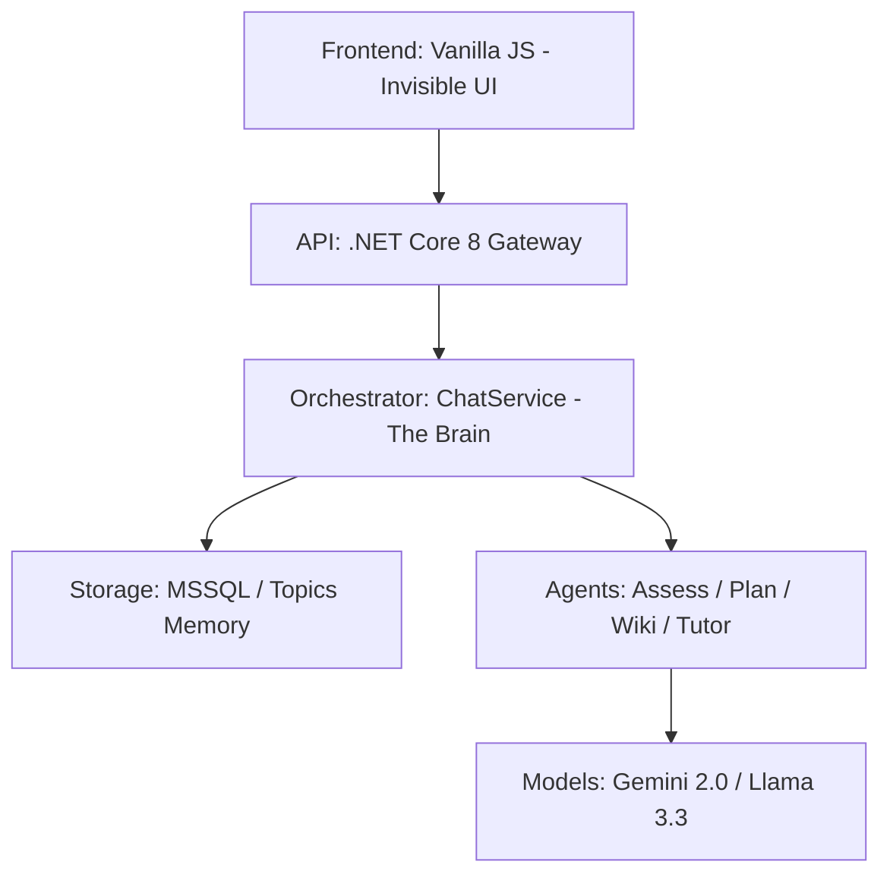

# docs/architecture.md — Orka Sistem Mimarisi ve Etkileşim Döngüsü

Orka'nın mimarisi, statik istek-cevap döngüsünden ziyade, bir **"Diyalog Durum Makinesi" (Dialogue State Machine)** üzerine kuruludur. Bu doküman, .NET Core 8 ve AI katmanlarının nasıl bir "otomasyon" gibi canlandığını tanımlar.

---

## 🛰️ Genel Katman Yapısı (The Stack)

---

## 🌀 Canlı Etkileşim Döngüsü (The Interaction Loop)

Sistem, her kullanıcı mesajında aşağıdaki 4 adımlı döngüyü işletir:

1.  **Duyusal Analiz (Perception):**
    - Mesaj gelir, `Topic.Metadata` okunur.
    - AI, "Kullanıcı şu an mülakat mı yapıyor yoksa ders mi çalışıyor?" sorusuna yanıt bulur.
    - `Hafıza` (History + Metadata) eşleştirilir.
2.  **Karar Verme (Cognition):**
    - Niyet ve Durum birleşir. Karar verilir: "Ders anlatırken araya soru girdi; cevap ver ve derse dön." veya "Yeni konu tespiti; onay al."
3.  **Eylem Tetikleme (Actuation):**
    - Manager, ilgili .NET metodlarını (Plan üret, Wiki'ye soru ekle, Seviye ölç) tetikler.
4.  **Geri Bildirim (Response & Record):**
    - Yanıt döner, Wiki güncellenir ve yeni durum (Phase) DB'ye kaydedilir.

---

## 🏛️ .NET Mimari Yasaları

- **Topic Metadata:** Her öğrenme konusu, kendi hafızasıyla (`PhaseMetadata`) yaşar. Bu JSON alanı projenin "Hafıza Merkezi"dir.
- **Service Decoupling:** Servisler birbirine doğrudan bağımlı değildir; sadece `ChatService` (Orchestrator) tarafından yönetilirler.
- **Background Jobs:** Wiki Curator ve Session Summarizer, kullanıcıyı bekletmeden arka planda (Fire & Forget) çalışmak zorundadır.

---

## 🚫 YASAKLI AKIŞLAR

- **Hard-coded Routing:** `if (msg == "test")` gibi kodlar yasaktır. Kararı her zaman `Dialogue Manager` verir.
- **Pasif Wiki:** Wiki sadece bir sayfa gibi gösterilemez. Sayfanın en altındaki **"Pekiştirme Soruları"** dinamik olarak her ders bittiğinde tetiklenmelidir.
- **Geçiş Doğrulaması (Transition Guard):** AI'nın faz değiştirmesi için .NET tarafında belirli şartlar aranır. Örn: "Plan onaylanmadan `ActiveStudy` fazına geçilemez."
- **Halüsinasyon Filtresi:** AI'dan gelen yanıtlar sistemsel olarak taranır. Eğer yanıt anlamsız veya protokol dışıysa, kullanıcıya "Bağlantıda bir kopukluk oldu, tekrar eder misin?" mesajı (Safe Fallback) gönderilir.

---
> Bu mimari, sistemin "şişirme balon" gibi patlamasını engeller; her bir parça sağlam bir otomasyon dişlisi gibi yerine oturur.
