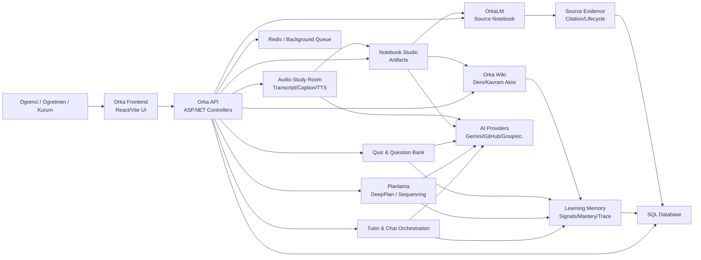
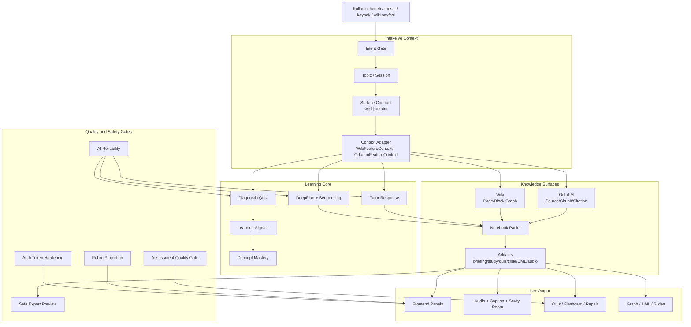
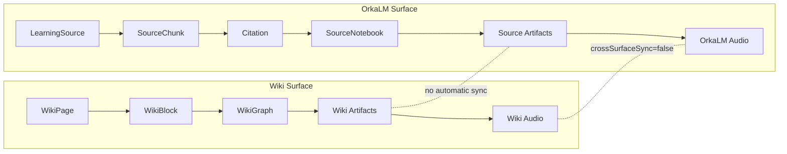
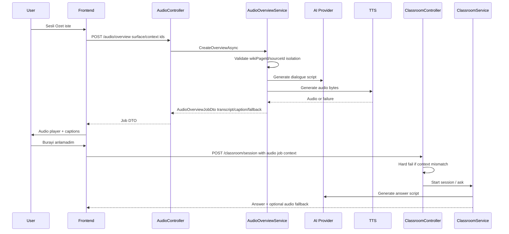
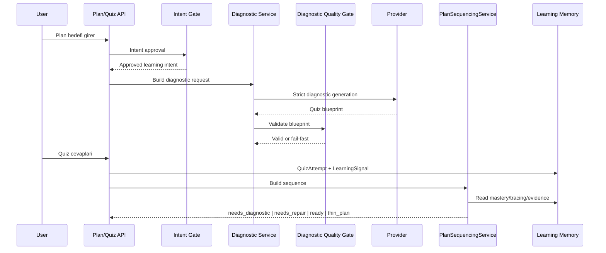
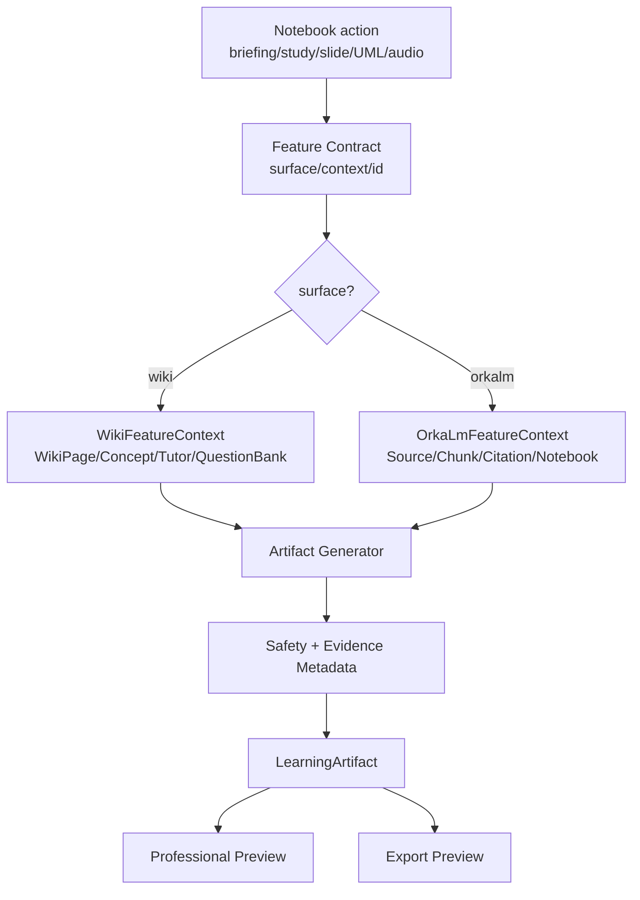
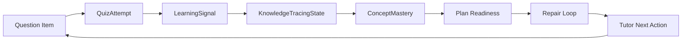
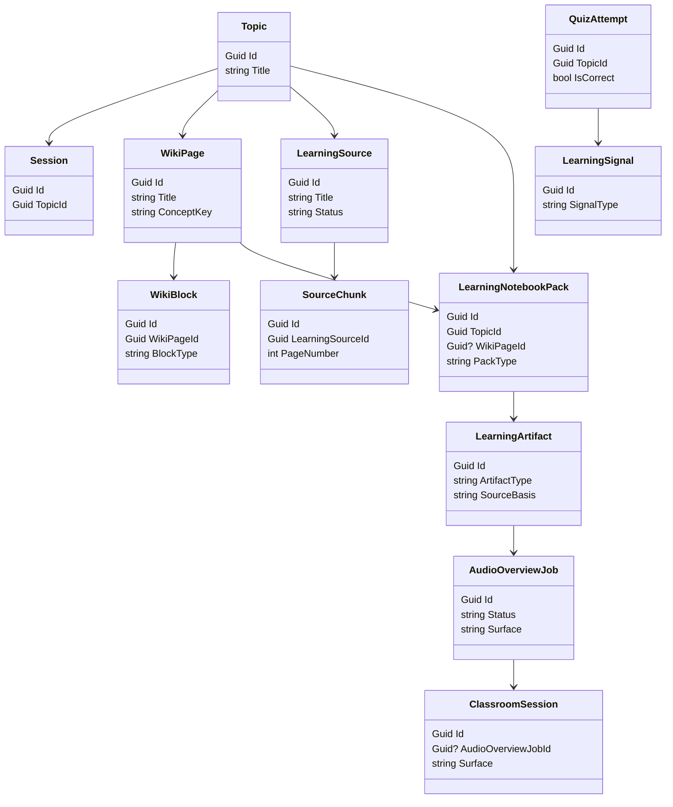
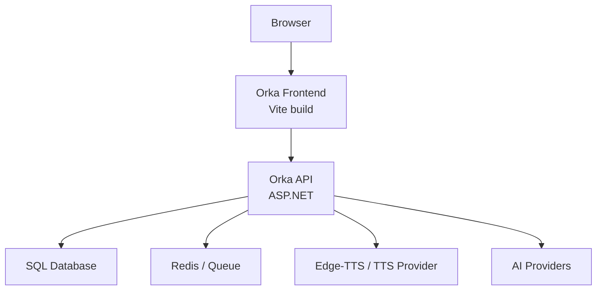

# OrkaOS v1 - UML Diyagramlari, Toplu Sistem Tasarimi ve Roadmap

Tarih: 2026-06-04  
Durum: Sistem ve ozellik UML dokumani  
Kapsam: Iki toplu UML, ozellik bazli diagramlar, data flow, deployment, gelecek fazlar

## 1. Toplu UML #1 - OrkaOS Sistem Context Diyagrami

## 2. Toplu UML #2 - Kapsamli Feature/Data Flow

## 3. Wiki-OrkaLM Ayrim Diyagrami

## 4. Audio Study Room Sequence Diyagrami

## 5. Diagnostic + Plan Sequencing Sequence Diyagrami

## 6. Notebook Studio Artifact Flow

## 7. Soru Bankasi ve Learning Evidence Diyagrami

## 8. Class Diagram - Ana Domain Model

## 9. State Diagram - Plan Readiness

```mermaid
stateDiagram-v2
  [*] --> NoEvidence
  NoEvidence --> NeedsDiagnostic: no learner evidence
  NeedsDiagnostic --> EvidenceCollected: quiz/practice signal
  EvidenceCollected --> NeedsRepair: weak evidence
  EvidenceCollected --> Ready: sufficient mastery
  EvidenceCollected --> ThinPlan: graph/output too thin
  NeedsRepair --> RepairLoop
  RepairLoop --> EvidenceCollected: checkpoint attempt
  ThinPlan --> BuildConceptGraph
  BuildConceptGraph --> EvidenceCollected
  Ready --> ActivePlan
```

## 10. Deployment Diyagrami

## 11. Gelecek Roadmap

### 11.1 Release temizlik fazi

- Dirty worktree kapsam ayrimi
- PR/commit stratejisi
- Life-proof skipped test karari
- CI workflow standardizasyonu

### 11.2 Audio kalite fazi

- Studio voice preset
- Multi-language voice pairs
- Audio generation observability
- Caption editing
- Segment-based asking
- Audio retention dashboard

### 11.3 Manual bridge fazi

Bu faz otomatik sync degil, kullanici kontrollu kopru olur.

Olasiliklar:

- OrkaLM artifact -> "Wiki'ye not olarak ekle"
- Wiki page -> "OrkaLM source notebook ile iliskilendir"
- Citation -> Wiki block reference
- Wiki concept -> Source concept link

Kurallar:

- Varsayilan sync kapali.
- Kullanici onayi olmadan yazma yok.
- Audit trail zorunlu.

### 11.4 Video/visual overview fazi

- Video overview
- Infographic
- Animated concept map
- Slide deck export
- Teacher presentation mode

### 11.5 Kurumsal faz

- Teacher/admin dashboard
- Class/cohort analytics
- Standards coverage
- Question bank operations
- Institution-safe data lifecycle

## 12. OrkaOS v1 Kapanis Notu

OrkaOS v1 icin temel mimari artik su hale geldi:

- Wiki normal ders akisi olarak kalir.
- OrkaLM kaynak yukleme ve source notebook olarak kalir.
- Ozellikler iki yuzeyde de vardir.
- Context'ler karismaz.
- AI strict roller fake fallback yapmaz.
- Diagnostic/planlama kalite kapilari fail-fast davranir.
- Sesli ozet ve sesli calisma odasi transcript/caption/fallback ile profesyonel contract'a baglanir.
- Sistem release testlerinden gecmistir.

