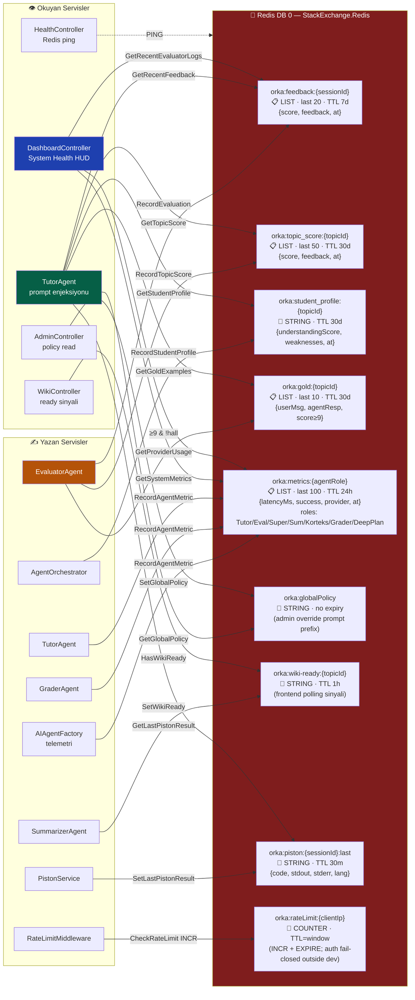
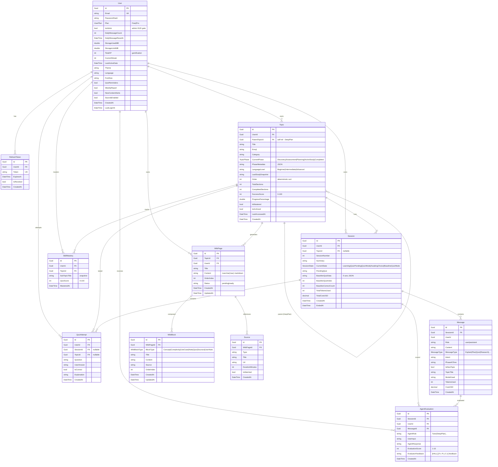

<div align="center">

# Orka AI (V1 Production Ready)

**Kişiselleştirilmiş Öğrenme Orkestratörü**

*Konuyu sen söyle — öğrenme yolunu Orka çizsin.*

[](https://dotnet.microsoft.com)
[](https://react.dev)
[](https://learn.microsoft.com/ef)
[](https://redis.io)
[](https://learn.microsoft.com/semantic-kernel/)
[](LICENSE)

</div>

---

## Local Dev Contract

- Backend API: `http://localhost:5065`
- Frontend dev server: `http://localhost:3000`
- Runtime/API smoke env var: `ORKA_API_URL`
- Frontend proxy env var: `VITE_API_PROXY_TARGET`

```powershell
cd D:/Orka
powershell -ExecutionPolicy Bypass -File scripts\start-api.ps1
powershell -ExecutionPolicy Bypass -File scripts\start-front.ps1
powershell -ExecutionPolicy Bypass -File scripts\quick-backend.ps1
```

See `docs/dev-contract.md` for the canonical smoke/regression matrix. Deployment, migration, CORS, CSP, secret, Redis, and provider gates are tracked in `docs/deployment/migration-policy.md` and `scripts/CHECKLIST.md`.

Feature work with Codex must start from `CODEX.md`, then follow the current
roadmap in `docs/project-state/current-roadmap.md` and the Stage 4 Codex Skills
Anayasasi in `docs/codex-skills/`. Start with `docs/codex-skills/README.md`, then read the
backend, AI/RAG, frontend contract, data lifecycle, and testing gate constitution
files that apply to the feature.

---

## 1. Orka Nedir?

Orka AI, kullanıcının **doğal dilde söylediği herhangi bir konuyu** anlayıp kendisine özel bir müfredat hazırlayan, dersleri akıcı biçimde anlatan, sınav yapan, kod çalıştıran ve öğrendikçe bir **kişisel wiki** dolduran çok-ajanlı (multi-agent) bir AI öğrenme platformudur.

Klasik online kursların aksine Orka:

- **Sabit içerik sunmaz** — her kullanıcıya ve her konuya özel bir yol çizer.
- **Tek bir LLM'e bağımlı değildir** — görevin doğasına göre farklı ajanlar farklı modelleri kullanır.
- **Kendi cevap kalitesini ölçer** — bir `EvaluatorAgent` her anlatımı 3 boyutta puanlar; düşük puanlı cevaplar bir sonraki prompt'ta **ders niteliğinde geri besleme** olarak geri gelir. RAG kalite metrikleri (Faithfulness & Relevance) `RagEvaluationService` tarafından otonom olarak denetlenir.
- **Öğrenciyi ezberlemez, modeller** — "Öğrenci Profili" ve CAT (Computerized Adaptive Testing) ile kullanıcının zayıf noktalarını sürekli güncel tutar. Klasik test teorisiyle (CTT) soru zorluklarını kendi kendine kalibre eder.

Kısaca: Orka, cevap veren değil, **cevabını sürekli iyileştiren** ve uluslararası eğitim standartlarıyla (CASE/QTI/xAPI) uyumlu yaşayan bir sistemdir.

---

## 2. Organizasyon Yapısı — Yaşayan Bir Organizma

Orka'nın çekirdeği, klasik "iste-cevapla" akışının üzerine kurulmuş bir **kapalı geri besleme döngüsüdür**. Her kullanıcı etkileşimi aşağıdaki zinciri tetikler:

```text
Kullanıcı mesajı
      │
      ▼
┌──────────────────────┐
│ AgentOrchestrator    │  ← merkezi yönlendirme (state machine + intent)
└──────────┬───────────┘
           │  (rol + görev)
           ▼
┌──────────────────────┐
│  İş Ajanı            │  Tutor · DeepPlan · Quiz · Wiki · Korteks · ...
│  (cevap üretir)      │
└──────────┬───────────┘
           │  response
           ▼
┌──────────────────────┐
│ EvaluatorAgent       │  → pedagoji / faktual / bağlam (her biri 1-5)
│ (LLMOps Kalite)      │  → overall (1-10) + hallucinationRisk
└──────────┬───────────┘
           │  skor + gerekçe
           ▼
┌──────────────────────────────────────────────┐
│ Redis — "Canlı Hafıza"                       │
│  • orka:feedback:{sessionId}      (son 20)   │ ← session notları
│  • orka:topic_score:{topicId}     (avg)      │ ← konu kümülatif kalite
│  • orka:student_profile:{topicId} (anlık)    │ ← zayıf noktalar, seviye
│  • orka:gold:{topicId}            (≥9 puan)  │ ← başarılı anlatım örneği
│  • orka:metrics:{agentRole}       (TTFT vs.) │ ← LLMOps telemetri
│  • orka:v3:tutor-events:{id}                 │ ← Frontend Live Trace Akışı
└──────────┬───────────────────────────────────┘
           │  bir sonraki mesajda…
           ▼
┌──────────────────────┐
│ TutorAgent prompt'u  │  ← geri besleme + altın örnek + öğrenci profili
│ (gelişen prompt)     │    enjekte edilir — "dynamic few-shot"
└──────────────────────┘
```

### 2.1 Çok Boyutlu Değerlendirme (RAG-Triad Esintili)

`EvaluatorAgent` her ajan cevabını tek puan yerine **3 boyutta** skorlar:

| Boyut | Ölçek | Ne ölçer |
|---|---|---|
| **pedagogy** | 1–5 | Açıklama öğretici mi, seviyeye uygun mu, gereksiz gevezelik var mı? |
| **factual**  | 1–5 | İçerik doğru mu, uydurma bilgi / hallucination var mı? |
| **context**  | 1–5 | Kullanıcının sorusuyla gerçekten alakalı mı? |

`overall = ((pedagogy + factual + context) / 15) × 10` formülüyle 1–10 arası normalize edilir. `factual < 3` → `hallucinationRisk = true` otomatik.

### 2.2 Üç Katmanlı Hafıza ve Live Trace

Orka üç farklı zaman ölçeğinde hafıza tutar (Mesaj, Session, Topic). Buna ek olarak V1 mimarisinde **Redis Live Trace UX** aktiftir. Ajanların arka planda yaşadığı "Düşünme, Planlama, Kaynak tarama" anları frontend'deki `LiveTutorTrace` sekmesinde canlı olarak okunabilir.

### 2.3 Gelişen Prompt (Dynamic Few-Shot)

`TutorAgent` her cevap öncesi Redis'ten şu dört katmanı okuyup prompt'una enjekte eder:

1. Son 5 **EvaluatorAgent** geri bildirimi (session)
2. Konu için **ortalama kalite puanı** (topic)
3. **Öğrenci Profili** — kavrama seviyesi + zayıf noktalar (topic)
4. Geçmişte ≥9 puan almış **altın örnekler** (topic, max 10)

Böylece aynı konuyu ikinci kez anlatırken sistem zaten daha iyidir — kopya prompt değil, **öğrenen prompt**.

### 2.4 Altın Örnek Kütüphanesi

`EvaluatorAgent` bir `TutorAgent` cevabına 9 veya 10 verdiyse ve `hallucinationRisk=false` ise, bu konuşma `orka:gold:{topicId}` anahtarına kaydedilir. Halüsinasyon riskli yüksek-puanlı cevaplar **kasten** örnek kütüphanesine alınmaz.

### 2.5 State Machine & CAT (Adaptive Assessment)

Orka'nın soru sorma aşaması statik değildir. Quiz moduna geçildiğinde `AdaptiveAssessmentSelector` devreye girer. Formül bazlı bir kalibrasyon sistemi (`AssessmentCalibrationServices`), öğrencinin hangi konuda zorlandığını bularak klasik test teorisi (CTT) prensipleriyle o an sorulabilecek en mükemmel zorluktaki soruyu seçer.

### 2.6 Production Hardening & Otomatik Bakım

Sistem, veritabanı loglarının şişmesini veya ölü audio dosyalarının kalmasını engellemek için kendi kendini temizler. `RetentionCleanupWorker` ve `RedisStreamMaintenanceWorker` arka planda periyodik bakım yapar. Sistemin tüm sinyalleri API katmanına entegre edilmiş **OpenTelemetry** SDK ile izlenebilir durumdadır.

---

## 3. Sistem UML — Tam Mimari

> 💡 **Not:** Sistemin tüm detaylı akışları (DeepPlan Modül/Ders Hiyerarşisi, Piston IDE Entegrasyonu, Korteks Araştırma Sekansları vb.) için özel olarak hazırladığımız kapsamlı [ARCHITECTURE.md](ARCHITECTURE.md) dosyasını inceleyebilirsiniz.

```mermaid
graph TB
    subgraph Client["🖥️ Frontend — React 19 + Vite + Tailwind v4"]
        UI[Home · Landing · Courses]
        CP[ChatPanel<br/>SSE & Polling Trace]
        WP[WikiMainPanel<br/>polling]
        IDE[InteractiveIDE<br/>Monaco]
        HUD[SystemHealthHUD<br/>admin only]
        API_TS[services/api.ts<br/>Axios + fetch]
    end

    subgraph API[".NET 8 Web API — Orka.API"]
        AUTH[AuthController<br/>JWT + refresh]
        CHAT[ChatController<br/>SSE stream]
        QUIZ[QuizController]
        TOPICS[TopicsController]
        WIKI[WikiController<br/>SSE stream]
        KORT[KorteksController]
        CODE[CodeController<br/>Judge0/Piston]
        DASH[DashboardController<br/>admin HUD]
        HEALTH[HealthController<br/>/health/ready]
        VOICE[VoiceController<br/>Edge TTS Stream]
        USERC[UserController]
        SKILL[SkillMasteryController]
        MW[OpenTelemetry +<br/>ExceptionMiddleware]
    end

    subgraph Orchestrator["🧠 Agent Orchestrator — Infrastructure"]
        ORCH[AgentOrchestratorService<br/>state machine + routing]
        ROUTER[RouterService<br/>intent classifier]
        INTENT[IntentClassifierAgent]
        CTX[ContextBuilder]
    end

    subgraph Agents["🤖 AI Agents — Orka.Infrastructure.Services"]
        TUTOR[TutorAgent<br/>anlatım + quiz]
        DEEP[DeepPlanAgent<br/>müfredat]
        ANLZ[AnalyzerAgent<br/>completion detect]
        SUM[SummarizerAgent<br/>wiki idempotent]
        WIKIAG[WikiAgent<br/>Q&A stream]
        KORTEX[KorteksAgent<br/>Tavily + Wiki]
        SUPER[SupervisorAgent]
        GRADER[GraderAgent<br/>quiz puanla]
        EVAL[EvaluatorAgent<br/>3-dim scoring]
        QZA[QuizAgent]
    end

    subgraph SK["Semantic Kernel Plugins"]
        TAV[TavilySearchPlugin]
        WIKIP[WikipediaPlugin]
        TP[TopicPlugin]
        WIKIPL[WikiPlugin]
    end

    subgraph Chain["AI Service Chain — Failover"]
        FAC[AIAgentFactory<br/>role → model]
        CHAIN[AIServiceChain]
        GHM[GitHubModels<br/>Primary]
        GROQ[GroqService]
        GEM[GeminiService]
        MIS[MistralService]
        SAM[SambaNovaService]
        CER[CerebrasService]
        OPR[OpenRouterService]
        COH[CohereEmbeddingService]
    end

    subgraph Data["💾 Persistence"]
        SQL[(SQL Server LocalDB<br/>EF Core 8)]
        REDIS[(Redis 7<br/>StackExchange.Redis)]
    end

    subgraph External["🌐 External APIs"]
        TAVILY[Tavily Search]
        WIKI_EXT[Wikipedia REST]
        JUDGE[Judge0 CE<br/>sandbox exec]
        AIAPI[LLM Providers]
    end

    UI --> API_TS
    CP -->|SSE| CHAT
    WP --> WIKI
    IDE --> CODE
    HUD --> DASH

    API_TS --> AUTH
    API_TS --> TOPICS
    API_TS --> QUIZ
    API_TS --> USERC
    API_TS --> SKILL

    CHAT --> ORCH
    QUIZ --> ORCH
    TOPICS --> ORCH
    WIKI --> WIKIAG
    KORT --> KORTEX
    CODE --> AGENTS_PISTON[PistonService]

    ORCH --> ROUTER
    ORCH --> INTENT
    ORCH --> CTX
    ORCH --> TUTOR
    ORCH --> DEEP
    ORCH --> ANLZ
    ORCH --> SUM
    ORCH --> QZA
    ORCH --> GRADER

    TUTOR --> EVAL
    DEEP --> EVAL
    WIKIAG --> EVAL
    KORTEX --> EVAL
    SUM --> EVAL

    WIKIAG --> SK
    KORTEX --> SK
    SK --> TAV
    TAV --> TAVILY
    WIKIP --> WIKI_EXT
    AGENTS_PISTON --> JUDGE
    VOICE --> TTS_SUB[Python edge-tts<br/>Subprocess]

    TUTOR --> FAC
    DEEP --> FAC
    EVAL --> FAC
    WIKIAG --> FAC
    KORTEX --> FAC
    SUPER --> FAC
    GRADER --> FAC

    FAC --> CHAIN
    CHAIN --> GHM
    CHAIN --> GROQ
    CHAIN --> GEM
    CHAIN --> MIS
    CHAIN --> SAM
    CHAIN --> CER
    CHAIN --> OPR
    GHM --> AIAPI
    GROQ --> AIAPI
    GEM --> AIAPI

    ORCH --> SQL
    EVAL --> REDIS
    TUTOR --> REDIS
    DASH --> REDIS
    DASH --> SQL
    HEALTH --> REDIS
    HEALTH --> SQL

    style ORCH fill:#0f766e,color:#fff
    style EVAL fill:#b45309,color:#fff
    style REDIS fill:#991b1b,color:#fff
    style SQL fill:#1e3a8a,color:#fff
    style FAC fill:#065f46,color:#fff
```



---

## 4. Redis UML — Anahtar Topolojisi

Redis, Orka'nın **canlı hafızasıdır**. Kalıcı veri SQL'dedir; Redis yalnızca **hızla değişen, yüksek TTL'li** öğrenme sinyallerini ve trace loglarını tutar.



**Tasarım Prensipleri:**
- **Key namespace'i** her zaman `orka:<amaç>:<scope-id>` — hem pattern taraması hem silme için.
- **Hiçbir anahtar kalıcı değil** (globalPolicy hariç) — TTL her yazımda yenilenir.
- **Auth rate limit guardrail** — Development local fallback kullanabilir; Staging/Production Redis-backed auth limiter fail-closed davranır.
- **LPUSH + LTRIM** pattern'i — listelerde sonsuz büyüme önlenir, en yeni en üstte.

---

## 5. Database UML — SQL Server Şeması



**Önemli Kısıtlar:**
- `User.Email` / `RefreshToken.Token` — **unique index**
- `Topic.ParentTopicId` — self-reference (silme zinciri `NoAction` — cascade cycle engeli)
- `Message (SessionId, CreatedAt)` — composite index (chat listesi sıralı okuma)
- `Session (UserId, TopicId)` — composite index
- Enum alanları **string** olarak saklanır (`HasConversion<string>()`)

---

## 6. Teknolojiler & Mimari Desenler

### Backend (.NET 8)

| Katman | Teknoloji |
|---|---|
| Runtime | **.NET 8** (LTS) |
| Web API | **ASP.NET Core 8** Minimal hosting + Controller pattern |
| ORM | **Entity Framework Core 8** (Code-First, auto-migrate at boot) |
| Veritabanı | **SQL Server 2022 LocalDB** (prod: Azure SQL) |
| Cache & Events | **Redis 7** via `StackExchange.Redis` |
| AI Orchestration | **Microsoft Semantic Kernel** (plugin bazlı) |
| Mediator | **MediatR** — domain event'leri (`TopicCompletedEvent`) |
| Observability | **OpenTelemetry** — SDK Trace, Metric & Log Exporter |
| HTTP Resilience | **Microsoft.Extensions.Http.Resilience** — retry + circuit breaker |
| Health | `AspNetCore.HealthChecks.Redis` + `AddDbContextCheck` |
| Background Jobs | `IHostedService` (Retention Cleanup, DB Audit) |

### Frontend (React 19)

| Katman | Teknoloji |
|---|---|
| Framework | **React 19** + **TypeScript 5.8** |
| Build | **Vite 6** |
| Styling | **Tailwind CSS v4** (config-less) |
| Router | **wouter** (react-router kullanılmaz) |
| HTTP | **Axios** + native `fetch` (SSE/Polling LiveTrace) |
| Kod Editör | **@monaco-editor/react** (InteractiveIDE) |
| Layout | **react-resizable-panels** (SplitPane) |

### AI Katmanı

| Ajan / Servis | Rol |
|---|---|
| **AgentOrchestratorService** | Tüm akışların merkezi — state machine + routing |
| **TutorAgent** | Ders anlatımı, cevap değerlendirme |
| **DeepPlanAgent** | Müfredat (hiyerarşik topic tree) üretimi |
| **EvaluatorAgent** | **LLMOps kalite — 3 boyutlu skorlama** |
| **RagEvaluationService** | Faithfulness ve Relevance RAG analizleri |
| **AdaptiveAssessmentSelector** | CAT tabanlı, belirsizlik durumuna göre zorluk/soru seçimi |
| **StandardsAndProductionServices**| CASE, QTI, Caliper ve xAPI formatlarına çevrim, uyumluluk |
| **EdgeTtsStreamService** | Python `edge-tts` subprocess üzerinden canlı ses akışı (Podcast) |

### Mimari Desenler
- **Clean Architecture** — `Core → Infrastructure → API` tek yönlü bağımlılık
- **Factory Pattern** — `AIAgentFactory` rol bazlı model seçimi
- **Chain of Responsibility** — `AIServiceChain` provider failover
- **State Machine** — `SessionState` + `TopicPhase` enum driven
- **CQRS-lite** — okuma/yazma servis ayrımı
- **Plugin Pattern** — Semantic Kernel plugin'leri dinamik yüklenebilir
- **Rate Limiting & Auth Guardrails** — Development in-memory, Staging/Production Redis-backed auth limit policy.

---

## 7. Kurulum

### Ön Gereksinimler

- [.NET 8 SDK](https://dotnet.microsoft.com/download)
- [Node.js 18+](https://nodejs.org)
- SQL Server LocalDB (Visual Studio ile gelir)
- Redis 7 — yerel instance veya Docker (`docker run -p 6379:6379 redis:7`)

### Backend'i Çalıştırma (API)

```bash
# API anahtarlarını user-secrets'a ekle
cd Orka.API
dotnet user-secrets set "AI:GitHubModels:Token" "ghp_..."
dotnet user-secrets set "AI:Groq:ApiKey" "gsk_..."

# Canonical local API port
dotnet run --urls "http://localhost:5065"
```

### Frontend'i Çalıştırma

```bash
cd Orka-Front
npm install
npm run dev
# → http://localhost:3000
```

### Testleri Çalıştırma

```bash
# Backend Testleri
dotnet test

# Frontend Smoke ve Contract Testleri
cd Orka-Front
npm run quick:smoke
```

---

## 8. Lisans

[MIT](LICENSE) — Ahmet Akif Sevgili
