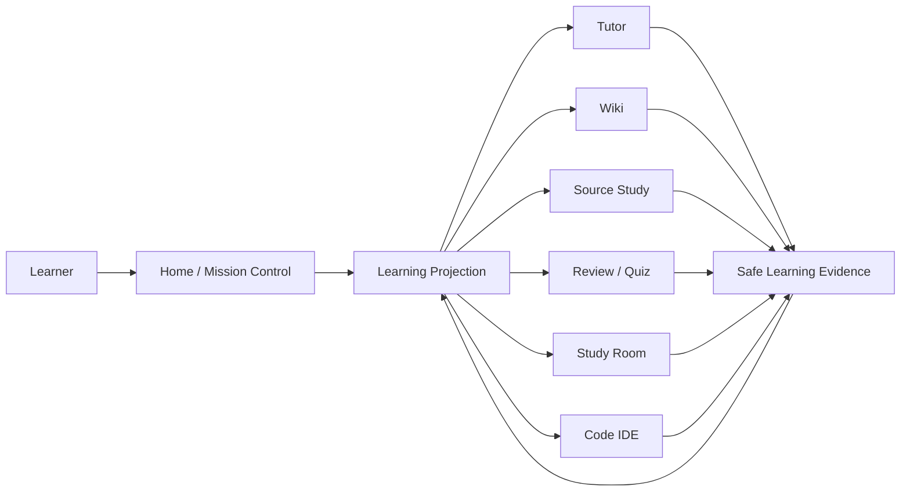
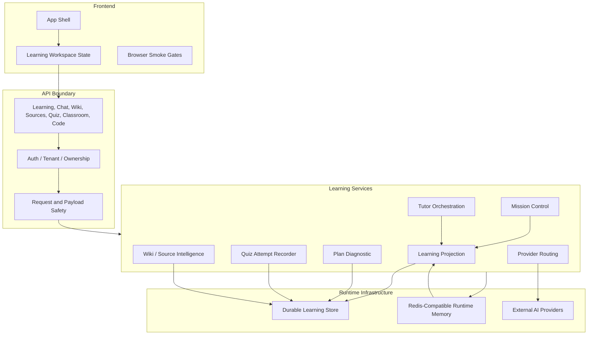
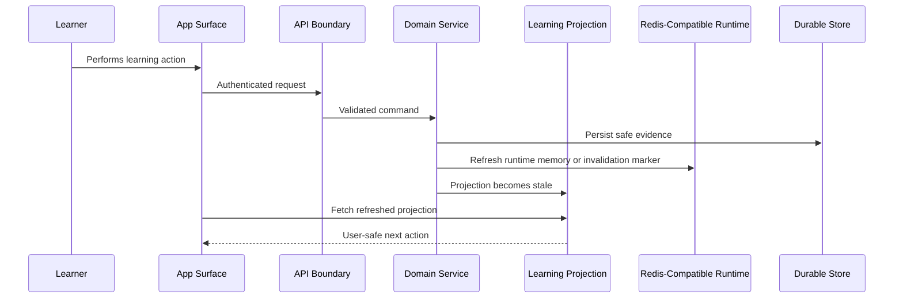
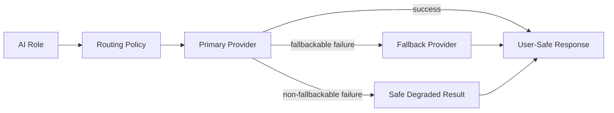
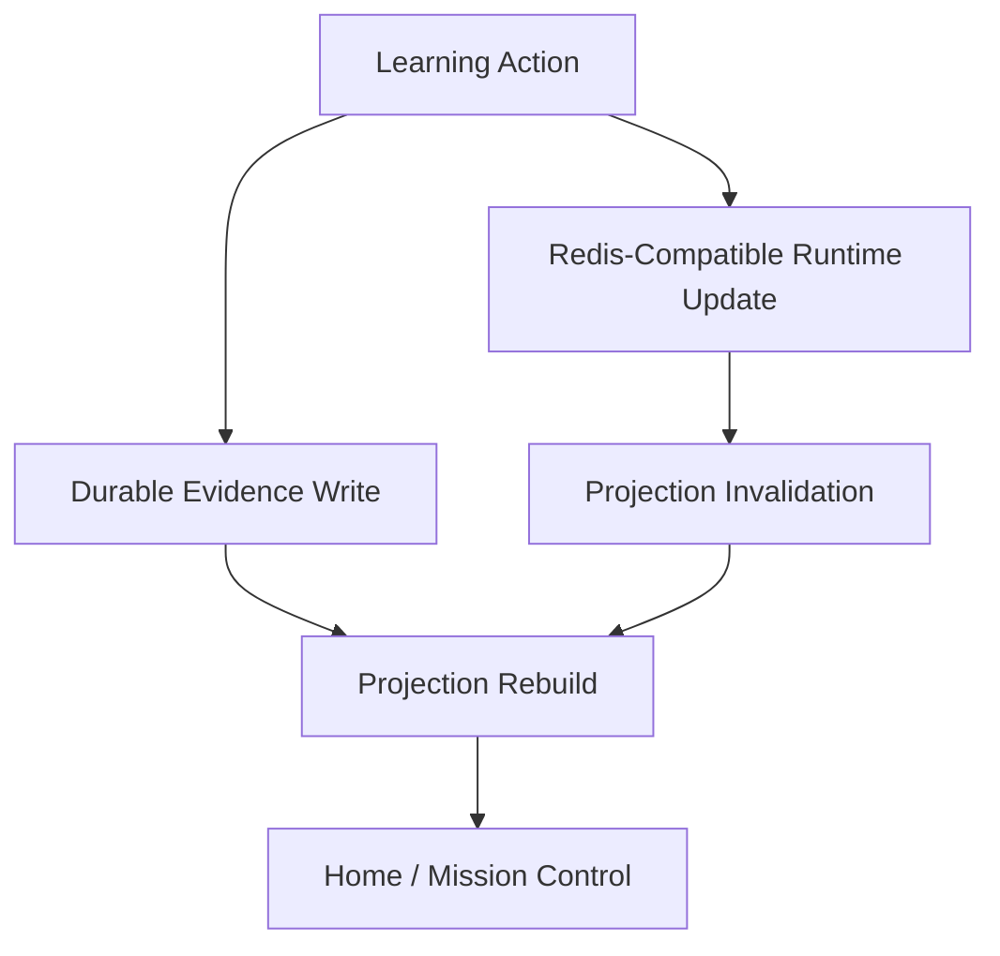

# Orka AI Learning OS

Orka is a personal AI learning operating system. It connects planning,
diagnostic checks, Tutor, Wiki, source study, review, quiz, study room, code
practice, memory, and dashboard surfaces around one learner projection.

The product goal is simple: every learning action should update the same
student context, and every next action should be explainable from that context.

This README is intentionally operational and security-conscious. It does not
publish database internals, secret names, provider credentials, raw prompts,
private payloads, or generated test artifacts.

## Product Loop

1. The learner enters Home / Mission Control.
2. Orka reads the current learning projection and recommends the next useful
   action.
3. The learner works in Tutor, Wiki, Sources, Review / Quiz, Study Room, Code
   IDE, or an exam-oriented surface.
4. The action writes safe learning evidence through the backend services.
5. The projection refreshes, and Home reflects the updated learning state.



## Architecture Summary

Orka is split into four main layers:

- Frontend app: React, TypeScript, Vite, and Playwright-backed browser smoke
  gates.
- API layer: authenticated HTTP endpoints, ownership checks, request boundary
  validation, and provider-free release gates.
- Core learning services: projection, mission control, tutor orchestration,
  plan diagnostics, quiz recording, Wiki/source intelligence, study room,
  code learning, and quality/safety guards.
- Data and runtime infrastructure: relational persistence for durable learning
  records plus Redis-compatible runtime memory, cache invalidation, rate
  limiting, coordination signals, and short-lived learning context.

The relational database is treated as an internal implementation detail in
public documentation. Redis compatibility is documented at the behavior level:
Orka can use Redis-backed runtime memory and invalidation paths without making
student-facing contracts depend on Redis internals.



## Main Services

| Area | Service responsibility |
| --- | --- |
| Learning Projection | Builds the canonical learner state used by Home, Tutor, Wiki, Sources, and Review. |
| Mission Control | Chooses the primary and secondary next actions from the current projection. |
| Study Coach | Converts workload, gaps, and recent activity into a practical study rhythm. |
| Tutor Orchestration | Produces context-aware teaching turns and records safe traces. |
| Plan Diagnostic | Turns a study intent into diagnostic questions and a materialized plan. |
| Quiz Attempt Recorder | Verifies attempts, records learning signals, starts repair evidence, and closes repair when a verified correct attempt follows. |
| Wiki / Sources | Maintains concept pages, source-backed summaries, citations, study cards, and repair traces. |
| Study Room | Creates short focused study sessions with checkpoints and handoffs. |
| Code Learning IDE | Runs coding practice through safe runtime contracts and converts errors into learning signals. |
| Provider Routing | Routes AI calls through configured providers, classifies failures, and falls back without leaking secrets. |

## Service Motto UML

The service motto is: observe safely, adapt locally, update the shared
projection, and never expose hidden payloads to the learner.



## Provider Policy

Provider calls are behind service abstractions. Default release checks avoid
paid or quota-sensitive live calls. Live provider tests are opt-in and should be
run only when the operator intentionally enables them.

The provider layer classifies common failure cases, including auth problems,
rate limiting, server errors, quota failures, and request-size failures. Fallback
behavior is deterministic in tests and does not require exposing provider
payloads in public responses.



## Safety Boundaries

Public contracts must not expose:

- hidden prompts or raw prompt payloads
- provider request or response bodies
- raw source chunks
- tool payloads
- local paths
- stack traces
- secrets, keys, bearer tokens, JWTs, or refresh tokens
- owner identifiers or unsafe user identifiers
- pre-submit answer keys or internal correctness labels
- generated artifact internals that are not meant for learners

## Redis Compatibility

Redis is used as a compatible runtime layer for short-lived coordination,
memory, invalidation, and cache-like behavior. Durable learning truth remains in
the backend domain model. Redis unavailability should degrade runtime
convenience, not corrupt durable learning state.



## Local Dev Contract / Development

Requirements:

- .NET 8 SDK
- Node.js 18+
- SQL Server LocalDB or compatible SQL Server configuration
- Redis 7 or compatible Redis runtime for Redis-backed paths

Canonical local URLs:

- API: `http://localhost:5065`
- Frontend: `http://localhost:3000`

Run API:

```powershell
cd D:\Orka
powershell -ExecutionPolicy Bypass -File scripts\start-api.ps1
```

Run frontend:

```powershell
cd D:\Orka
powershell -ExecutionPolicy Bypass -File scripts\start-front.ps1
```

Common verification:

```powershell
cd D:\Orka
powershell -ExecutionPolicy Bypass -File scripts\quick-backend.ps1

cd D:\Orka\Orka-Front
npm run typecheck
npm run test:unit
npm run quick:smoke
npm run build
```

Full local life proof, with provider calls disabled by default:

```powershell
cd D:\Orka
powershell -ExecutionPolicy Bypass -File scripts\life-proof.ps1 -ApiUrl http://localhost:5065 -Personas new,repair,evidence-code -NoBuild
```

Generated reports, temporary test results, local artifacts, local secrets, and
build outputs are ignored and should not be committed.

## Important Documentation

- `CODEX.md` - Codex workflow and repository rules.
- `docs/project-state/current-roadmap.md` - current delivery order and closure notes.
- `docs/project-state/remaining-risk-register.md` - remaining live/operational risk closure register.
- `docs/architecture/ORKA_SYSTEM_ARCHITECTURE.md` - detailed architecture UML.
- `docs/architecture/orka-learning-os-contract-map.md` - Learning OS contract map.
- `docs/dev-contract.md` - provider-free development and test contract.
- `scripts/CHECKLIST.md` - release and safety gates.
- `docs/codex-skills/README.md` - repo-local feature work constitutions.

## Production Notes

Before broad production use, operators should validate deployment monitoring,
backup and restore, secret rotation, quota handling, provider quality review,
browser visual QA with seeded learner states, and runtime sandbox limits.

No official exam outcome, placement, guarantee, medical, psychological, or
wellbeing claim is made by this repository.

## License

MIT - Ahmet Akif Sevgili
