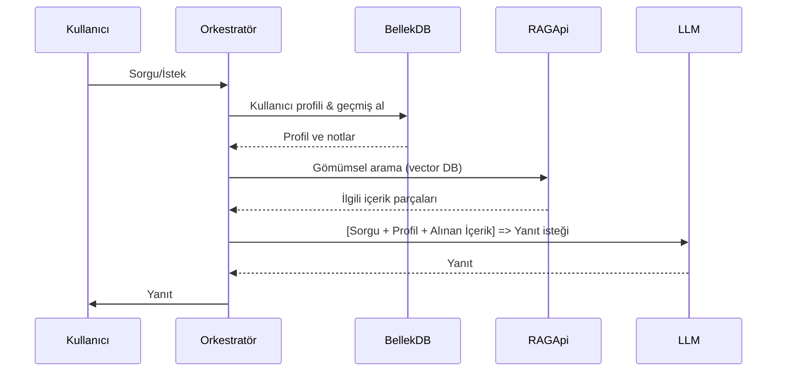

# Yönetici Özeti  
Kişiselleştirilmiş görev odaklı yapay zeka ajanları, çok adımlı iş akışları ile dış veri kaynaklarını kullanan, kullanıcının tercih ve geçmişini hatırlayan akıllı sistemlerdir. Bu ajanlar genellikle bir “orkestrasyon” katmanında LLM’lerin (Büyük Dil Modelleri) yeteneklerini aracılar (tool), bilgi erişim (RAG – Retrieval Augmented Generation) ve bellek mekanizmalarıyla birleştirir【8†L99-L103】【44†L269-L278】. Kullanıcı isteği alındığında profil modelleme, bellek yönetimi, planlama ve eylem yürütme gibi bileşenler birlikte çalışarak kişiselleştirilmiş yanıt üretir【45†L249-L254】【45†L219-L224】. Örneğin bir acente; kullanıcının profil bilgisini yükler, mevcut sorgu için alakalı geçmiş notları ve belgeleri vektör aramasıyla getirir, ardından LLM’e hem kullanıcı geçmişini hem anlık bağlamı içeren bir metin vererek sonuç oluşturur. Sonuçlar sürekli kullanıcı geri bildirimi ile güncellenerek ajan zaman içinde öğrenir【45†L219-L224】【21†L157-L163】. 

Bu raporda, mimarilerden teknoloji yığınlarına, veri işlem hattından dağıtım desenlerine kadar çok yönlü bir analiz sunulmaktadır. LangChain, LlamaIndex, Hugging Face, Rasa, Botpress gibi açık kaynak çerçeveler ile AWS Bedrock, Azure AI (Foundry, OpenAI), Google Vertex AI gibi hizmetler değerlendirilecek; kullanıcı profili, etkileşim kayıtları ve gömme veritabanlarıyla kişiselleştirme veri akışları ele alınacaktır. Ayrıca örnek bir ajan akışı ve dağıtım topolojisi mermaid diyagramlarıyla gösterilecek, kıyaslama tabloları ile araç ve servisler karşılaştırılacaktır. Son olarak değerlendirme metrikleri, test yaklaşımları ile maliyet, gecikme ve güvenlik gibi zorluklar incelenecektir.  

## Ajan Mimarileri ve Bileşenleri  
Kişiselleştirilmiş ajanlar genellikle **çok ajanlı sistemler** (Multi-Agent Systems) veya çok modüllü mimariler üzerine kuruludur. Her ajan, LLM tabanlı bir “beyin” ile araçlar ve dış veri kaynaklarını kullanarak bir alt-görevi yerine getirir. Orkestrasyon katmanı (örneğin LangChain, CrewAI, veya bulut tabanlı AgentCore) bu ajanları senkronize eder【12†L116-L124】【41†L212-L221】. Örneğin LangChain dokümantasyonu, bir RAG iş akışının indeksleme, arama, bağlam ekleme ve model çağrısı aşamalarını sıralı hale getiren bir ajan orkestrasını gösterir【8†L99-L103】【5†L269-L277】. Microsoft Agent Framework ve Google Vertex AI Agent Engine gibi platformlar da benzer biçimde **session**, **memory bank** ve **güvenlik** modülleri içerir【13†L161-L169】【41†L233-L241】.

Ajanların temel bileşenleri şunlardır:  
- **Model (LLM)**: ChatGPT, Claude, Gemini gibi büyük dil modelleri. LangChain gibi çerçeveler birden çok sağlayıcıyı destekler (OpenAI, Azure, Google, AWS, HuggingFace vb.)【44†L269-L278】【44†L409-L418】.  
- **RAG (Bilgi Ekleme)**: Vektör veritabanlarından alakalı belgeleri getirerek modele bağlam sağlar. Bu aşama veri parçalarının gömümlenmesi (embedding) ve arama yapılmasını içerir【15†L117-L125】【15†L129-L130】.  
- **Bellek ve Kişiselleştirme Katmanı**: Kısa ve uzun süreli bellek modülleri kullanarak geçmiş etkileşimler ve kullanıcı tercihleri tutulur【21†L157-L163】【23†L56-L64】. Azure Foundry ve Google Memory Bank gibi hizmetler, kullanıcının diyalog geçmişi, profil bilgisi gibi sabit verileri saklar【23†L56-L64】【41†L233-L241】. Bu bilgiler yeni konuşmalara ön bilgileri olarak enjekte edilir.  
- **Araçlar (Tools)**: Ajanların görevini tamamlamak için kullandığı dış servislerdir (örneğin arama API’leri, CRM ya da veritabanı sorguları). Orkestrasyon katmanı hangi araç kullanılacağına karar verir ve LLM’e gerekli komutları iletir【12†L116-L124】【15†L129-L130】.  
- **Planlama ve Yürütme**: Bazı ajan mimarilerinde, planlama modülü bir yüksek seviye görev listesi oluşturur. Ajan, alt görevler olarak ayrılan bu adımları sırasıyla gerçekleştirir【12†L122-L130】【21†L177-L186】. Multi-Ajan iş akışında özel ajanlar iş birliği yaparak karmaşık problemleri çözer.

Tüm bu bileşenler bir arada, aşağıdaki mermaid diyagramında gösterildiği şekilde bir ajan akışını oluşturur:



Bu akışta, ajan her kullanıcı isteğinde önce ilişkili geçmiş bilgilerini toplar, ardından en iyi yanıtı üretmek için LLM’i hem gerçek zamanlı sorguyla hem de daha önce saklanan kullanıcı bilgilerle besler. Sonuçlar, kullanıcının davranış ve geri bildirimleriyle tekrarlayan bir döngü içinde sürekli güncellenir【45†L219-L224】【21†L157-L163】. Örneğin *State Management with Long-Term Memory* çalışmasında, OpenAI Agents SDK kullanılarak benzer bir long-term bellek ve durum enjekte etme tasarımı gösterilmiştir【34†L518-L526】【34†L525-L530】.  

## Yaygın Teknoloji Yığınları ve Araçlar  
Ajan geliştirmede hem açık kaynak kütüphaneler hem de bulut hizmetleri yoğun şekilde kullanılır. Başlıca çerçeveler (framework) ve araçlar şunlardır: 

- **LangChain & LangGraph (OpenAI Labs)** – Python tabanlı, çok adımlı workflow’lar için popüler bir ajan kütüphanesi. RAG, bellek ve araç (tool) kullanımını entegre eder【8†L99-L103】【44†L269-L278】. Birden çok sağlayıcı (OpenAI, Azure, AWS, Google, HuggingFace vb.) ile çalışır【44†L269-L278】【44†L409-L418】. LangSmith ile takip (trace) ve değerlendirme imkânı sunar.  
- **LlamaIndex (eski adıyla GPT-Index)** – Açık kaynak RAG kütüphanesi. Belgeleri indeksleyip sorgulamaya olanak sağlar【15†L78-L82】. Gelişmiş RAG desenleri (soru bölümleme, sorgu yönlendirme vb.) için destek sunar【15†L78-L82】【15†L129-L130】.  
- **CrewAI / AutoGen / AutoGPT** – Otomatik ajan çalıştırma için script veya düşük kod çözümleri. Örneğin AutoGPT platformunda blok tabanlı ajan oluşturma, workflow yönetimi ve hazır ajan kütüphanesi vardır【29†L421-L430】【29†L447-L456】. Bu tür araçlar genellikle açık kaynaklı olup Python/Node.js ile konteyner olarak çalıştırılabilir.  
- **Rasa (Rasa Technologies)** – Geleneksel konuşma asistanı platformu. Kural-temelli akışlar ve NLU (niyet sınıflandırma) içerir. Rasa, LLM entegrasyonu ve eklentileriyle genişleyebilir. Şirket içi barındırmaya uygundur【36†L98-L105】.  
- **Botpress (Botpress Inc.)** – Açık kaynak, görsel bir konuşma botu oluşturma platformu. LLM-agnostik yapısıyla OpenAI, Anthropic gibi modellerle entegrasyon sağlar【36†L108-L116】. 190’dan fazla entegrasyon ve sürükle-bırak tasarım ile öne çıkar.  
- **Hugging Face** – Model depoları ve Transformers kütüphanesi ile en yaygın kullanılan açık LLM sağlayıcılarından biridir. Hugging Face Inference API ve Inferece Endpoints ile üretimde model çalıştırma imkanı sunar. Özel modellerin barındırılması ve kolay entegrasyon avantajı vardır.  
- **Microsoft Agent Framework (2024)** – Microsoft’un açık kaynak çerçevesi. Semantic Kernel ve AutoGen’u birleştirir. Kurumsal düzeyde gözlemlenebilirlik, güvenlik ve çoklu belleğe (ÇH, vektör DB) bağlantı sağlar【13†L161-L169】【41†L233-L241】. A2A protokolü ve MCP standardını destekler.  
- **Vertex AI Agent Builder (Google Cloud)** – Google’ın sunucu tarafı ajan platformu. "Memory Bank" ile kalıcı bellek, "Sessions" ile etkileşim kaydı, güvenli kod çalıştırma (Sandbox) gibi hizmetleri içerir【41†L233-L241】. Geniş bulut ekosistemine (BigQuery, Datastore, Cloud Functions vb.) erişim sunar.  
- **Amazon Bedrock (AgentCore)** – AWS’nin çoklu LLM sağlayıcılarını (Anthropic, AI21, Cohere, Grammarly, Mistral, Aleph-Alpha, yazma becerileriyle Claude, Amazon Titan vb.) tek API ile sunan platformu【15†L84-L92】【10†L156-L160】. AgentCore paketi bellek yönetimi, kimlik (identity), tarayıcı, kod yorumlayıcı, gözlemlenebilirlik, değerlendirme ve politika (guardrail) bileşenleri içerir【10†L156-L160】.  

Bu araç ve servislerin karakteristikleri aşağıdaki tabloda özetlenmiştir:

| Araç/Platform               | Sağlayıcı/Kaynak            | Tür/Kısa Açıklama                                                         |
|-----------------------------|-----------------------------|---------------------------------------------------------------------------|
| **LangChain / LangGraph**   | OpenAI Labs (Open Source)   | Çok-adımlı ajan orkestrasyonu, RAG, bellek, çoklu model entegrasyonu【8†L99-L103】【44†L269-L278】.  |
| **LlamaIndex**              | OAI GPT Index (Open Source) | Belgeler için indeksleme ve gelişmiş sorgu boru hattı (RAG)【15†L78-L82】.    |
| **Rasa**                    | Rasa Technologies (Open)    | Kural-temelli sohbet asistanı. Kurumsal dağıtım, COM (Conversational Action) modelleri içerir【36†L98-L105】. |
| **Botpress**                | Botpress Inc. (Open)        | Görsel bot oluşturucu, LLM-agnostik (OpenAI, Claude vb.), geniş entegrasyon【36†L108-L116】. |
| **Hugging Face**            | Hugging Face (Open)         | Model dağıtım ve barındırma, Transformers kütüphanesi, Inference API.       |
| **Microsoft Agent Framework** | Microsoft (Open Source)    | SK+AutoGen birleşimi, çoklu bellek bağlantısı, gözlemlenebilirlik, A2A desteği【13†L161-L169】. |
| **Google Vertex AI Builder**| Google Cloud (Ticari)       | Agent Engine, Memory Bank, değerlendirme araçları, Google ekosistemi entegrasyonu【41†L212-L221】【41†L233-L241】. |
| **AWS Bedrock AgentCore**   | Amazon (Ticari)             | Çoklu model desteği, özelleştirme (fine-tune), RAG, AgentCore bileşenleri (bellek, gözlem, güvenlik)【15†L84-L92】【10†L156-L160】. |
| **AutoGPT (Forge)**         | Significant-Gravitas (Open) | CLI/GUI ile ajan geliştirme. Blok bazlı iş akışları, hazır ajan marketi【29†L421-L430】【29†L447-L456】. |

Bulut tarafında başlıca hizmetler şunlardır:

| Hizmet                  | Sağlayıcı    | Özellikler (Öz)                                                                               |
|-------------------------|--------------|----------------------------------------------------------------------------------------------|
| **Amazon Bedrock**      | AWS          | Çoklu FM (Anthropic, Cohere, Mistral, Titan vb.), fine-tuning, RAG eklentisi, %500 düşük gecikme modu, agent bileşenleri (bellek, kod, gözlem, politika)【15†L84-L92】【10†L156-L160】. |
| **Azure OpenAI + Foundry** | Microsoft | GPT/Gemini modelleri API, *Foundry Agent Service* ile uzun dönem bellek (profil, özet kayıtları) destekler【23†L56-L64】【23†L129-L138】. Şifreleme ve yasal uygunluk (GDPR, HIPAA) için sertifikalara sahiptir. |
| **Google Vertex AI**     | Google Cloud | Gemini modelleri, *Agent Builder* ile entegre ajan geliştirme (Memory Bank, Code Execution, gözlem)【41†L212-L221】【41†L233-L241】. Çeşitli veri kaynakları ve A2A protokolü desteği. |
| **OpenAI ChatGPT & API**| OpenAI       | GPT-4/5 modelleri, araç çağrısı fonksiyonu (plugin), RFT/RLHF ile özelleştirme【31†L665-L674】. C2S (Chat Completions), embed modelleri. |
| **Anthropic Claude**     | Anthropic    | Claude X, Sonnet modelleri API. Güvenlik odaklı LLM çözümleri.                                      |
| **HuggingFace Infinity** | Hugging Face | Barındırılan Mistral, Llama, Phi vb. modeller, düşük gecikme için hızlandırılmış GPU/TPU kümesi.   |

## Veri Kaynakları ve Kişiselleştirme Boru Hatları  
Kişiselleştirilmiş ajanlar büyük ölçüde veriyle beslenir. Kullanıcı profilleri, etkileşim geçmişi ve gömme (embedding) veritabanları en önemli kaynaklardır.  

- **Kullanıcı Profilleri**: Kimlik bilgisi, demografi, tercihler (ör. dil, diyet, satın alma geçmişi) gibi statik bilgiler. Azure Foundry örneğinde “User profile memory” olarak tutulur (ör: takma isim, alerji, dil tercihi)【23†L129-L138】. Bu bilgiler her oturum başında modele ön bilgi olarak eklenir.  
- **Etkileşim Kayıtları**: Sohbet geçmişi, form girişleri, tıklama ve kullanım logları. Zaman içinde modelin öğrenmesi için önemli sinyal oluşturur. Çoğu ajan, son sohbetleri veya görev adımlarını özetleyerek kalıcı belleğe not alır【23†L129-L138】. Örneğin, Azure’ın Foundry servisi “Chat summary memory” ile her oturumun özetini tutar, yeni oturuma bunlar entegre edilir【23†L129-L138】.  
- **Gömme Tabanlı Bilgi Kaynakları**: Kurumsal dokümanlar, ürün katalogları veya veri göllerinin embedding’i alınır ve vektör veri tabanlarında indekslenir. Pinecone, Weaviate, Qdrant, Chroma gibi araçlar kullanılır. Sorgu geldiğinde kullanıcı sorgusu gömülür, en yakın vektörlere bakılır ve ilişkili metinler çekilir. Bu sayede model kuruma ait özel bilgiyle desteklenir【15†L117-L125】【15†L129-L130】.  
- **Canlı Veri Entegrasyonu**: Gerçek zamanlı bilgiler (ör. hava durumu, finansal veriler) gerektiğinde API çağrılarıyla alınabilir. Orkestratör, gerektiğinde dış servislere bağlantı kurar (ör. Flight API, CRM sorgusu vb.). Böylece ajan dinamik çevresel verilerle güncel kalır.  
- **Gizlilik ve Uyum**: GDPR, KVKK gibi düzenlemelere uyum için veri anonimleştirme, şifreleme ve erişim kontrolleri şarttır. AWS ve Azure hizmetleri veri sahipliğini garanti eder; örn. Bedrock verinizi eğitimde kullanmaz, yalnızca belirtildiği senaryoda tutar【10†L116-L124】. Kişisel veriler bellekten saklanırken erişim ve silme politikaları (örn. “sunucu ve unut” talepleri) göz önünde bulundurulur.

## Dağıtım ve Operasyon Desenleri  
Ajanları üretime almak, yüksek yük ve düşük gecikme şartlarını karşılamayı gerektirir. Öne çıkan desenler:  

- **Bulut vs. Uç (Cloud vs Edge)**: Çoğunlukla bulutta GPU/TPU kaynaklı sunucularda çalıştırılır. AWS (ECS/EKS, Lambda), Azure (Kubernetes, Function), GCP (Cloud Run, AI Platform) gibi altyapılarda ölçeklenir. Kritik gizlilik/yanıt hızı ihtiyaçlarında, özelleştirilmiş modeller uç cihazda (örn. Llama tarzı modeller) çalıştırılabilir. Edge dağıtımlar için C++/Rust çeviri veya ONNX optimizasyonu yapılabilir.  
- **Mikroservis Mimarisi**: Her ana bileşen (API geçidi, ajan orkestratörü, LLM sunucu, bellek veritabanı, ön yüz) ayrı konteyner/mikroservis olarak konuşlandırılır. Bu yapı istekleri kuyruğa atma ve paralel işleme imkanı tanır. Örneğin birkaç ajan paralel çalışırken Kafka/RabbitMQ ile birbirine mesaj gönderir veya bir meslek sistemi kullanır. AWS Lambda veya Azure Functions ile sunucusuz çalışma da tercih edilebilir. Çapraz hizmet kimlik doğrulama (API anahtarı, IAM rolleri) kullanılarak güvenli entegrasyon sağlanır.  
- **Otomasyon ve CI/CD**: Kodu Git ile sürümleyen, Docker ile paketleyen ortamlarda sürekli teslim (CI/CD) boru hatları kurulur. Kod güncellemeleri önce test ortamında konuşlandırılır (ör. dev/staging kubernetes cluster), entegrasyon testleri otomatik çalıştırılır. Başarılı olursa prod ortama geçilir. AWS CodePipeline, Azure DevOps veya Jenkins sık kullanılır.  
- **Ölçekleme ve Performans**: Beklenmedik trafik artışları için yatay ölçek sağlanır. Konteynerler otomatik olarak çoğaltılır veya örneğin LangChain tabanlı hizmetlerde **LangChain Embeddings API** kullanılarak önbellekleme yapılır. Model yanıt süresi için durum özeti veya embedding sorgu sonuçları önbelleklenebilir. AWS Bedrock örneğinde; *promised* düşük gecikme için rezerve kapasite sağlanır【15†L84-L92】.  
- **Gözlemlenebilirlik**: Dağıtık sistemde izleme zorunludur. Uygulama-logları için ElasticSearch/CloudWatch, metrikler için Prometheus/Grafana, takip için Jaeger/OpenTelemetry gibi çözümler kurulabilir. Vertex AI Agent Engine, tüm etkileşimleri “Sessions”a, bellek öğelerini “Memory Bank”a kaydeder【41†L233-L241】. LangChain ise **LangSmith** platformuyla her LLM ve araç çağrısını izleyip analiz etmeye imkan verir. Anomali veya performans sorunlarını tespit için uyarılar tanımlanır.  

Aşağıdaki mermaid diyagramı, tipik bir mikroservis temelli dağıtım topolojisini özetler:  

```mermaid
flowchart LR
    Kullanici[İstemci] -->|HTTPS| API_Gateway[API Geçidi]
    API_Gateway --> Orkestrator[Ajan Orkestratörü (Kubernetes)]
    Orkestrator --> LLM_Service[LLM Model Sunucuları]
    Orkestrator --> RAG_Service[Vector DB Servisi]
    Orkestrator --> Tools_Service[Araç Entegrasyonu]
    Orkestrator --> Memory_Service[Bellek Veri Tabanı]
    Orkestrator -->|Loglar| Log_Service[Log/Monitör Servisi]
    Memory_Service --> DB[(NoSQL Veritabanı)]
    RAG_Service --> DB
```

Bu yapıda API geçidi (veya yük dengeleyici) dış istekleri alır, ajan orkestratörü bunları ilgili ajan iş akışlarına yönlendirir. Ajan gerektiğinde LLM servisine, hafızaya veya araç servislerine çağrıda bulunur. Tüm servisler ortak izleme ve güvenlik çerçevesi altındadır.

## Örnek Mimari ve Kod Projeleri  
Gerçek dünyada bu yaklaşımlara dair birçok örnek ve açık kaynak proje bulunur:  

- **Çok-Ajanlı RAG Örneği**: The-Swarm-Corporation’un *Multi-Agent-RAG-Template* projesi, birden çok yapay zeka ajanının dokümanları birlikte işleyip analiz ettiği bir senaryo sunar【26†L279-L288】. Bu şablonda ajanlar kolayca eklenebilir, farklı LLM ve RAG motorları (örneğin GROQ + LlamaIndex) seçilebilir. Belgelerin esnek şekilde ayrıştırılması, yeni verilerin anlık endekslenmesi gibi özellikler bulunur【26†L279-L288】【26†L290-L299】.  
- **LangGraph Ajanları**: LangChain’in *LangGraph Studio* örneklerinde, karmaşık RAG iş akışları grafik olarak modellenir【27†L307-L315】. Örneğin bir “Researcher Graph” altakışı, “LangChain” konulu adımlara göre sorgu bölümü ve paralel belge aramalarını gösterir. Bu şablonları inceleyerek, kendi çok aşamalı görev akışlarınıza fikir alabilirsiniz【27†L307-L315】.  
- **LangChain ve LlamaIndex Tutorial’ları**: LangChain ve LlamaIndex dokümantasyonları, basit bir metin sorgusu üzerinden RAG ajanı oluşturmayı gösterir【3†L118-L125】【15†L117-L125】. Örneğin AWS’in blogu, bir dosya dizinini vektörleştirip sorgulayarak “Fransa’nın başkenti nedir?” sorusuna yanıt üretir【15†L117-L125】. Kod örnekleri GitHub’daki *rag-research-agent-template* gibi repolarda da mevcuttur【27†L283-L292】【26†L279-L288】.  
- **AutoGPT ve Benchmarks**: AutoGPT’nin *agbenchmark* aracı, ajan performansını ölçmek için kullanılır【29†L532-L540】. Bu tür araçlar, tıpkı birim testi gibi ajanınızın farklı görevlerde nasıl davrandığını otomatik test eder.  

Bu ve benzeri projeler üzerinden süreçler incelenerek, kendi sistem mimarinizi şekillendirmek mümkündür. (Projelerin bağlantıları paragraf içinde verilmemiştir ancak [26],[27],[29] kaynak kod depoları örnek alınabilir.)

## Değerlendirme Metrikleri ve Test Stratejileri  
Ajanların başarısını ölçmek için hem retrieval hem de yanıt oluşturma kalitesi değerlendirilir. Yaygın metrikler şunlardır:  

- **Retrieval Kalitesi**: Anahtar, ilgili bağlamı geri getirebilme oranı. Örneğin *recall@K* veya *MAP* gibi istatistikler ile aranan konuya dair doğru belge bulunma oranı ölçülür【39†L88-L97】. Ayrıca insan veya LLM tabanlı yargıçlarla bağlamın alakalılığı puanlanabilir.  
- **Yanıt Kalitesi**: Üretilen yanıtların doğruluğu, tutarlılığı ve eksiksizliği. Değerlendirme referanslı (cevap anahtarları karşılaştırması) veya referanssız yapılabilir. Referanssız yöntemlerde yanıtların gerçek dünyayla uyumu, ton uygunluğu veya yapısal bütünlüğü kontrol edilir【39†L88-L97】. Çünkü RAG sistemi “model neden yanıtlamadı” (geri alınamayan bilgi) ve “model neden yanlıştı” (halüsinasyon) olarak iki aşamada incelenmelidir【39†L88-L97】.  
- **Kullanıcı Deneyimi Metriği**: Müşteri memnuniyeti, doğru yardım sağlama oranı veya etkileşim süresi gibi üst düzey ölçüler. Özellikle kişiselleştirilmiş sistemlerde “kullanıcının önerilen yanıtları benimseme oranı” ve “uzun vadeli etkileşim devamlılığı” gibi metrikler ön plana çıkar.  
- **Performans ve Kayıp Ölçümleri**: Gecikme süreleri (latency) ve işlem maliyeti. Örneğin API gecikmesi ve GPU kullanımını ölçen metrikler. Performansı düşüren darboğazlar için izleme yapılır.  

Test stratejileri arasında birim ve entegrasyon testleri, simülasyonla ajan senaryoları oluşturma (örneğin EvidentlyAI’nin RAG testleri gibi【39†L88-L97】【39†L98-L101】) ve hata/uç durum testleri bulunur. Yapay (sentetik) verilerle test veri seti oluşturmak, *adversarial* saldırılara karşı güvenlik testleri uygulamak önemlidir【39†L98-L101】. Canlı sisteme geçmeden önce A/B testleriyle farklı ajan versiyonları karşılaştırılabilir. Özetle, her bileşen (retrieval, model, araçlar) ayrı ayrı incelenmeli ve uçtan uca performans doğrulanmalıdır【39†L88-L97】【39†L98-L101】.

## Zorluklar ve En İyi Uygulamalar  
Kişiselleştirilmiş ajanlar geliştirmede çeşitli zorluklar vardır, ancak aşağıdaki uygulamalar yaygın olarak önerilir:

- **Maliyet ve Kaynak Yönetimi**: Büyük modellerin API kullanımı pahalıdır. Promtları optimize etmek, model boyutunu ihtiyaca göre seçmek veya yük dağıtımı yapmak önemlidir. AWS Bedrock gibi hizmetler otomatik ölçekleme ile kaynakları dinamik yönetir【10†L134-L142】. Ayrıca bilgiyi önbelleğe almak (cache), küçük modelleri veya hibrit modelleri (örneğin bir taslak için küçük LLM, son cevap için büyük LLM) kullanmak maliyeti azaltır.  
- **Gecikme (Latency)**: Karmaşık akışlar kullanıldığında yanıt süreleri uzayabilir. Paralel API çağrıları ve hızlı vektör arama altyapıları (örn. Pinecone, Qdrant) bu sorunu hafifletebilir. AWS gibi servislerde “provisioned” mod düşük gecikme garantisi sunar【15†L84-L92】. Kullanılmayan kaynaklar kapatılarak kuyruk gecikmeleri azaltılır.  
- **Halüsinasyon ve Güvenlik**: LLM’ler zaman zaman hayali bilgi üretebilir (halüsinasyon). RAG ile doğru bağlam eklemek sık önlem olmakla birlikte, ayrıca **dış politika-kılavuzları** (guardrails) kullanılır. Örneğin Amazon Bedrock ve Azure AI’da zararlı veya yanıltıcı çıktı olasılığını azaltmaya yönelik güvenlik kontrolleri yer alır【10†L116-L124】【15†L129-L130】. OpenAI’in RLHF süreci veya Microsoft’un içsel filtreleri de kullanılabilir.  
- **Veri Güvenliği ve Uyumluluk**: Kullanıcı verisi hassastır. Katmanlı güvenlik (şifreleme, IAM, VPC/SC) kullanılır; veri saklama politikaları sıkı tutulur. Örneğin Bedrock veri sahiplidir ve eğitim için model kullanılamaz【10†L116-L124】. Bellek sistemlerinde saklanan kişisel bilgiler için silme ve anonimleştirme mekanizmaları uygulanır.  
- **Sürdürülebilirlik ve Yazılım Kalitesi**: Çok sayıda bileşeni yönetmek karmaşıktır. Kod tekrarı olmaması için modüler geliştirilmeli, kapsamlı logging ve dokümantasyon olmalı. Öngörülemeyen davranışlar için otomatik alarmlar kurulmalı. Otomasyon (CI/CD, test otomasyonu) sürekli teslimatın temelidir.  

Bu zorluklarla başa çıkmak için **önce basit başlayıp iteratif geliştirmek** iyi bir yaklaşımdır. İlk adımda sınırlı kapsamlı bir ajan kurup test edip, sonra araç ekleme veya memory özelliklerini aşamalı ekleyerek ilerlemek önerilir. Ayrıca güvenlik ve gizlilik tasarımını baştan düşünmek (privacy by design) kritik önem taşır.  

**Kaynaklar:** Yukarıdaki analiz, resmî dokümantasyonlar (LangChain, AWS, Azure, Google), akademik incelemeler ve endüstri blogları referans alınarak hazırlanmıştır【8†L99-L103】【10†L156-L160】【21†L157-L163】【23†L56-L64】【39†L88-L97】. Spesifik kod örnekleri ve mimari şablonlar için ilgili GitHub projelerine (The-Swarm RAG, LangChain/Graf, AutoGPT vb.) bakılabilir【26†L279-L288】【27†L307-L315】【29†L421-L430】.