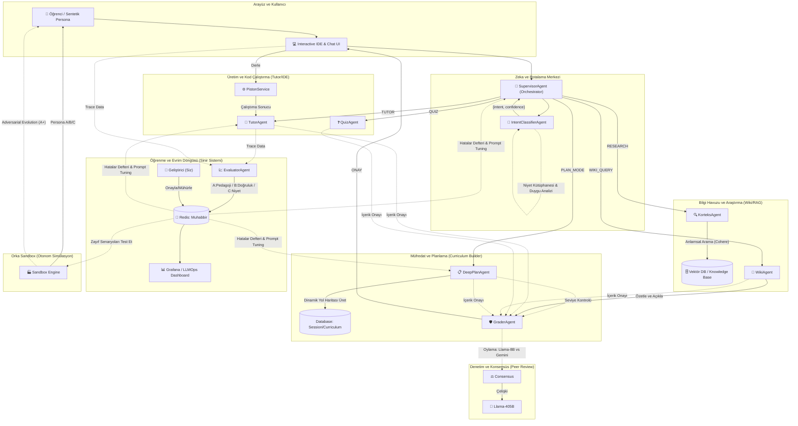
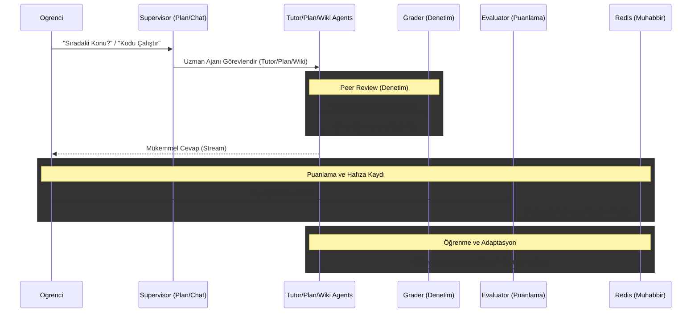
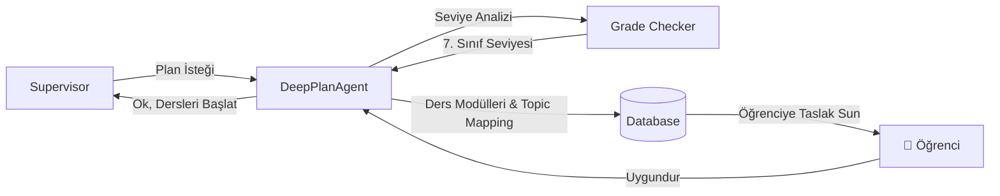
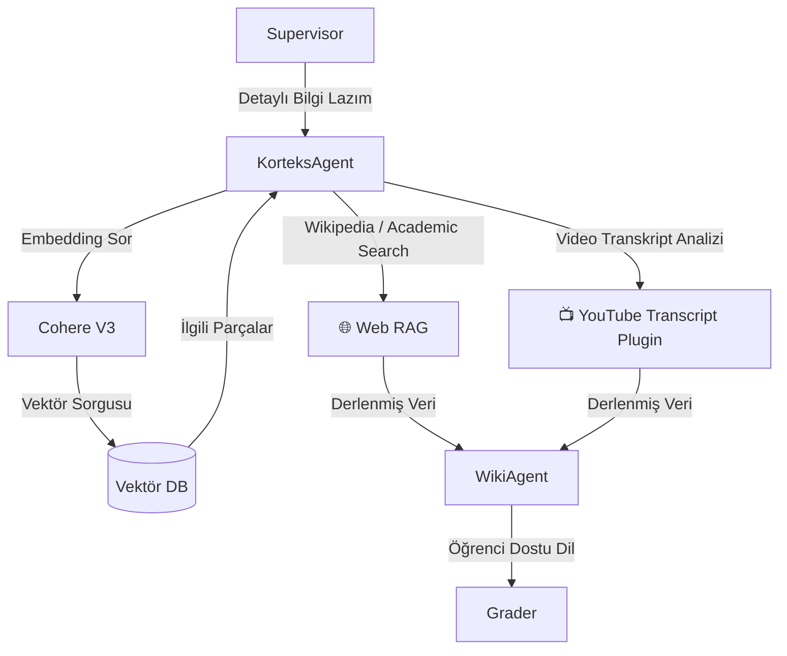
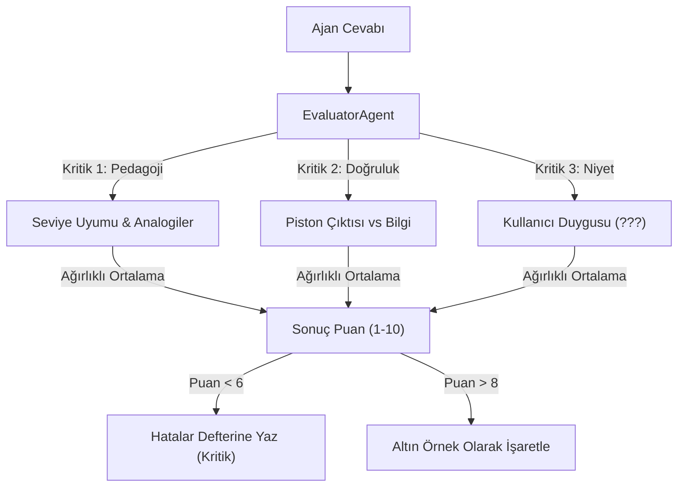
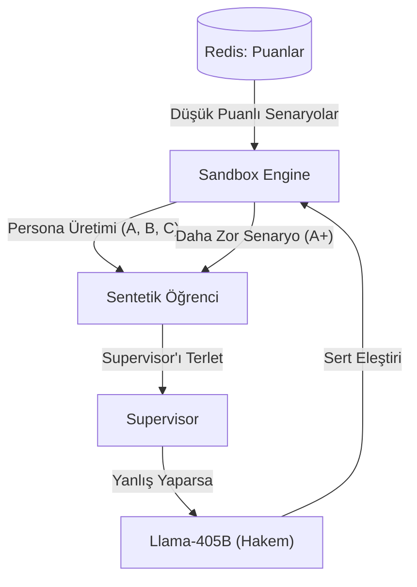

# 🔱 Orka AI: Konsolide ve Parçalı Sistem Mimarisi (Final State)

Bu belge, Orka AI projesinin bütününe ve her bir modülün iç işleyişine odaklanan nihai teknik anayasadır.

---

## 🏗️ 1. GLOBAL HİBRİT MİMARİ (Full Stack Flowchart)
*Büyük Resim: Tüm ajanların, servislerin ve veri yollarının kesiştiği ana harita.*

---

## 💬 2. MESAJIN TEKNİK YOLCULUĞU (Sequence Diagram)
*Bir isteğin (Ders, Soru veya Plan) ajanlar arasındaki anlık fısıldaşmaları.*

---

## 📋 3. MÜFREDAT VE PLANLAMA (DeepPlan) AKIŞI
*Sistemin bir konuyu nasıl parçalara ayırdığı ve öğrenciden onay aldığı süreç.*

---

## 📖 4. BİLGİ HAVUZU VE WİWİ ENTEGRASYONU
*RAG (Retrieval-Augmented Generation) katmanının çalışma mantığı.*

---

## 💹 5. PUANLAMA (Evaluation) ALGORİTMA MANTIĞI
*EvaluatorAgent hangi kriterlere göre puan keser veya verir?*

---

## 🏭 6. ORKA SANDBOX & OTONOM EVRİM (OALL)
*Sistemin kendi kendine zorlaşan senaryolarla gelişmesi.*

---

> [!NOTE]
> Bu modüler parçalar, en üstteki Global Mimari'nin "zoom yapılmış" teknik halleridir. Hiçbir kısıtlama kalmadı; Orka'nın tüm damarları burada.
