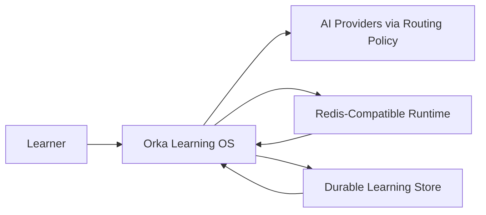
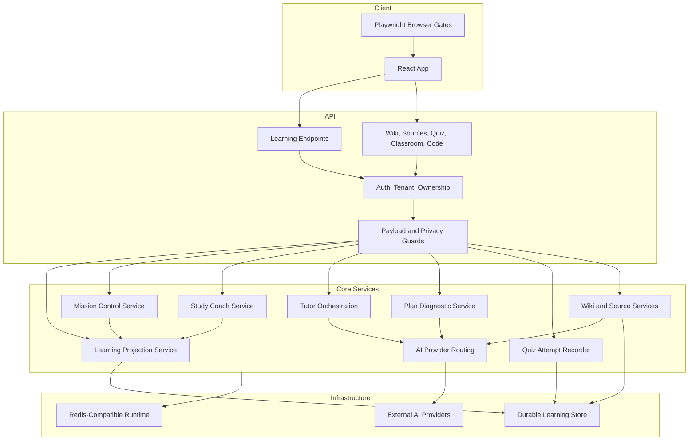
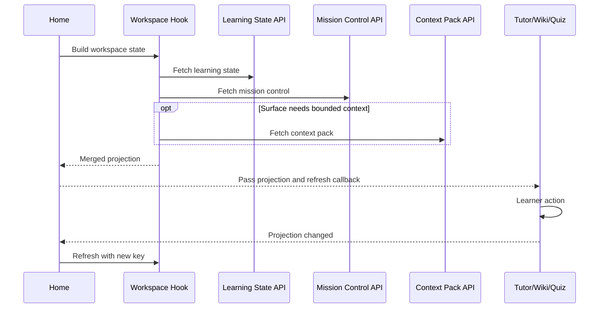
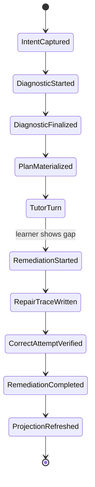
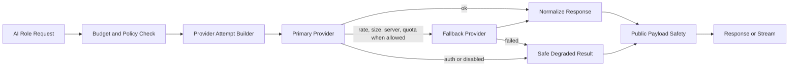
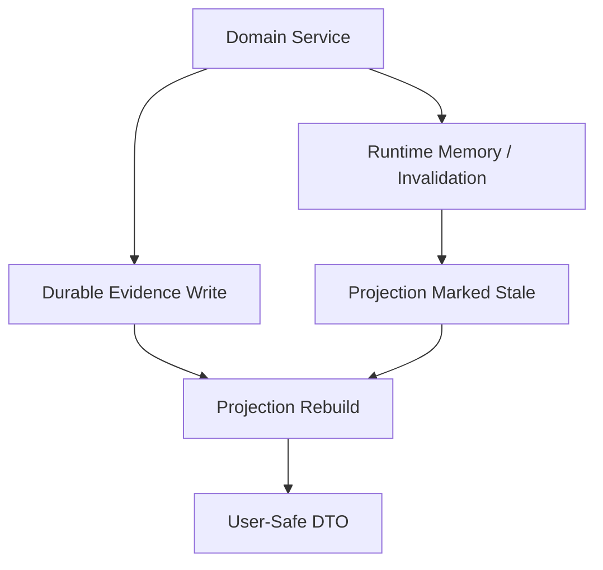
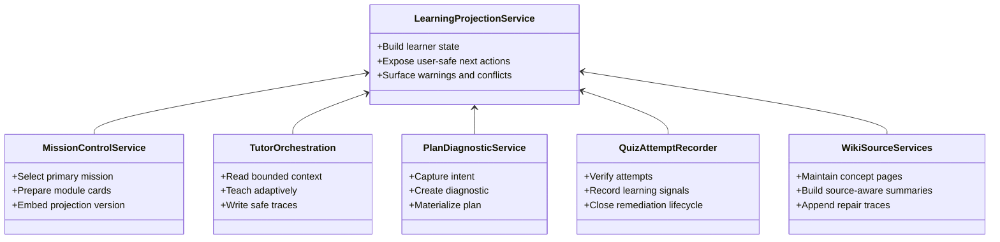
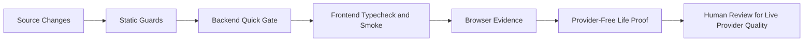

# Orka System Architecture

This document describes the current Orka Learning OS architecture with
implementation-aligned UML. It intentionally avoids database table contents,
secret names, provider payloads, raw prompts, and operational identifiers.

## 1. System Context

## 2. Container View

## 3. Learning Projection Binding

The central projection is the shared product truth for Home, Tutor, Wiki,
Sources, Review, and Quiz.

## 4. Diagnostic to Remediation Loop

The loop is closed by durable signals and a refreshed projection. Completion is
only recorded after a verified correct attempt follows a remediation start for
the same learning area.

## 5. Provider Routing and Degradation

The provider layer classifies failure kinds and keeps live provider checks
separate from deterministic gates. Gemini remains opt-in when disabled by
configuration. Cohere can participate in configured fallback paths.

## 6. Redis-Compatible Runtime Behavior

Redis-compatible runtime paths are used for short-lived memory and invalidation,
not as the sole source of learning truth.

If Redis is unavailable, durable writes must remain safe. Runtime convenience
can degrade, but learner state must not be corrupted by cache failure.

## 7. Service Responsibilities

## 8. Public Payload Rules

All public DTOs should be learner-safe. They may include labels, summaries,
readiness states, next actions, warnings, and opaque references. They must not
include hidden prompts, provider payloads, raw source chunks, raw tool data,
local paths, stack traces, secrets, bearer tokens, JWTs, unsafe owner
identifiers, or answer keys before submission.

## 9. Release Gate Shape

Default gates are deterministic and provider-free. Live provider checks are an
explicit operator action and are not required for normal local regression.

## 10. Design Principles

- One central projection for learner state.
- Safe degradation over silent corruption.
- Provider routing behind abstractions.
- Redis-compatible runtime behavior without exposing runtime internals.
- Durable learning evidence first; cache and runtime memory second.
- Public payloads are summaries, labels, references, and actions, not internals.
- Browser evidence is required for UI interaction confidence.
