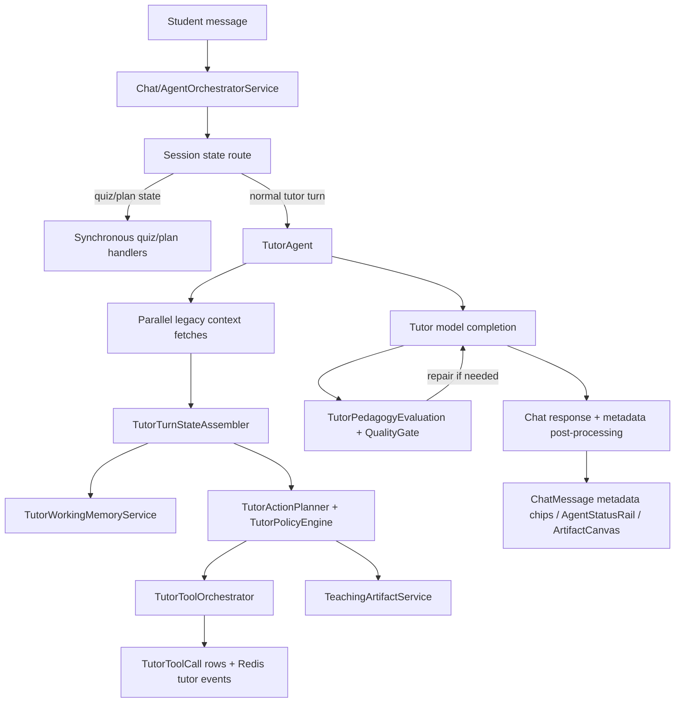
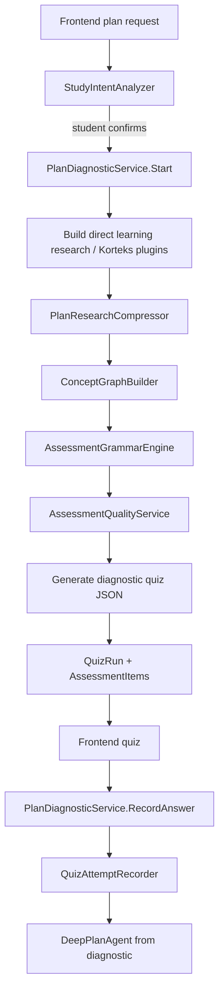
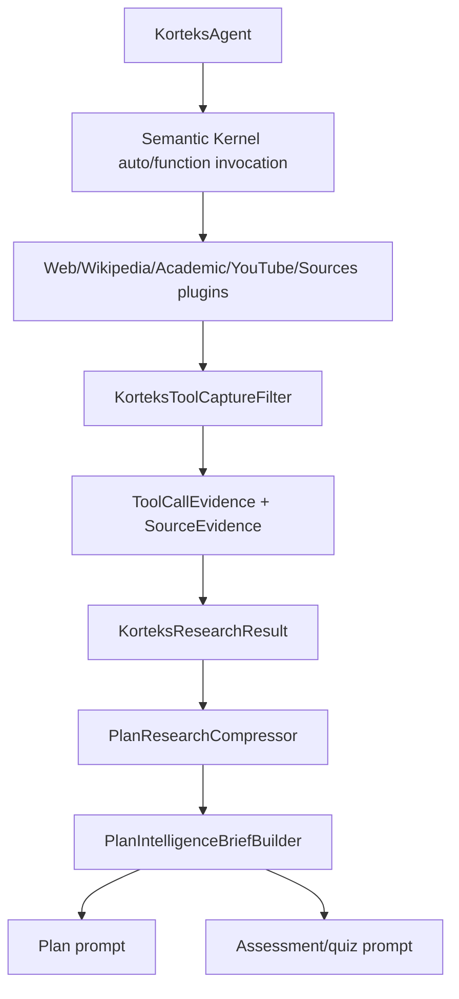
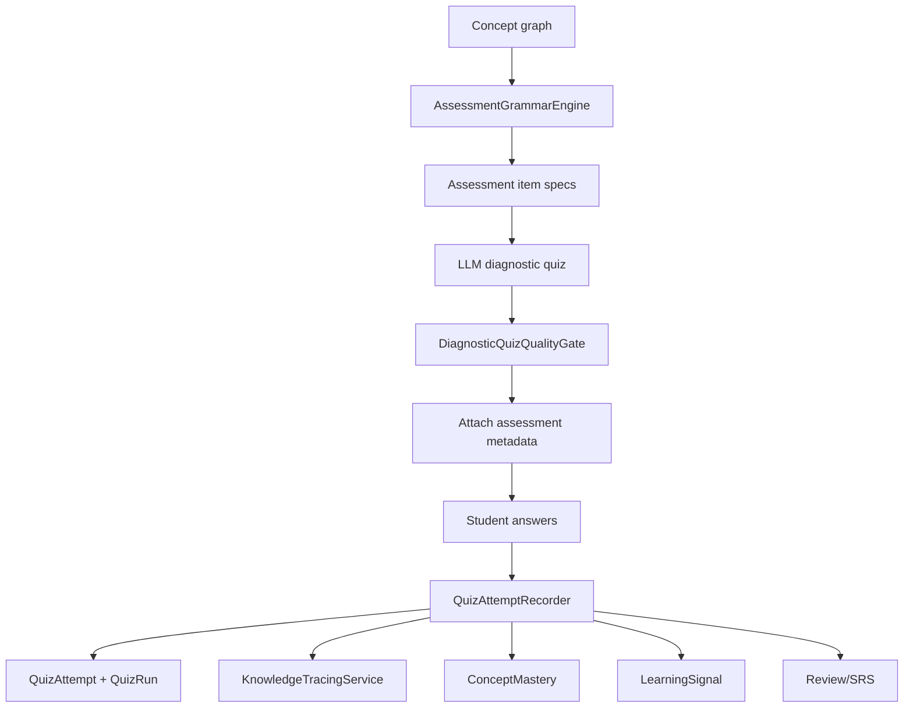
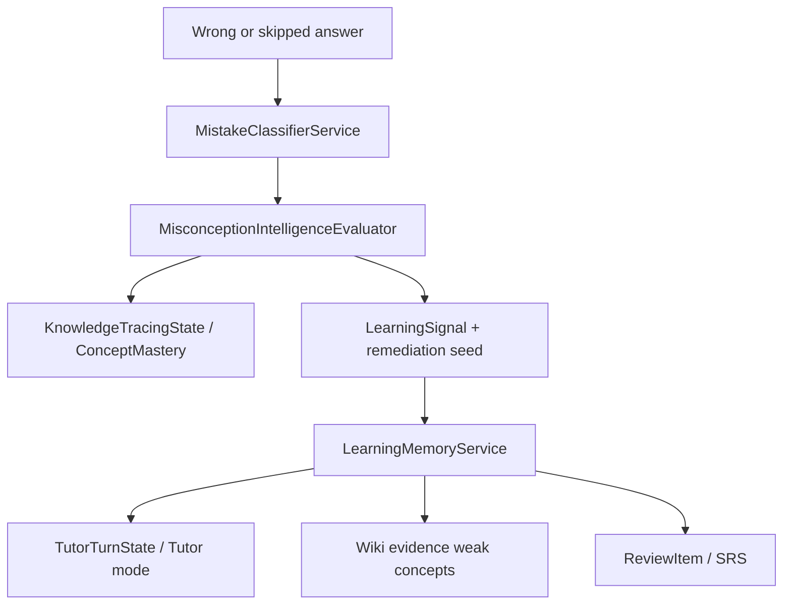
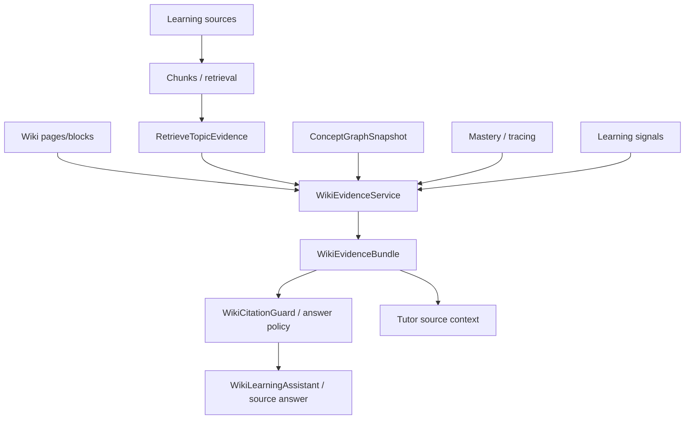
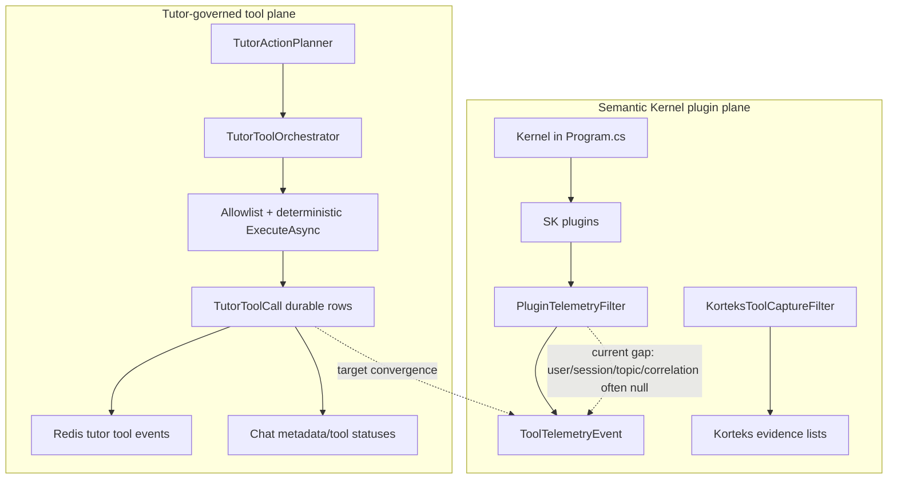
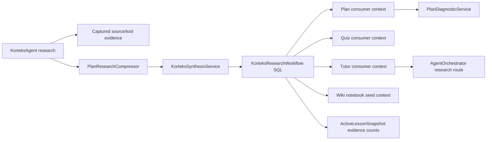
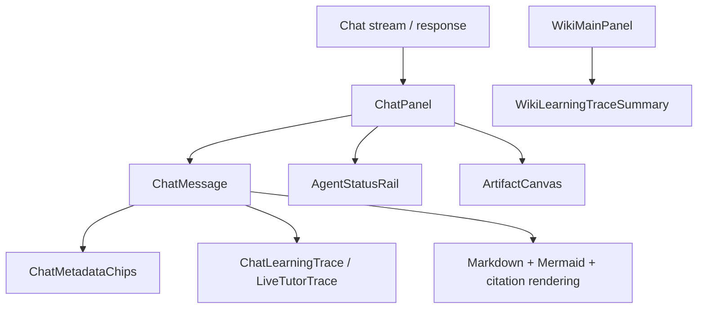

# Orka Learning OS Contract Map

Status: Pack 0 source-of-truth architecture map  
Scope: Main Learning OS Professionalization  
Last reviewed: 2026-05-18

## Purpose

Orka is a student-facing learning system. Tutor is the pedagogical owner of the learner experience; Korteks researches; RAG/Wiki provides source-grounded knowledge; quiz and assessment measure concepts and misconceptions; tools are governed capabilities; Central Exams is a domain module inside this architecture, not the architecture itself.

This document maps the current repo reality and locks the professionalization roadmap. It does not claim every target is already implemented.

## Source-Of-Truth Docs

Current source-of-truth:

- `docs/architecture/orka-learning-os-contract-map.md`
- `docs/project-state/current-roadmap.md`
- `docs/dev-contract.md`
- `docs/frontend-contract.md`
- `docs/tutor-pedagogy-visualization-contract.md`
- `docs/codex-skills/README.md`

Historical / reference docs:

- `docs/audit/orka-ana-tamir-roadmap-2026.md` - original Tutor-centered repair roadmap.
- `docs/audit/orka-v2.9-quality-reality-gate.md` - earlier quality reality gate.
- `docs/audit/orka-v2.10-heavy-learning-flow-eval.md` - gated heavy learning flow evaluation.
- `docs/audit/tool-activation-tutor-consumption-hardening.md` - tool activation and Tutor consumption hardening.
- `docs/audit/living-learning-organism-map.md` - optimistic system map; use as historical evidence, not a final professional launch claim.
- `docs/architecture/ORKA_MASTER_GUIDE.md` and `docs/architecture/ORKA_SYSTEM_ARCHITECTURE.md` - legacy architecture guides; useful for history but not precise enough for Pack 1-11 implementation ownership.

## Service Ownership Map

| Area | Current owners | Current evidence | Target owner after professionalization |
|---|---|---|---|
| Intent / request classification | `StudyIntentAnalyzer`, plan diagnostic entrypoints, orchestrator state checks | Plan flow requires approved intent before Korteks in `PlanDiagnosticService` and frontend plan intent UI | Pack 1 snapshot contract records approved intent as active learning state |
| Korteks research | `KorteksAgent`, SK plugins, `KorteksToolCaptureFilter` | Research can auto-invoke Semantic Kernel tools and capture source evidence | Pack 3 Korteks workflow produces bounded research and synthesis artifacts |
| Research compression / synthesis | `PlanResearchCompressor`, `PlanIntelligenceBriefBuilder` | Plan diagnostic compresses Korteks output before quiz/plan | Pack 3 makes synthesis a formal contract for plan, quiz, wiki, and Tutor |
| Plan generation | `DeepPlanAgent`, `PlanDiagnosticService` | Uses research brief, adaptive context, concept graph guidance and structural minimums | Pack 5 adds semantic plan scoring and curriculum sequencing gates |
| Plan quality | `DeepPlanAgent` structural rules, heavy eval docs, quality report support | Minimum module/lesson count exists; topic-specific semantic quality is not fully centralized | Pack 5 `PlanQualityScorer` and revision loop |
| Quiz / assessment generation | `AssessmentGrammarEngine`, `DiagnosticQuizQualityGate`, `QuizAgent`, `PlanDiagnosticService` | Assessment grammar creates concept/difficulty/misconception specs; quality gate blocks product-label leaks | Pack 6 unifies quiz generation and final item quality |
| Quiz attempt recording | `QuizAttemptRecorder` | Writes attempts, quiz run counts, XP, review pressure, learning events, learning signals | Pack 6 normalizes every assessment flow into one result pipeline |
| Misconception detection | `MistakeClassifierService`, `MisconceptionIntelligenceEvaluator`, `QuizAttemptRecorder` | Wrong answers create mistake classifications and remediation seeds | Pack 6 formal misconception engine with Tutor/Wiki/plan handoff |
| Knowledge tracing / mastery | `KnowledgeTracingService`, `ConceptMasteryService`, `SkillMasteryService` | Attempts update knowledge tracing and concept mastery | Pack 1 snapshot and Pack 6 assessment pipeline expose one learner-state contract |
| Learning memory | `LearningMemoryService` | Builds weak/strong topics, remediation-ready items, confidence summary | Pack 1 makes memory one input to `StudentContextSnapshot` |
| Adaptive planner | `AdaptiveStudyPlannerService`, `DeepPlanAgent` | Uses learner evidence but is not the single lesson planner contract | Pack 5 connects plan quality, curriculum sequencing, and memory |
| Tutor turn state | `TutorTurnStateAssembler`, `TutorWorkingMemoryService`, `TutorAgent` | Builds turn state from graph, profile, wiki/source, learning signals, IDE context | Pack 1 turns partial context into `ActiveLessonSnapshot` / `StudentContextSnapshot` |
| Tutor action planning | `TutorActionPlanner`, `TutorPolicyEngine` | Creates teaching mode, direct-answer policy, artifacts, tools | Pack 7 closes pedagogy and response policy around snapshot and tool ledger |
| Tutor tool orchestration | `TutorToolOrchestrator` | Durable `TutorToolCall` rows and stream events for allowlisted Tutor tools | Pack 2 becomes the unified tool runtime for all agent/tool planes |
| Semantic Kernel plugin plane | `Kernel` registration in `Program.cs`, `PluginTelemetryFilter`, SK plugins | Plugin telemetry records tool id and latency but user/session/topic/correlation are null | Pack 2 converts SK plugins into governed adapters or explicitly bounded auto-invoke scopes |
| Tutor pedagogy evaluation | `TutorPedagogyRubricService`, `TutorPedagogyEvaluationService`, `TutorPedagogyQualityGate` | Deterministic rubric and repair loop exist | Pack 7 adds end-to-end Tutor answer quality closure and golden scenarios |
| RAG/source evidence | `LearningSourceService`, `WikiEvidenceService`, `SourceQualityServices`, `RagEvaluationService` | Retrieves source chunks, wiki blocks, citation/evidence quality | Pack 4 makes source-to-citation lifecycle explicit and invalidation-safe |
| Wiki notebook / knowledge workspace | `WikiService`, `WikiLearningAssistant`, `WikiArtifactService`, `WikiCitationGuard` | Wiki exposes workspace state, assistant, citations, briefing/glossary/study assets | Pack 4 makes notebook organization and per-topic evidence lifecycle stable |
| OrkaLM / Notebook Studio | `LearningNotebookStudioService`, `NotebookExportService`, `LearningArtifactService`, `SourceEvidenceLifecycleService`, `SourceConceptLinkingService`, `SourceQuestionService`, `SourceCompareService`, `SourceQuestionThreadService`, `AudioOverviewService`, `FlashcardService`, `AssessmentBlueprintService`, `WikiLearningTraceWriter` | Wiki page-aware packs combine source evidence, snapshots, mastery, misconceptions, artifacts, audio, mind maps, flashcards, review quiz blueprints, slide outlines, safe media/export manifests, and deterministic slide export preview/Markdown/escaped HTML/manifest packages with explicit source/accessibility warnings. `WikiMainPanel` presents the Wiki Vault UX: page tree/list search, source/evidence filters, active page context, backlinks, outgoing links, local graph neighbors, page-aware Notebook Studio actions, OrkaLM source notebook context, deterministic source-to-concept graph summaries, selected-source/source-collection ask-source UX, deterministic multi-source compare/citation review, bounded source Q&A thread memory, and compact source-study status summaries. `WikiLearningTraceWriter` is the canonical non-generative writer for Tutor/student/quiz/repair/source/artifact/compare/Q&A learning traces into Wiki blocks. `SourceConceptLinkingService` is the canonical non-generative linker from uploaded sources to existing Wiki concept pages. `SourceQuestionService` is the canonical ask-source adapter that reuses the existing source/RAG/Tutor path while returning safe citation/evidence DTOs and optional Wiki traces. `SourceCompareService` is the canonical compare/review adapter over source lifecycle, citation checks, and source-to-concept links. `SourceQuestionThreadService` is the canonical bounded memory and source-study summary adapter over source Q&A safe summaries, citation review state, source readiness, and graph context. Phase 24-25 final closure verifies that public source quality/retrieval DTOs do not expose owner ids and source page evidence DTOs do not return raw chunk/highlight text. | OrkaLM remains a Wiki/source-aware study studio, not a standalone NotebookLM clone or full Obsidian clone; PPTX/video generation, semantic source contradiction detection, raw transcript storage, source-review scheduling, manual citation annotation, manual link editor, and advanced canvas graph editing are not enabled until a safe explicit phase is approved |
| Teaching artifacts | `TeachingArtifactService`, frontend `ArtifactCanvas`, Mermaid/image markdown contract | Tutor action plan can produce artifacts; frontend can render artifact canvas and Mermaid fallback | Pack 8 creates one artifact lifecycle for diagram/image/video/table/formula/study-note outputs |
| Tool capability governance | `ToolCapabilityService`, `ToolCapabilitiesContext`, tool capability endpoints | Frontend should read capability endpoint, not Tutor prose | Pack 2 and Pack 10 connect capabilities, ledger, telemetry, cost, and frontend states |
| Runtime telemetry / cost | `RuntimeTelemetryService`, provider telemetry, cost records | Custom `orka.tool` / `orka.cost` activities and SQL rows exist | Pack 10 aligns spans/events with the main learning flow and GenAI/tool semantics |
| Frontend learning workspace | `ChatPanel`, `ChatMessage`, `AgenticWorkspace`, `WikiMainPanel`, smoke guards | Metadata chips, learning trace, agent status rail, artifact canvas exist | Pack 9 synchronizes plan/quiz/tutor/wiki/tool state as one workspace |
| Central Exams domain | Central exam, question bank, curriculum, content ops, quality analytics services | KPSS works; YKS/LGS/YDS scaffold; results feed learning signals | Remains a domain module; must reuse snapshots, tools, assessment, wiki, and Tutor contracts |

### Pedagogical Productization Phase 1 Addendum

- `TutorActionPlanner` now emits a safe `TutorToolDecisionDto` alongside teaching mode, tool plans, and artifact plans.
- The decision is deterministic and uses existing learner state, remediation signals, source evidence readiness, Wiki/source/IDE context, review pressure, and research/artifact availability.
- Evidence-limited source intent no longer selects `source_grounded_answer`; it blocks source-grounded routing and prefers clarification or model-assisted explanation with source limits.
- `ChatResponseMetadata.TutorToolDecision` exposes only selected action, safe reason codes, learner-signal labels, allowed/blocked tool ids, evidence/readiness status, and student-safe summary.
- No provider, OpenAI Responses/Agents migration, remote MCP, or new tool execution surface is introduced by this polish.

### Pedagogical Productization Phase 2 Addendum

- `TutorActionPlanner` now emits a safe `TutorLessonDeliveryDto` after the Phase 1 tool decision is made.
- The delivery contract is deterministic and chooses a teaching mode from learner level, mastery/confidence, quiz/remediation signals, source evidence readiness, and Tutor response policy.
- Supported delivery modes include `concept_explanation`, `guided_example`, `checkpoint_question`, `quiz_review`, `misconception_repair`, `prerequisite_repair`, `source_grounded_explanation`, `model_assisted_explanation`, and `ask_clarifying_question`.
- The lesson rubric is passed into Tutor prompt guidance and public chat metadata as safe structure, rubric flags, step labels, warnings, and student-visible summary. It does not expose raw prompts, provider/tool payloads, source chunks, local paths, owner ids, or answer keys.
- `AgentOrchestratorService` uses delivery metadata to make Wiki trace block typing cleaner: repair notes, source notes, checkpoints, worked examples, and Tutor explanations remain safe and deduped through existing trace paths.
- No provider, OpenAI Responses/Agents migration, remote MCP, or new generation surface is introduced by this polish.

### Pedagogical Productization Phase 3 Addendum

- `PlanSequencingService` now emits safe adaptive diagnostic and course-plan quality metadata without adding storage migrations or provider calls.
- `AdaptiveDiagnosticDto` captures provisional intent, learner level, placement basis, diagnostic questions, prerequisite/weak concept signals, plan readiness, warnings, and next action.
- `CoursePlanQualityDto` captures readiness status, milestone count, checkpoint coverage, repair loops, assessment alignment, source evidence status, overclaim risk, and recommended next action.
- Plan readiness is explicitly bounded: `ready`, `needs_diagnostic`, `needs_prerequisite_check`, `needs_repair`, `source_limited`, `thin_plan`, or `degraded`.
- Tutor turn state and `ChatResponseMetadata` carry the diagnostic/course-plan summary so Phase 1 tool decisions and Phase 2 lesson delivery can prefer diagnostic, prerequisite check, or remediation when plan evidence is thin.
- Frontend trace chips render only compact labels and safe summaries; no raw prompt, provider/tool payload, raw source chunk, owner id, or answer key is exposed.
- Source-backed course planning still requires source evidence; learner level and exam readiness remain provisional unless backed by assessment/mastery evidence.

### Pedagogical Productization Phase 4 Addendum

- `QuizAttemptRecorder`, `TutorTurnStateAssembler`, `TutorActionPlanner`, and `AgentOrchestratorService` now carry a safe `RemediationLessonDto`.
- The remediation contract distinguishes wrong-answer repair, blank/skipped prerequisite repair, student-confused guided reteach, weak-concept repair, misconception repair, and source-evidence review.
- A repair lesson includes bounded trigger, repair type, evidence basis labels, lesson shape, checkpoint, outcome policy, warnings, and student-visible summary. It does not expose raw prompts, provider/tool payloads, source chunks, local paths, owner ids, or pre-submit answer keys/correct answers.
- Tutor prompt guidance receives repair type, goal, checkpoint, and next action so telafi turns can follow micro-lesson -> worked example -> guided practice -> checkpoint instead of generic re-explanation.
- Wiki trace content records the repair type and checkpoint as safe learning trace text; Notebook Studio can continue treating repair state as a repair-pack candidate without auto-generating artifacts on every miss.
- No provider, OpenAI Responses/Agents migration, remote MCP, new paid call, or new execution surface is introduced by this polish.

### Pedagogical Productization Phase 5 Addendum

- `IWikiAutoCurationService` / `WikiAutoCurationService` now produces a safe `WikiCurationSummaryDto` for Wiki pages without new storage migrations, provider calls, or destructive cleanup.
- Curation summarizes page hygiene as `clean`, `duplicate_trace`, `stale_trace`, `repair_pending`, `source_limited`, or `degraded`, with retained/merged/suppressed/stale signal counts, warnings, next action, and student-visible summary.
- `WikiLearningTraceWriter` dedupes repeated traces with normalized safe text/title comparison in addition to durable tutor/quiz/artifact identifiers, while preserving student manual notes.
- `LearningMemoryService` and `ActiveLessonSnapshotService` now expose `LearningMemoryHygieneDto`: bounded memory status, retained signals, merged weak-concept labels, safe warnings, and safe summaries only.
- Chat metadata, Wiki page DTOs, and Notebook Studio pack metadata consume curated memory/Wiki context; they do not expose raw transcripts, prompts, provider/tool payloads, source chunks, local paths, owner ids, or answer keys.
- Source-linked Wiki context stays evidence-aware: stale/deleted/insufficient source states degrade with warnings, and Tutor-generated notes are not treated as source citations.

### Pedagogical Productization Phase 6 Addendum

- `IWikiCopilotService` / `WikiCopilotService` now produces a safe page-aware `WikiCopilotContextDto` without provider calls or hidden autonomous actions.
- Copilot reads Wiki page/block state, curation summary, source/evidence readiness, weak concepts, repair state, artifact count, and Notebook pack status.
- Suggestions are deterministic handoffs: repair/checkpoint, weak-concept review, source ask/citation inspection when evidence is ready, Tutor help for thin pages, curation guidance for noisy pages, and Notebook Studio pack actions when page context is meaningful.
- Source-grounded suggestions are blocked/degraded when evidence is stale, deleted, degraded, or insufficient.

### Pedagogical Productization Phase 7 Addendum

- `PedagogicalReleaseClosureTests.ProviderFreeLearningLoop_ConnectsPedagogicalProductizationSurfaces` is the final deterministic release harness for the combined learning loop.
- The harness connects topic/goal, adaptive diagnostic, course-plan quality, Tutor tool decision, lesson delivery, remediation lesson, blank quiz impact, learning snapshot, Wiki curation/Copilot, OrkaLM source notebook, Notebook Studio context, dashboard reachability, and public payload leak guards.
- It uses existing smoke/in-memory provider-free services only. It does not add new provider calls, Stripe calls, OpenAI Responses/Agents migration, real PPTX/video, Realtime, or graph-canvas scope.
- Stripe/payment code was not found in the audited release surface; payment safety is not applicable unless a future payment module is intentionally added.

### Backend Release Hardening Phase 1 Addendum

- `AiDebugLogger` is safe by default: it summarizes provider diagnostics with provider, operation, HTTP status, model, endpoint host/path, payload length/hash, and redaction counts only.
- Raw prompts, provider request/response bodies, source chunks, tool payloads, debug traces, stack traces, local paths, secrets, owner ids, unsafe user ids, and answer keys are not written by the AI debug logger.
- AI debug file writing is disabled by default and requires an explicit development-only opt-in through environment configuration.
- Provider non-success logging keeps status and safe body-length/hash diagnostics instead of writing raw provider bodies. Provider failure diagnostics are zero-body: `RedactedDiagnostic` contains provider/status/category/retryability/body length/hash metadata only, not raw or redacted response body excerpts. No provider architecture migration, new OpenAI API surface, or new provider call path was introduced.

### Backend Release Hardening Phase 2 Addendum

- `BackendLifeTests` is the senior-QA HTTP lifetest path from register/login through topics, plan/diagnostic, Tutor/chat, quiz/remediation, learning snapshot, Wiki Copilot, source upload/evidence, Notebook Studio export preview, dashboard, cross-user privacy, and degraded source states.
- `PedagogicalReleaseClosureTests` remains the deterministic combined learning-loop harness for diagnostic-first planning, course-plan quality, Tutor tool decision, lesson delivery, remediation, quiz impact, snapshot, Wiki Copilot, Notebook Studio, source notebook, dashboard, and public payload safety.
- `scripts/quick-backend.ps1` now runs `BackendLifeTests|PedagogicalReleaseClosureTests` as a backend lifetest release proof before stabilization and coordination baselines. The path uses `ApiSmokeFactory` provider-free replacements and does not add paid provider calls or provider architecture migration.

### Backend Release Hardening Phase 3 Addendum

- `ApiSmokeFactory` applies test-host-only logging filters for noisy release-validation categories: EF Core in-memory information logs, disabled scheduled worker information logs, background queue lifecycle information logs, and the benign MediatR license banner.
- The filters do not clear providers and do not raise the application-wide minimum to error; backend warning/error logs remain visible during release validation.
- Quick backend scripts remain deterministic, provider-free, and aligned with the lifetest release proof. No production logging behavior, provider architecture, OpenAI API surface, or paid provider path was changed.

### Backend Release Hardening Phase 4 Addendum

- `.github/workflows/backend-release.yml` is the CI mirror of the backend release proof.
- The workflow runs on `windows-latest`, restores `Orka.sln`, prepares SQL Server LocalDB for lifecycle tests, runs `scripts/quick-backend.ps1`, runs `Orka.Infrastructure.UnitTests`, and checks `git diff --check`.
- The workflow does not configure real AI provider credentials and does not run `ExternalProviderIntegrationTests` or `ORKA_RUN_EXTERNAL_PROVIDER_TESTS`.
- The current local branch has no matching open PR and the public GitHub repository currently reports no Actions workflows/runs before this local workflow addition, so remote CI status must be verified after the workflow is pushed.

## Data Ownership Map

| Data family | Current durable/cache stores | Owner rule |
|---|---|---|
| Session/message/topic | SQL `Sessions`, `Messages`, `Topics`; Redis stream/cache helpers | Orchestrator creates; Tutor reads through context/snapshot |
| Plan diagnostic | Redis plan state store, `QuizRun`, `AssessmentItem`, concept graph snapshots | Plan diagnostic owns start/answer lifecycle until Pack 1 snapshot wraps it |
| Concept graph | `ConceptGraphSnapshot`, `LearningConcept`, relations | Korteks/plan diagnostic builds; plan/quiz/wiki/tutor consume |
| Attempts and mastery | `QuizAttempt`, `QuizRun`, `KnowledgeTracingState`, `ConceptMastery`, `SkillMastery`, `ReviewItem` | Assessment pipeline writes; memory/planner/tutor consume |
| Tutor active memory | `TutorTurnState`, `TutorWorkingMemorySnapshot`, `TutorActionTrace`, `TutorToolCall`, `TutorPedagogyEvaluationRun` | Tutor services write; frontend renders safe metadata |
| Source/RAG/Wiki | `LearningSource`, chunks/pages, retrieval runs, citation checks, `WikiPage`, `WikiBlock`, quality reports | Source/Wiki services write; citation guard controls public answer confidence |
| Tool runtime | `TutorToolCall`, `ToolTelemetryEvent`, `CostRecord`, provider telemetry | Currently split between TutorToolOrchestrator and SK plugin filter; Pack 2 converges |
| Central exams | Exam framework, question bank, attempts, deneme, curriculum/content ops/quality analytics | Domain module; never forks memory/planner/tutor/wiki architecture |

## Current Flow Maps

### Chat / Tutor Learning Turn

Current note: Tutor has a strong internal turn/action/pedagogy path, but it still starts from multiple partial context fetches rather than one `ActiveLessonSnapshot`.

### Plan Diagnostic Flow

Current note: plan generation has strong structural floors and concept graph inputs. Semantic plan quality and curriculum sequencing are still not one central gate.

### Korteks Research To Synthesis

Current note: Korteks has research capture, but SK tool calls are not yet governed by the same durable tool ledger as Tutor tools.

### Quiz Generation And Attempt Recording

Current note: attempt recording is mature. The missing professional contract is a single assessment orchestrator that all quiz/practice/deneme flows must use.

### Wrong Answer To Remediation

Current note: the path exists, but Pack 6 must prove every assessment type feeds the same remediation semantics.

### Source / RAG / Wiki Evidence

Current note: there are good pieces, but the lifecycle from source upload to concept graph to notebook to deletion/invalidation-safe Tutor answer is not a single contract yet.

### Tool Execution Planes

Current note: this is the largest architectural split. Pack 2 must converge it before tool-heavy product promises.

### Pack 2 Tool Runtime Governance Map

Pack 2 adds a bounded `UnifiedToolRuntime` layer. Semantic Kernel remains an execution adapter/plugin host, but tool policy now has a student-facing runtime contract that can record decisions, denied/degraded fallbacks, evidence mode, snapshot ids, Tutor turn ids, and safe result summaries.

| Tool / plane | Current owner plane | Runtime category | Can ground factual claims? | Durable trace | Target convergence |
|---|---|---|---:|---|---|
| `source_search` / `sources_query` | Tutor orchestrator + SK `SourcesQueryPlugin` | `source_grounding_tool` | Yes, only with source/citation evidence | `TutorToolCall`, `ToolRuntimeTrace`, telemetry | Keep Tutor-owned; SK is adapter-only |
| `wiki_search` / Wiki plugins | Tutor orchestrator + SK `WikiPlugin` | `wiki_notebook_tool` | Yes, only with Wiki/source evidence | `TutorToolCall`, `ToolRuntimeTrace`, telemetry | Route teaching use through Tutor/runtime |
| `ide_last_result` / `ide_execution` | Tutor context + explicit `/api/code/*` user action + disabled SK auto-run | `code_execution_tool` | No | `TutorToolCall`, `ToolRuntimeTrace`, IDE learning signals | Keep explicit user execution; Tutor consumes safe summary |
| `review_query`, `flashcard_query` | Tutor orchestrator + SK plugins | `tutor_learning_tool` | No | `TutorToolCall`, `ToolRuntimeTrace` | Use as learning memory evidence, not factual grounding |
| `wolfram_alpha` | Tutor orchestrator + provider plugin | `real_world_reference_tool` | Yes for computed reference when provider evidence exists | `ToolRuntimeTrace`, telemetry | Provider-gated, bounded fallback |
| `news`, `weather`, `crypto` | Tutor orchestrator + provider plugins | `real_world_reference_tool` | No curriculum truth; external reference only | `ToolRuntimeTrace`, telemetry | Label as current/external reference |
| `youtube_pedagogy`, `visual_generation` | SK/provider plugin plane | `media_reference_tool` | No by default | telemetry; runtime when Tutor-planned | Pedagogy/artifact aid, not factual source of truth |
| `knowledge_entity`, `geo_context`, `science_context`, `research_context`, `forum_signal` | Tutor real-world evidence service | `source_grounding_tool` / `media_reference_tool` | External evidence only; forum is misconception signal | `TeachingEvidenceItem`, `TutorToolCall`, `ToolRuntimeTrace` | Keep evidence cards bounded and cited |
| Remaining SK auto-invoked plugins | Semantic Kernel plugin plane | `deprecated_or_legacy_tool` until mapped | No by default | bounded `ToolTelemetryEvent` only | Pack 2 documents the gap; later packs may migrate per tool |

Runtime rules:

- Capability visibility and runtime permission are separate. `ToolCapabilityService` says whether a tool exists/visible; `UnifiedToolRuntimeService` decides whether it may run in the current learning context.
- Tutor must have a pedagogical purpose before executing learning tools.
- YouTube/media tools are reference or pedagogy aids, not factual grounding unless verified evidence exists.
- Current/news/market/weather tools are external references and must not become curriculum truth.
- Public DTOs expose safe summaries, evidence labels, citation URLs, statuses, ids, and fallback reasons only.
- Public DTOs must not expose raw provider payloads, secrets, hidden prompts, raw plugin arguments, raw model responses, local paths, or stack traces.
- Semantic Kernel plugin filter telemetry remains bounded. It records plugin/function/status/latency and explicitly does not store raw arguments or results.

### Pack 3 Korteks Synthesis Contract Map

Pack 3 adds `KorteksResearchWorkflow` as the durable boundary between raw Korteks research and downstream learning consumers. Korteks still researches through the existing Semantic Kernel plugin plane, but the output is normalized by `KorteksSynthesisService` before plan, quiz, Tutor, or Wiki surfaces consume it.

| Artifact | Owner | Consumers | Safety rule |
|---|---|---|---|
| `KorteksResearchResultDto` | `KorteksAgent` | synthesis service only, legacy formatter fallback | May contain raw report excerpt; not the canonical public learning contract |
| `CompressedPlanResearchContextDto` | `PlanResearchCompressor` | concept graph, plan brief, quiz brief | Bounded research hints only; does not override adaptive/diagnostic context |
| `KorteksResearchWorkflow` | `KorteksSynthesisService` | Plan diagnostic, Tutor research route, frontend contract, snapshots | User-scoped, durable, source-aware, no raw provider payload |
| `KorteksConsumerContextsDto.Plan` | `KorteksSynthesisService` | `PlanDiagnosticService`, `DeepPlanAgent` prompt bridge | Advisory research support; concept graph and diagnostic profile have priority |
| `KorteksConsumerContextsDto.Quiz` | `KorteksSynthesisService` | diagnostic quiz scope and future quiz engines | Scope only; no source names, URLs, Orka product labels, or answer leakage |
| `KorteksConsumerContextsDto.Tutor` | `KorteksSynthesisService` | research route Tutor prompt | Tutor may cite only accepted URL-backed evidence and must warn on fallback |
| `KorteksConsumerContextsDto.Wiki` | `KorteksSynthesisService` | future Wiki notebook lifecycle | Notebook seed only; not auto-generated final Wiki content |

Current flow:

Remaining gap: streaming Korteks research still returns the legacy SSE stream and does not persist a synthesis workflow until a structured/sync or internal research route is used. This is intentional for Pack 3 compatibility; a later workspace synchronization pack can attach stream completion to the same synthesis contract.

### Frontend Metadata / Render Flow

Current note: frontend already renders metadata as first-class state in several places. Pack 9 should make this consistent across plan, quiz, wiki, artifacts, and tool status instead of relying on chat prose.

## Architecture Gap Register

| Gap | Current evidence | Risk | Target pack | Must fix before professional launch? | Can defer? |
|---|---|---|---|---|---|
| Context fragmentation | Tutor gathers conversation, wiki, notebook, learning signals, IDE, YouTube, review pressure separately | Different services can teach from different learner state | Pack 1 | Yes | No |
| Tool runtime split | `TutorToolOrchestrator` has durable user-scoped rows; SK plugin telemetry has null user/session/topic/correlation | Tool use cannot be audited uniformly; unsafe auto-tool expansion risk | Pack 2 | Yes | No |
| Korteks synthesis looseness | Korteks evidence compresses into plan/quiz prompts but synthesis is not a formal reusable artifact | Plan/quiz/wiki can interpret research differently | Pack 3 | Yes | No |
| RAG/Wiki lifecycle gaps | Evidence bundle exists; source upload -> graph -> notebook -> deletion-safe answer is not one lifecycle | Citation drift, stale notebook, unsafe source confidence | Pack 4 | Yes | No |
| Plan quality gaps | DeepPlan has structural minimums; semantic topic/curriculum coverage scorer is not centralized | Generic or overbroad plans can pass structure | Pack 5 | Yes | No |
| Quiz/assessment quality gaps | Assessment grammar is strong; final generated question quality and all assessment flows are not unified | Leaky, off-topic, or non-diagnostic items can slip | Pack 6 | Yes | No |
| Tutor pedagogy gaps | Rubric and repair exist; not all answers are forced through a single snapshot/tool/evidence contract | Tutor can be good but not fully deterministic/provable | Pack 7 | Yes | No |
| Artifact/media learning gaps | Mermaid/image/YouTube/wiki artifacts exist across content and metadata | Visual/video/diagram outputs can be inconsistent or prose-driven | Pack 8 | No for core, yes for polished launch | Partial |
| Frontend synchronization gaps | Chat metadata, AgentStatusRail, Wiki traces exist but are not one workspace contract | Backend intelligence may look like scattered chatbot extras | Pack 9 | Yes for product launch | No |
| Observability gaps | Custom telemetry and cost rows exist, but not full flow/span lineage | Hard to debug live quality, cost, tool drift | Pack 10 | Yes before scale | Partial for early local |
| Agentic security gaps | Pack 11 adds deterministic `AgenticTrust` checks across user/source/tool/tutor/memory/citation/public payload surfaces | Remaining risk is final-audit coverage across the full integrated flow | Final audit | Yes before public scale | No |
| Documentation drift | `ORKA_MASTER_GUIDE` and older audit docs contain historical claims and old labels | Developers may implement from stale architecture | Pack 0 | Yes | No |

## Locked Professionalization Roadmap

The implementation pack count is fixed unless explicitly changed by the user later. The final audit is not an implementation pack.

### Pack 1 - ActiveLessonSnapshot & StudentContext Contract

- Goal: create one lesson/student context contract used by Tutor, plan, quiz, Wiki, and tools.
- Why: current state is powerful but fragmented across context fetches and caches.
- Main services: `TutorTurnStateAssembler`, `TutorWorkingMemoryService`, `LearningMemoryService`, `KnowledgeTracingService`, `ConceptMasteryService`, `PlanDiagnosticService`, `WikiEvidenceService`.
- Out of scope: new Tutor behavior, new tools, frontend redesign.
- Required tests: snapshot user scope, stale snapshot rebuild, source deletion invalidation, no raw prompt/source payload in DTOs.
- Exit criteria: every core learning turn can name the active snapshot id and its evidence basis.

### Pack 2 - Unified Tool Runtime & Kernel Governance

- Goal: converge Tutor tools and Semantic Kernel plugin tools under one governed runtime.
- Why: SK plugin calls and Tutor tool calls currently have different audit semantics.
- Main services: `TutorToolOrchestrator`, `ToolCapabilityService`, `RuntimeTelemetryService`, `PluginTelemetryFilter`, `KorteksToolCaptureFilter`, SK plugins.
- Out of scope: adding new external providers.
- Required tests: no high-risk auto-invoke, all tool calls have user/session/topic/correlation when available, fallback states are safe.
- Exit criteria: every tool result has capability, ledger, telemetry, safety status, and consumption proof.

### Pack 3 - Korteks Research Workflow & Synthesis Contract

- Goal: formalize research -> synthesis outputs for plan, quiz, Tutor, and Wiki.
- Why: Korteks should research; synthesis should decide educational use.
- Main services: `KorteksAgent`, `PlanResearchCompressor`, `PlanIntelligenceBriefBuilder`, `ConceptGraphBuilder`, `PlanDiagnosticService`.
- Out of scope: new web scraping, new provider calls, content generation.
- Required tests: approved intent only, grounded/degraded modes, source evidence boundaries, synthesis schema stability.
- Exit criteria: plan/quiz/wiki/tutor consume a structured synthesis artifact, not loose research prose.

### Pack 4 - RAG / Source / Wiki Knowledge Lifecycle

- Goal: stabilize source upload/query/wiki notebook/citation lifecycle.
- Why: source-grounded learning must survive deletion, low confidence, and stale retrieval.
- Main services: `LearningSourceService`, `WikiEvidenceService`, `WikiLearningAssistant`, `WikiCitationGuard`, `WikiArtifactService`, `RagEvaluationService`, `SourceQualityServices`.
- Out of scope: PDF/OCR/scraping expansion, new cloud storage.
- Required tests: citation coverage, deleted source removal, source quality degraded states, per-topic notebook organization.
- Exit criteria: Tutor/Wiki can say exactly whether an answer is source-backed, wiki-backed, or model fallback.

### Pack 5 - Plan Quality & Curriculum Sequencing

- Goal: make plans topic-specific, concept-aware, prerequisite-aware, and remediation-aware.
- Why: structural module counts do not guarantee professional plans.
- Main services: `DeepPlanAgent`, `AdaptiveStudyPlannerService`, `LearningMemoryService`, `ConceptGraphBuilder`, curriculum services where relevant.
- Out of scope: Central Exams content population.
- Required tests: generic plan rejection, prerequisite order, weak-area emphasis, curriculum/source evidence where available.
- Exit criteria: low-quality or generic plans are revised or blocked before becoming the student's path.

### Pack 6 - Quiz / Assessment Quality & Misconception Engine

- Goal: unify assessment generation, answer recording, misconception detection, and remediation handoff.
- Why: quiz must measure concepts and drive learning, not just produce questions.
- Main services: `AssessmentGrammarEngine`, `AssessmentQualityService`, `DiagnosticQuizQualityGate`, `QuizAttemptRecorder`, `MistakeClassifierService`, `KnowledgeTracingService`.
- Out of scope: official scoring, percentile, full psychometric IRT.
- Required tests: answer leak rejection, final item quality, all assessment flows record comparable results, wrong answer changes remediation state.
- Exit criteria: any quiz/practice/deneme answer produces the same safe learning signal semantics.
- Release cleanup addendum: blank/skipped answers are treated as prerequisite/guided-repair signals, not as high-confidence misconceptions. They may drive repair notes and Tutor next actions, but they must not expose answer keys or claim mastery/source certainty.

### Pack 7 - Tutor Pedagogy & Response Policy Closure

- Goal: make Tutor the explicit pedagogical owner for every learning answer.
- Why: Tutor must use learner state, tool results, source evidence, and response policy consistently.
- Main services: `TutorAgent`, `TutorPolicyEngine`, `TutorActionPlanner`, `TutorPedagogyEvaluationService`, `TutorPedagogyQualityGate`, `TutorReflectionService`.
- Out of scope: new domain modules or broad UI redesign.
- Required tests: hint-first behavior, remediation language, source discipline, tool-result consumption, micro-checks, golden scenarios.
- Exit criteria: Tutor answers fail closed or repair when pedagogy/source/tool policy is violated.
- Implementation status: `ITutorResponsePolicyService` is the bounded Pack 7 convergence layer. It reads `TutorTurnState`, action trace, latest quiz attempt, source evidence bundle, tool calls, plan metadata, and snapshot ids, then emits safe teaching move, grounding, remediation, tool policy, next actions, and response-quality warnings. Public metadata/endpoints expose only labels and bounded summaries; raw source chunks, hidden prompts, provider payloads, raw tool output, and answer keys remain outside the contract.

### Pack 8 - Learning Artifacts Engine

- Goal: put diagrams, images, YouTube references, tables, formulas, code outputs, and wiki notes under one artifact lifecycle.
- Why: learning artifacts should be planned, accessible, safe, and concept-linked.
- Main services: `TeachingArtifactService`, `WikiArtifactService`, `TutorActionPlanner`, visual/YouTube/tool providers, frontend artifact rendering.
- Out of scope: AI image production scale, copyrighted media ingestion.
- Required tests: artifact source basis, alt/fallback, no provider raw payload, YouTube pedagogy-only rule.
- Exit criteria: artifacts are generated/rendered because they serve a learning objective, not because the model improvised them.

### Pack 9 - Frontend Learning Workspace Synchronization

- Goal: make plan, quiz, Tutor, Wiki, source evidence, tools, and artifacts feel like one workspace.
- Why: backend intelligence must be visible and usable, not hidden in prose.
- Main surfaces: `ChatPanel`, `ChatMessage`, `AgenticWorkspace`, `WikiMainPanel`, `ToolCapabilityStrip`, smoke scripts.
- Out of scope: full redesign, corporate baseline.
- Required tests: metadata-first UI, no answer-key leak, degraded states, mobile-safe core flow, safe copy.
- Exit criteria: a student can follow what Orka is doing, why, with which evidence, and what to do next.

### Pack 10 - Observability, Cost & Runtime Telemetry

- Goal: trace the whole learning flow from intent to answer and tool/cost outcomes.
- Why: professional systems need live diagnosis of quality, latency, fallback, and cost.
- Main services: `RuntimeTelemetryService`, provider telemetry, cost records, correlation context, tool runtime, chat metadata.
- Current implementation: `LearningRuntimeTelemetryService` normalizes existing `ToolTelemetryEvents`, `ToolRuntimeTraces`, and `CostRecords` into safe user-scoped runtime traces, correlation summaries, health summaries, topic flow summaries, and privacy checks. `ProductionReadinessService` includes the runtime telemetry section. Frontend consumes `LearningRuntimeAPI` through the learning workspace state and shows a compact runtime health strip.
- Storage rule: Pack 10 reuses existing telemetry/cost/tool trace tables; no new raw payload table or external APM dependency is introduced.
- Out of scope: production SLO promises and external APM deployment.
- Required tests: span/record linkage, correlation propagation, no raw payload leaks, deterministic quick gates remain external-network-free.
- Exit criteria: a degraded Tutor answer can be traced back through intent, research, sources, tools, model/provider, and quality gate.

### Pack 11 - Agentic Security & Trust Hardening

- Goal: close prompt injection, source poisoning, tool misuse, memory poisoning, and cross-user leakage fixtures.
- Why: Orka has multiple agents, tools, sources, and memories; trust boundaries must be explicit.
- Main services: source/RAG, tool runtime, Tutor, Korteks, memory, frontend metadata, regression guards.
- Current implementation: `IAgenticTrustPolicyService` is the bounded deterministic trust layer. It checks user messages, source/wiki-like content, tool requests, Tutor responses, memory write candidates, citation sets, and public payloads without new provider calls. It reuses `UnifiedToolRuntimeService` for capability/policy decisions, `SourceEvidenceLifecycleService` for citation trust, `TutorResponsePolicyService` for answer-key/source/claim checks, and `TelemetryPrivacyGuard` for public payload leak checks.
- Runtime audit: trust checks write safe `agentic_trust` events through `LearningRuntimeTelemetryService`; no raw prompt/source/tool/provider payload table is introduced.
- Frontend contract: `AgenticTrustAPI` and DTOs expose only issue category, severity, safe label/remediation, status, and timestamps. No raw malicious text or hidden/debug payload is part of the public contract.
- Out of scope: enterprise SOC/SIEM buildout.
- Required tests: malicious source text, hidden tool instruction, fake citation, memory poisoning, cross-user private data, excessive agency.
- Exit criteria: known agentic threat patterns are blocked, degraded, or surfaced safely.

### Final Audit + Closure

- Goal: verify Packs 1-11 together and close the phase.
- Not an implementation pack.
- Required proof: targeted backend/unit/frontend smoke, quick gates, docs, no unrelated work, no stage/commit unless requested.

## Guardrails

- Tutor is the pedagogical owner.
- Korteks researches; Tutor teaches.
- Synthesis converts research into plan/quiz/wiki/tutor-safe educational inputs.
- YouTube is pedagogy/reference, not factual grounding unless verified transcript/source evidence exists.
- Tools must be governed, traceable, capability-checked, and safe on fallback.
- No hidden provider/debug payload in public DTOs.
- Public student-facing API responses must use safe DTOs/projections; entities with `UserId`, owner ids, raw state JSON, prompt/tool/provider payloads, raw source chunks, or raw evidence payload hashes must not be returned directly.
- Quiz measures concepts and misconceptions, not product labels, UI terms, or internal Orka plumbing.
- Plans must be topic-specific, concept-aware, prerequisite-aware, and remediation-aware.
- RAG answers must distinguish sourced, wiki-backed, degraded, and model-fallback claims.
- Wiki notes must be source/evidence-aware and deletion-safe.
- Central Exams must reuse Orka architecture and must not fork memory, planner, tutor, or wiki logic.
- No teacher/classroom/dershane workflow unless explicitly planned later. Existing audio/classroom-style UX remains a personal learning mode, not an institutional product.

## Terminology Glossary

| Term | Meaning |
|---|---|
| Tutor | The pedagogical owner that explains, remediates, asks micro-checks, and uses learner evidence safely. |
| Korteks | Research engine that gathers source/context evidence and produces research artifacts. |
| Synthesis | The bounded educational transformation from research evidence into plan/quiz/wiki/tutor inputs. |
| ActiveLessonSnapshot | Target contract for the current lesson state: intent, topic, concepts, mastery, sources, tools, plan, quiz, and next action. |
| StudentContextSnapshot | Target contract for learner state across topics: strengths, weak concepts, confidence, remediation, affect/load/style signals. |
| LearningMemory | Current service projection of strong/weak topics, misconceptions, remediation-ready items, and confidence. |
| KnowledgeTracing | Evidence-based per-concept mastery state updated from assessment attempts. |
| Mastery | Current estimate of concept/skill understanding with confidence and remediation need. |
| Misconception | A bounded wrong-answer pattern used for safe remediation, not a psychological diagnosis. |
| RAG evidence | Retrieved source/wiki chunks and citation metadata used to ground answers. |
| Wiki notebook | Student-facing topic knowledge workspace built from wiki pages, blocks, sources, and learning context. |
| OrkaLM source notebook | Source-centered Notebook Studio surface for uploaded PDFs/TXT/MD sources. It uses `LearningSource`, source evidence bundles, `orkalm_source` Wiki pages, deterministic source-to-concept links, and `LearningNotebookPack` metadata instead of a separate app/table. |
| Source-to-concept link | A user-scoped `WikiLink` relationship from an `orkalm_source` page to an existing concept Wiki page. Links are confidence-labeled graph hints based on deterministic evidence and do not by themselves create source-backed claims. |
| Ask-source | Source-centered question flow backed by `SourceQuestionService`. It can ask a selected source or bounded source collection, labels source basis/evidence/readiness, returns safe citation labels, can write Wiki traces, and never exposes raw chunks/prompts/provider payloads. |
| Wiki Copilot | Page-aware helper surface backed by `IWikiCopilotService`. It reads safe Wiki page, curation, source/evidence, repair, artifact, and Notebook Studio status and returns deterministic suggestions/handoffs without provider calls, raw payloads, hidden actions, or source-grounded claims without evidence. |
| Teaching artifact | Diagram, table, formula, image prompt, video reference, code result, or study note created for a learning objective. |
| Tool ledger | Target durable record for every governed tool call and result, including safety, fallback, and consumption state. |
| Tool capability | Backend contract describing whether a tool is enabled, gated, risky, provider-backed, and telemetry/cost tracked. |
| Runtime telemetry | Durable and trace-level records for tool/model/provider/cost/fallback behavior. |
| Pedagogy evaluation | Tutor response quality check for policy alignment, scaffolding, grounding, misconception repair, clarity, and safety. |
| Central Exams | Built-in domain module for exam prep using Orka's shared curriculum, question bank, assessment, learning, Tutor, and Wiki contracts. |

## Pack 0 Findings Summary

- Orka has a serious learning architecture foundation: Tutor turn state, working memory, action planning, tool calls, pedagogy evaluation, concept graph, assessment grammar, learning memory, RAG/Wiki evidence, and frontend metadata surfaces.
- The main professionalization blocker is not missing pieces; it is convergence. Context, tools, research, assessment, Wiki evidence, and frontend render state need common contracts.
- The largest current architectural split is the tool plane: Tutor-governed tools are durable and user-scoped; Semantic Kernel plugin telemetry is less contextual and should become an adapter under the same governance.
- Plan and quiz quality have meaningful gates, but professional topic-specific plan semantics and final quiz item quality need centralized scoring.
- Frontend already treats metadata as first-class in several places; Pack 9 should unify this into one learning workspace experience.
