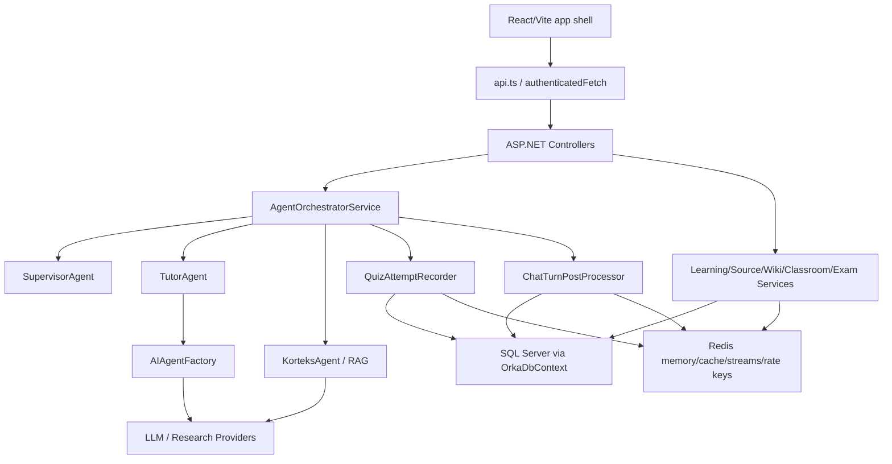

# Orka Fresh Multi-Agent Audit - 2026-05-25

## Snapshot

- Workspace: `D:\Orka`
- Branch: `codex/heavy-learning-flow-eval-browser-qa`
- HEAD: `72ee3ca0dcd3e9a28fe94e22a7ca1caefb7d0a63`
- Worktree: dirty; many modified/untracked files are part of the audited snapshot.
- Scope: read-only product audit across `Orka.API`, `Orka.Core`, `Orka.Infrastructure`, `Orka-Front`, tests, scripts, CI, Redis/SQL usage, and architecture seams.

## Agent Team

- Noether: backend/API and AI orchestration.
- Carver: pedagogy, assessment, mastery, quiz learning evidence.
- Huygens: data security, privacy, Redis/SQL, auth, production safety.
- Rawls: frontend contracts, UX, SSE, audio, routing.
- Nietzsche: tests, release gates, CI.
- James: system cartography and architecture x-ray.

## Verification Commands

| Command | Result | Note |
|---|---:|---|
| `cd Orka-Front; npm run typecheck` | PASS | Previous ProductCoherence DTO/API break is closed in this snapshot. |
| `cd Orka-Front; npm run quick:smoke` | PASS | Static UI/contract/security smoke passes. |
| `cd Orka-Front; npm run build` | PASS | Build succeeded; main JS bundle is large: about 2,033 KB raw / 630 KB gzip. |
| `dotnet test .\Orka.API.Tests\Orka.API.Tests.csproj --no-restore --filter "FullyQualifiedName~ChatParityTests\|FullyQualifiedName~ProductionSafetyLiteTests\|FullyQualifiedName~QuizAttemptSafetyTests"` | PASS | 38/38 passed. |

## Executive Verdict

Gemini did not just shuffle code around; several previous blockers are genuinely improved:

- Frontend `typecheck` now passes.
- ProductCoherence API wrappers and DTO exports exist in `api.ts` / `types.ts`.
- `AudioOverviewAPI.get` exists, so the polling hook no longer breaks TypeScript.
- `LongTermAdaptiveLearningService` now converts `ConceptMastery.MasteryScore / 100m`, closing the old 0-100 vs 0-1 mastery-scale P1.
- Auth partitioning no longer trusts `X-Forwarded-For` in production inside `AuthController`.
- Question bank service now has answer-key stripping logic for non-admin system questions.
- Redis production policy now rejects localhost Redis in protected environments.

But the system is not production-clean yet. The remaining high-risk layer moved from "build/contract broken" to "security, tenant boundary, learning evidence integrity, and release gates." These are more subtle, but more important for beta/public use.

## Critical / High Findings

### P1 - Refresh Tokens Are Still Exposed To JavaScript

- Files: `Orka.API/Controllers/AuthController.cs:85`, `Orka.API/Controllers/AuthController.cs:129`, `Orka.API/Controllers/AuthController.cs:161`, `Orka-Front/src/services/api.ts:59`, `Orka.API/wwwroot/login.html:72`
- Evidence: the backend sets an HttpOnly refresh cookie, but also returns refresh tokens in JSON. Frontend/static pages store `orka_refresh` in `localStorage`.
- Impact: XSS or a malicious extension can steal long-lived refresh tokens, bypassing the intended HttpOnly-cookie protection.
- Fix: stop returning refresh tokens in response bodies; refresh only via HttpOnly `Secure` SameSite cookie. Keep access tokens short-lived.
- Test: login/register/refresh responses must not contain `refreshToken` or `refresh_token`; refresh still works via cookie.

### P1 - Non-Admin Users Can Mutate System Curriculum/Registry Rows

- Files: `Orka.API/Controllers/CurriculumController.cs:9`, `Orka.Infrastructure/Services/CurriculumSourceRegistryService.cs:191`, `:423`, `:487`
- Evidence: controller requires only `[Authorize]`; service permits rows where `OwnerUserId == null || OwnerUserId == userId`, then mutates verification/license/deprecation/supersession/node state.
- Impact: any authenticated user may poison global official-looking curriculum/source metadata.
- Fix: require Admin for `OwnerUserId == null` mutations, or fork a user-owned copy before mutation.
- Test: non-admin mutation of system row returns 403; admin succeeds.

### P1 - Quiz Generate/Attempt Tenant Boundary Is Incomplete

- Files: `Orka.API/Controllers/QuizController.cs:45`, `:82`, `Orka.API/Services/ResourceOwnershipGuard.cs:15`
- Evidence: `/api/quiz/generate` uses `FindAsync(topicId)` without checking `Topic.UserId`; `/api/quiz/attempt` passes `TopicId`/`SessionId` into recorder without ownership guard.
- Impact: a user with another user's GUID can generate quiz content for that topic or pollute their own learning records with foreign topic/session references.
- Fix: apply `ResourceOwnershipGuard` to `TopicId`, `SessionId`, `QuizRunId`, and `AssessmentItemId`.
- Test: User B using User A topic/session/quizRun ids gets 404/403.

### P1 - Legacy/Generated Quizzes Do Not Produce Trusted Learning Evidence

- Files: `Orka.API/Controllers/QuizController.cs:45`, `:455`, `Orka.Infrastructure/Services/QuizAttemptRecorder.cs:251`, `Orka-Front/src/components/QuizCard.tsx:179`
- Evidence: generated quizzes are raw LLM objects; frontend posts no trusted `isCorrect`; controller strips client correctness; recorder marks attempts without durable `AssessmentItem` as unverified.
- Impact: a learner can answer correctly but the system may not update item stats, KT, learning signals, mastery, XP, or remediation correctly.
- Fix: persist generated quiz questions as durable `AssessmentItems`/`QuizRun` rows, or issue server-side answer-key tokens.
- Test: generate quiz -> submit correct option -> assert correct `learningImpact`, `AssessmentItemStat`, `KnowledgeTracingState`, and `LearningSignal`.

### P1 - Quiz Attempt Submission Is Not Idempotent

- Files: `Orka.Infrastructure/Services/QuizAttemptRecorder.cs:70`, `:115`, `Orka.Infrastructure/Data/OrkaDbContext.cs:538`
- Evidence: `alreadyAwarded` suppresses XP only. A retry/double-click can still insert a `QuizAttempt` and update run counts, stats, KT, signals, SRS, and wiki notes. The `(UserId, TopicId, QuestionHash)` index is not unique.
- Impact: duplicate submissions can inflate mastery, wrong counts, calibration, and review pressure.
- Fix: add idempotency key or unique attempt identity such as `(UserId, QuizRunId, AssessmentItemId)` or `(UserId, TopicId, QuestionHash, MessageId)`.
- Test: same attempt posted twice results in one attempt row and one learning update.

### P1 - Expensive Endpoints Lack Shared Rate Limiting

- Files: `Orka.API/Program.cs:684`, `Orka.API/Controllers/ChatController.cs:24`, `Orka.API/Controllers/CodeController.cs:87`, `Orka.API/Controllers/KorteksController.cs:46`, `Orka.API/Controllers/SourcesController.cs:496`
- Evidence: only chat has `[EnableRateLimiting("ChatLimiter")]`; code execution, Korteks research, source Q&A/upload, quiz generation and other provider-heavy paths do not share per-user cost controls.
- Impact: authenticated users can drive LLM, embedding, sandbox, upload, and SSE costs without equivalent throttling.
- Fix: introduce `AiLimiter`, `CodeLimiter`, `ResearchLimiter`, `UploadLimiter` with user/IP partitioning and concurrency limits.
- Test: burst each endpoint past quota and assert 429 with separate users isolated.

### P1 - Chat Stream Cancellation/Timeout Does Not Propagate End-To-End

- Files: `Orka.API/Controllers/ChatController.cs:186`, `Orka.Core/Interfaces/IAgents.cs:13`, `Orka.Infrastructure/Services/AIAgentFactory.cs:179`
- Evidence: stream endpoint does not pass `HttpContext.RequestAborted` into orchestrator; stream interface lacks a cancellation token. Provider stream timeout is scoped around first chunk, not the full enumeration.
- Impact: if the client disconnects or a provider stalls after the first token, backend/provider work can continue unnecessarily.
- Fix: propagate cancellation token through controller -> orchestrator -> tutor/provider streams; apply timeout around the full enumerator.
- Test: client abort cancels fake provider; provider that stalls after first chunk times out/falls back.

### P1 - ProductCoherence Panels Exist But Are Not Routed

- Files: `Orka-Front/src/components/ProductCoherencePanels.tsx:420`, `:557`, `:674`, `:759`, `:809`, `:870`, `Orka-Front/src/pages/Home.tsx:15`, `:33`, `:365`
- Evidence: panels now compile and call real wrappers, but `Home` does not import/wire them; `VALID_VIEWS` excludes the new module ids.
- Impact: the new Mission Control, Study Room, Source/Wiki Pro, Notebook Pro, Exam War Room, and Code IDE panels are effectively dead UI.
- Fix: wire panels into `Home`, add valid view ids, and normalize navigation ids.
- Test: browser smoke opens each ProductCoherence module and asserts real content/API loading.

### P1 - Frontend Has No CI Release Gate

- Files: `.github/workflows/backend-release.yml:5`, `scripts/quick-all.ps1:10`, `Orka-Front/package.json:13`
- Evidence: current GitHub workflow is backend-focused; `quick-all.ps1` runs frontend smoke/build but omits `npm run typecheck`.
- Impact: frontend regressions can avoid CI entirely. Vite build can pass despite TypeScript errors.
- Fix: add frontend CI workflow or expand existing CI with `npm ci`, `typecheck`, `build`, `quick:smoke`, and browser smoke.
- Test/gate: PR touching `Orka-Front/**` must run and fail on frontend type/build/browser errors.

## Medium Findings

### P2 - Soft Delete And Tenant Isolation Depend On Manual Filters

- Files: `Orka.Infrastructure/Data/OrkaDbContext.cs:151`, `Orka.Core/Entities/LearningSource.cs:24`, `Orka.Core/Entities/SourceChunk.cs:15`
- Evidence: many entities have `IsDeleted`; no `HasQueryFilter` in `OrkaDbContext`. Several services manually filter correctly, but the guard is not global.
- Impact: one missed `!IsDeleted` or user predicate can leak or mutate deleted/cross-tenant content.
- Fix: add global query filters for soft-deletable/tenant-owned entities, or enforce repository/spec guards with coverage.
- Test: seed deleted sources/chunks/questions/wiki pages/curriculum rows; public APIs never return/mutate them.

### P2 - Raw Prompts, Source Text, And PII Retention Need A Minimized Data Policy

- Files: `Orka.Core/Entities/Message.cs:15`, `Orka.Infrastructure/Services/AgentOrchestratorService.cs:172`, `Orka.Infrastructure/Services/LearningSourceService.cs:107`, `Orka.Core/Entities/SourceChunk.cs:12`
- Evidence: raw chat content, source filenames, extracted chunks, embeddings and secondary learning artifacts are persisted. Upload guard focuses on file safety, not PII minimization.
- Impact: emails, phone numbers, paths, secrets, and prompt fragments can be retained in SQL/Redis and later re-used in prompts/retrieval.
- Fix: classify sensitive fields; redact/minimize before secondary persistence; encrypt high-risk columns; define retention/export/delete policy.
- Test: chat/upload with email/phone/token/path; secondary artifacts and Redis caches are redacted/excluded.

### P2 - Disabled Scheduled Workers Still Execute Once

- Files: `Orka.Infrastructure/Services/ScheduledWorkerHosts.cs:27`, `:42`, `:81`, `:96`
- Evidence: when `Workers:SrsReminder:Enabled=false` or `Workers:DailyChallenge:Enabled=false`, the host calls `RunDisabledProofAsync` before logging disabled.
- Impact: a production config intended to disable reminders/challenges can still execute once at startup.
- Fix: remove disabled proof from runtime; keep proof behavior in tests only.
- Test: with flags false, mocked worker service is never called.

### P2 - Chat Post-Processing Is Synchronous Despite Scheduling Name

- Files: `Orka.Infrastructure/Services/AgentOrchestratorService.cs:553`, `Orka.Infrastructure/Services/ChatTurnPostProcessor.cs:78`
- Evidence: `ScheduleTurnPostProcessingAsync` calls `ProcessSynchronouslyAsync`, which runs evaluator/analyzer/summarizer/wiki/progression inline.
- Impact: chat response/stream completion can be blocked by post-processing latency.
- Fix: queue nonessential post-processing; keep only response-critical metadata inline.
- Test: slow fake evaluator does not increase user-visible chat latency beyond a small threshold.

### P2 - SSE Contract Is Fragile

- Files: `Orka.API/Controllers/ChatController.cs:196`, `Orka.Infrastructure/Services/AgentOrchestratorService.cs:402`, `Orka.Infrastructure/Services/TutorAgent.cs:565`, `Orka-Front/src/components/ChatPanel.tsx:463`
- Evidence: backend emits all payloads as `data:` text and newline placeholder `[NEWLINE]`; frontend has `[DONE]` handling but backend chat stream does not emit `[DONE]`.
- Impact: metadata/final/error handling depends on parsing heuristics and EOF; split JSON or model JSON content can be dropped/misread.
- Fix: move to explicit SSE events: `event: token|thinking|tool|metadata|final|error|done`.
- Test: contract test asserts event names/order, metadata, error, and done event.

### P2 - Audio Stream URLs May Fail Cross-Origin Auth

- Files: `Orka.API/Controllers/AudioController.cs:8`, `:48`, `Orka-Front/src/services/api.ts:650`, `Orka-Front/src/components/WikiMainPanel.tsx:3251`, `Orka-Front/src/components/NotebookStudioPanel.tsx:584`
- Evidence: audio endpoints are authorized; frontend uses direct media URLs rather than authenticated fetch/blob or signed URL.
- Impact: cross-origin bearer-token deployments can show ready audio but fail playback.
- Fix: fetch audio as authenticated blob and attach object URL, or issue short-lived signed stream URLs.
- Test: expired cookie + valid bearer token + cross-origin API still plays audio.

### P2 - Adaptive Assessment Can Stop On Low-Quality Failure Evidence

- Files: `Orka.Infrastructure/Services/KnowledgeTracingService.cs:96`, `:247`, `Orka.Infrastructure/Services/AssessmentCalibrationServices.cs:760`
- Evidence: skipped/wrong attempts increase `EvidenceCount` and count-based confidence; adaptive completion checks evidence/confidence, not mastery/remediation/nonblank verified evidence.
- Impact: repeated blanks/wrongs can produce `evidence_sufficient`.
- Fix: separate evidence reliability from learner confidence; require nonblank verified responses and remediation gates.
- Test: three wrong/skipped target items should stay active or stop with remediation, not successful sufficiency.

### P2 - Long-Term Profile Can Double-Count One Learning Event

- Files: `Orka.Infrastructure/Services/LongTermAdaptiveLearningService.cs:115`, `:143`, `:175`, `:239`
- Evidence: profile aggregates KT states, concept masteries, quiz attempts and learning signals; one quiz attempt can appear in all projections.
- Impact: review pressure/evidence counts can inflate; stale high mastery can mask newer weak evidence.
- Fix: normalize around event provenance and de-duplicate by `QuizAttemptId`/item/time window.
- Test: one wrong verified attempt that produced KT/mastery/signals counts once in profile.

### P2 - Central Exam Practice Repeats And Is Siloed From Mastery/SRS

- Files: `Orka.Infrastructure/Services/CentralExamStudyService.cs:185`, `:545`, `:565`, `Orka.Infrastructure/Services/ExamLearningProfileService.cs:83`
- Evidence: practice starts by ordering visible questions; no per-user exposure suppression. Submit writes central exam answers and `LearningSignals` with `topicId: null`; topic-scoped mastery/SRS paths do not naturally consume them.
- Impact: repeated sessions can serve same first N questions; exam weaknesses may not enter the same durable mastery/review loop.
- Fix: persist exposure/last-seen and map exam outcomes to exam-scoped or topic/concept mastery/review state.
- Test: second exam practice avoids first session questions; wrong exam answer creates review/mastery signal.

### P2 - Release Evidence Is Not Commit-Traceable

- Files: `docs/api-inventory.md:7`, `docs/project-state/orka-notebook-studio-final-audit.md:292`
- Evidence: reports cite old commits or note mixed dirty worktrees without enforced run metadata.
- Impact: audit/release evidence cannot prove which immutable snapshot passed.
- Fix: every report includes branch, commit, dirty status, command list, start/end timestamps, and run id.
- Gate: fail release if report commit != HEAD or dirty snapshot is not explicitly labelled.

### P2 - Migration Gate Does Not Apply Real EF Migrations

- Files: `Orka.API.Tests/DataLifecycleTests.cs:613`, `Orka.API.Tests/MigrationPolicyTests.cs:116`
- Evidence: relational harness uses `EnsureCreatedAsync`; migration policy test uses fake pending migrations reader.
- Impact: migration DDL/idempotency/data-loss bugs can escape CI.
- Fix: add blank DB `MigrateAsync` and idempotent generated SQL validation.
- Test/gate: migration apply and idempotency test in CI.

## Low / Architecture Debt

### P3 - `Program.cs` Composition Root Is Too Large

- Files: `Orka.API/Program.cs:169`, `:218`, `:304`, `:373`
- Evidence: DB, Redis, health, auth, workers, provider clients, feature services and Semantic Kernel registrations all live in one file.
- Impact: feature ownership and review safety degrade as modules grow.
- Fix: split into `AddAuthInfrastructure`, `AddLearningOs`, `AddAiProviders`, `AddWorkers`, `AddObservability`.

### P3 - Product/Route Orphans Exist

- Files: `Orka-Front/src/App.tsx:89`, `Orka-Front/src/pages/CourseDetail.tsx:53`, `Orka-Front/src/pages/QuizHistoryAndNotes.tsx:12`, `Orka-Front/src/pages/Home.tsx:365`
- Evidence: `CourseDetail` and `QuizHistoryAndNotes` exist but are not exposed by router/panel switch.
- Impact: code may be stale, unfinished, or invisible.
- Fix: route intentionally or remove/archive.

### P3 - AI Provider Seam Has Unused Implementations

- Files: `Orka.Infrastructure/Services/AIAgentFactory.cs:38`, `:260`, `Orka.API/Program.cs:582`
- Evidence: `CohereService` and `HuggingFaceService` exist but are not part of `AIAgentFactory` routing/fallback.
- Impact: confusing provider inventory; operators may think a fallback is active when it is not.
- Fix: either register into provider router with tests or mark as non-chat utility/retire.

### P3 - Main Frontend Bundle Is Large

- Evidence: `npm run build` produced `dist/assets/index-DB3Jf49z.js` at about 2,033 KB raw / 630 KB gzip.
- Impact: slower first load on low-end/mobile networks.
- Fix: lazy-load heavy Mermaid/editor/notebook/central-exam panels and route-level split.
- Test: bundle analyzer budget and browser Lighthouse/performance smoke.

## System Dependency Map

## Redis / SQL Sensitive Data Map

| Data | SQL | Redis | External |
|---|---|---|---|
| Auth | `Users.Email`, password hash, refresh token hash | `auth:*` counters | JWT/access token to client; refresh currently JSON + cookie |
| Chat | `Messages.Content`, metadata, wiki traces | tutor events/memory/feedback | LLM providers |
| Sources | `LearningSources`, `SourceChunks.Text`, embeddings | source/Korteks/topic caches | embeddings + LLM source prompts |
| Code | learning signals, runtime context | `orka:piston:{sessionId}:last` | Piston/Judge0 sandbox |
| Tutor telemetry | cost/tool/runtime records | tutor stream/metrics/cache summaries | observability if configured |

## What Is Closed Compared To The Previous Audit

- Frontend compile/type contract P0: closed.
- Missing ProductCoherence API wrappers: closed at contract level.
- Missing `AudioOverviewAPI.get`: closed.
- Mastery 0-100 vs 0-1 conversion: closed.
- Auth `X-Forwarded-For` partition spoof inside `AuthController`: largely closed for production.
- Redis localhost in protected env: partially closed.
- Question bank system answer-key exposure: appears improved via `stripAnswerKey`; keep learner DTO tests.

## Recommended Fix Order

1. Security boundary first: remove refresh token JSON/localStorage, add Admin guard for global curriculum mutations, add quiz ownership guard.
2. Learning integrity second: durable generated quiz evidence + idempotent attempts.
3. Cost/availability third: shared rate limits for code/Korteks/source/upload/quiz and stream cancellation/timeout propagation.
4. User-facing product fourth: wire ProductCoherence panels into `Home` and add browser smoke.
5. Release gate fifth: frontend CI, `quick-all` typecheck, migration apply test, commit-bound reports.
6. Privacy/retention sixth: PII minimization for chat/source secondary artifacts and Redis caches.

