# Orka V2.9 Quality Reality Gate

Tarih: 2026-05-07  
Repo: `D:\Orka`  
Faz amacı: Orka'nın ana öğrenme hattını ölçülebilir hale getirmek.

## Kapsam

Bu faz yeni V3 özellik ekleme fazı değildir. Ana hedef, mevcut sistemin kötü çıktıyı yakalayıp yakalayamadığını ölçmektir.

Ölçülen ana hat:

```mermaid
flowchart LR
  A["Kullanıcı çalışma isteği"] --> B["StudyIntentAnalyzer"]
  B --> C["Kullanıcı onayı"]
  C --> D["Korteks araştırması"]
  D --> E["PlanResearchCompressor"]
  E --> F["PlanIntelligenceBriefBuilder"]
  F --> G["Diagnostic Quiz"]
  G --> H["Quiz sonuç analizi"]
  H --> I["DeepPlanAgent"]
  I --> J["Tutor + Wiki/OrkaLM + IDE + Learning Signals"]
```



## Yeni Kanıt Katmanı

### Backend

Yeni dosya:
- `Orka.API.Tests/OrkaV29QualityRealityGateTests.cs`

Kapsam:
- 56 senaryoluk kalite kataloğu
- 10 intent fixture
- correction/regeneration testi
- question count scope testi
- Korteks compression/synthesis testi
- quiz fallback domain testi
- kötü quiz reddetme testi
- plan brief diagnostic preservation testi
- DeepPlan kalite kontratı testi
- Tutor Orka IDE/adaptive context kontratı testi

Hedefli çalıştırma sonucu:

```text
dotnet test Orka.API.Tests\Orka.API.Tests.csproj --no-restore --filter OrkaV29QualityRealityGateTests
Passed: 78
Failed: 0
Skipped: 0
```

### Frontend

Genişletilen dosya:
- `Orka-Front/scripts/smoke-ui.mjs`

Eklenen guard'lar:
- Plan Mode staged UX görünür.
- Favicon var.
- V2.9 quality gate test dosyası smoke'a bağlı.

Korunan mevcut guard'lar:
- Quiz cevabı chat komutu gibi akmaz.
- `[SKIP_QUIZ]` görünmez.
- Quiz raw JSON sızdırmaz.
- Mermaid error güvenli fallback'e düşer.
- OrkaLM/Wiki yüzeyi aktif kalır.

## 56 Senaryo Skor Kartı

| ID | Alan | Beklenen | Otomasyon |
| --- | --- | --- | --- |
| A01 | Niyet | Java algoritmalar doğru ayrılır | automated |
| A02 | Niyet | Java veri yapıları + algoritmalar ayrılır | automated |
| A03 | Niyet | SQL index/query optimization ayrılır | automated |
| A04 | Niyet | KPSS paragraf hızlanma ayrılır | automated |
| A05 | Niyet | KPSS problem çözme ayrılır | automated |
| A06 | Niyet | C# async/await hata ayrılır | automated |
| A07 | Niyet | Python pandas veri analizi ayrılır | automated |
| A08 | Niyet | Matematik olasılık/kombinasyon ayrılır | automated |
| A09 | Niyet | IELTS speaking ayrılır | automated |
| A10 | Niyet | Yazım hatalı Java algoritma isteği toparlanır | automated |
| B11 | Korteks | Java araştırmasında C# sızıntısı olmaz | fixture |
| B12 | Korteks | SQL araştırması index/query/practice odaklıdır | fixture |
| B13 | Korteks | KPSS paragraf sınav tekniği korunur | fixture |
| B14 | Korteks | IELTS speaking ölçütleri korunur | fixture |
| B15 | Korteks | Matematik ön koşul/soru tipi korunur | fixture |
| B16 | Korteks | Source-aware notlar korunur | fixture |
| B17 | Sentez | Ön koşullar silinmez | automated |
| B18 | Sentez | Yaygın hatalar silinmez | automated |
| B19 | Sentez | Pratik sırası çıkarılır | automated |
| B20 | Sentez | Quiz kapsamı/soru sayısı girdisi oluşur | automated |
| C21 | Quiz | Java quiz Java algoritmada kalır | automated |
| C22 | Quiz | SQL quiz SQL optimizasyonda kalır | automated |
| C23 | Quiz | KPSS quiz paragraf becerisi ölçer | fixture |
| C24 | Quiz | C# quiz async/await ölçer | automated |
| C25 | Quiz | 15-25 soru aralığı korunur | automated |
| C26 | Quiz | Soru sayısı konu kapsamına göre değişir | automated |
| C27 | Quiz | Duplicate soru reddedilir | automated |
| C28 | Quiz | Şıklarda doğru/yanlış etiketi sızmaz | automated |
| C29 | Quiz | Yanlış cevaba sahte övgü verilmez | frontend guard |
| C30 | Sonuç | Eksik kavramlar ayrılır | contract |
| C31 | Sonuç | Bilinen kavramlar ayrılır | contract |
| C32 | Sonuç | Zayıf kavramlar ayrılır | contract |
| C33 | Sonuç | Pratik kavramları ayrılır | contract |
| C34 | Sonuç | Kavram yanılgısı paterni ayrılır | contract |
| D35 | Plan | Plan 3 başlığa kısılmaz | automated |
| D36 | Plan | Araştırma + quiz sonucu kullanılır | automated |
| D37 | Plan | Bilinenler hızlı tekrar/pratik olur | contract |
| D38 | Plan | Eksikler derin remediation olur | contract |
| D39 | Tutor | Aktif plan kullanılır | static contract |
| D40 | Tutor | Orka IDE/sandbox öne alınır | automated |
| D41 | Tutor | Visual Studio ilk varsayım olmaz | automated |
| D42 | Tutor | Wiki/OrkaLM kaynağı varsa kullanılır | static contract |
| D43 | Tutor | Kaynak yoksa açık söylenir | runtime needed |
| D44 | Tutor | Tempo bilinen/eksik profile göre ayarlanır | contract |
| E45 | UX | Plan Mode aktifliği görünür | frontend guard |
| E46 | UX | Plan aşamaları anlamlıdır | frontend guard |
| E47 | UX | Quiz tek kartta akar | frontend guard |
| E48 | UX | Sonraki soru chat balonu olmaz | frontend guard |
| E49 | UX | Quiz 500 UI'ı patlatmaz | runtime needed |
| E50 | UX | Mermaid hata fallback'i sakindir | frontend guard |
| E51 | UX | Favicon 404 yoktur | frontend guard |
| E52 | UX | Capability 500 unavailable state gösterir | frontend guard |
| E53 | Audio | Boş içerikte sahte 0:00 hazır görünmez | frontend guard |
| E54 | Learning | Flashcards öneri + manuel yüzeydir | frontend guard |
| E55 | Learning | Bookmarks kaynak/Tutor/Wiki parçası saklar | frontend guard |
| E56 | Progress | Sahte yüzde/progress basılmaz | frontend guard |

## Bu Fazda Yapılan Gerçek Düzeltmeler

1. Yazım hatalı Java algoritma istekleri daha iyi normalize edildi.
2. İngilizce araştırma niyeti için matematik, olasılık, kombinasyon, speaking, KPSS, async gibi terimler genişletildi.
3. Backend test katmanına 56 senaryoluk katalog + davranış testleri eklendi.
4. Frontend smoke script'i V2.9 quality gate ve staged plan UX'i koruyacak şekilde genişletildi.
5. Yaşam Raporu ile ölçüm sonucu açık ve izlenebilir hale getirildi.

## Kalan Ölçüm Boşlukları

| Alan | Durum | Neden |
| --- | --- | --- |
| Live Korteks output scoring | PASS_WITH_NOTE | Provider çağrısı gated olmalı. |
| Live Tutor response scoring | PASS_WITH_NOTE | LLM cevabı fixture dışı ayrıca rubrik ister. |
| Runtime browser lifetest | PASS_WITH_NOTE | Bu fazda kaynak kod/smoke/test seviyesi ölçüldü. |
| Wiki/OrkaLM full lesson memory lifecycle | PRODUCT_ROADMAP | Bağlantılar var; tam otomatik ders hafızası V3. |
| Full observability dashboard | PRODUCT_ROADMAP | Telemetry var; eval dashboard ayrı faz. |

## Kabul Kriteri

Bu faz ancak şu durumda kabul edilir:
- Backend V2.9 hedefli testleri geçer.
- Full backend testleri geçer.
- Frontend build/smoke/typecheck geçer.
- `yasam-raporu.md` ölçüm sonuçlarını abartmadan açıklar.
- TestSprite kullanılmaz.
- Provider key/secrets dokunulmaz.
- Direct provider call veya fake code execution eklenmez.

## Bu Turda Çalıştırılan Validasyon

| Komut / Kontrol | Sonuç |
| --- | --- |
| `dotnet build` | PASS, 0 warning / 0 error |
| `dotnet test Orka.API.Tests\Orka.API.Tests.csproj --no-restore --filter OrkaV29QualityRealityGateTests` | PASS, 78 passed |
| `dotnet test` | PASS, 229 passed |
| `dotnet test --no-build` | PASS, 229 passed |
| `python -m pytest contract_tests/ -q` | PASS, 37 passed / 1 skipped, backend 5101 açıkken |
| `npm run build` | PASS |
| `npm run smoke:ui` | PASS |
| `npm run smoke:contracts` | PASS |
| `npm run typecheck` | PASS |
| Backend runtime smoke | PASS, `/health/live`, `/health/ready`, `/api/tools/capabilities` -> 200 |
| Frontend runtime smoke | PASS, `http://localhost:3000/` ve `/login` -> 200 |

Not: İlk `pytest` denemesi backend 5101 kapalı olduğu için bağlantı reddiyle başarısız oldu. Backend geçici olarak ayağa kaldırıldıktan sonra aynı contract testleri geçti; bu repo davranışı değil runtime bağımlılığıydı.
