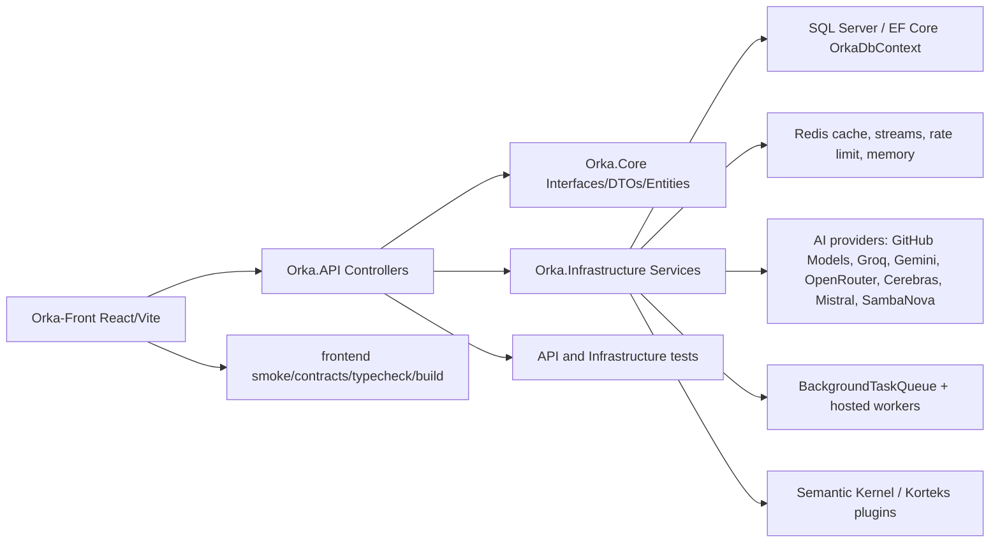

# Orka Sistem Rontgeni ve Gemini Degisiklik Baseline'i

Tarih: 2026-05-25

Kapsam: `D:\Orka` mevcut calisma agaci uzerinden salt-okuma mimari, veri, frontend, test ve release gate taramasi. Bu rapor Gemini veya baska bir ajanla yapilacak koklu degisikliklerden sonra "sistemi bozdu mu, gelistirdi mi, yeni bug acildi mi?" sorusunu olcmek icin baseline olarak kullanilmalidir.

Not: Calisma agaci temiz degil. Bu rapor `main`/son commit degil, mevcut dirty snapshot icin yazildi. `git status` cok sayida modified ve untracked dosya gosteriyor. Ayrica `repo/` altinda buyuk bir referans repo kutuphanesi var; runtime'in parcasi degil.

## 1. Kisa Karar Ozeti

- Sistem tek bir basit chat uygulamasi degil; `ASP.NET Core API + EF Core SQL + Redis + background workers + React/Vite frontend + AI provider router + pedagogik servisler` olarak tasarlanmis buyuk bir learning OS.
- Ana omurga saglam: controller/service/interface ayrimi var, test aileleri ciddi, product coherence icin yeni moduller eklenmis, Redis TTL'leri ve SQL indexleri yaygin.
- En buyuk teknik borc: bazi "god service/controller/component" dosyalari cok buyumus (`AgentOrchestratorService`, `TutorOrchestrationServices`, `DashboardController`, `WikiMainPanel`, `ChatPanel`). Gemini gibi koklu refactor yapan ajanlar burada kolayca contract kirabilir.
- En buyuk guvenlik/mahremiyet riski: SQL tarafinda global tenant/soft-delete query filter yok. `UserId`, `OwnerUserId`, `Visibility`, `IsDeleted` scoping'i servis sorgularindaki disipline bagli.
- En kritik dogrulanmis davranissal riskler: streaming chat'te RESEARCH/RAG bypass ihtimali, assessment discrimination formulu, async post-processing metadata lag, wiki trace PII temizligi eksigi, Gemini provider parser/token/config sozlesmeleri.
- `repo/` altindaki tasarim/referans repolari offline ilham icin yeterli. Bunlari MCP olarak entegre etmek su asamada gerekli degil; MCP ancak canli dokuman, GitHub issue/PR, browser veya dis veri kaynaklarina surekli baglanacaksan anlamli.

## 2. Cok Yuksek Seviye Sistem Haritasi



Runtime giris noktasi:
- `Orka.API/Program.cs`: DI, auth, CORS, rate limiter, health check, Redis, EF, hosted workers, middleware ve `MapControllers`.
- `Orka.Infrastructure/Data/OrkaDbContext.cs`: SQL tablo/iliski/index merkezi.
- `Orka-Front/src/App.tsx`, `Orka-Front/src/pages/Home.tsx`: frontend route ve view merkezi.
- `Orka-Front/src/services/api.ts`: frontend-backend contract wrapper merkezi.

## 3. Repo ve Calisma Agaci Envanteri

Ana cozum:
- `Orka.sln`
- `Orka.API/Orka.API.csproj`
- `Orka.Core/Orka.Core.csproj`
- `Orka.Infrastructure/Orka.Infrastructure.csproj`
- `Orka.API.Tests/Orka.API.Tests.csproj`
- `Orka.Infrastructure.UnitTests/Orka.Infrastructure.UnitTests.csproj`
- `Orka-Front/package.json`

Onemli klasorler:
- `Orka.API`: HTTP controller, startup, health, API runtime.
- `Orka.Core`: DTO, entity, interface, constant sozlesmeleri.
- `Orka.Infrastructure`: servis implementasyonlari, AI provider'lar, EF migrations, Redis, workers.
- `Orka-Front`: React/Vite UI, API wrapper, product panels.
- `scripts`: quick gate, lifetest, healthcheck, audit scriptleri.
- `docs`: roadmap, audit ve product contract dokumanlari.
- `repo`: runtime disi referans repo kutuphanesi. Commit edilmemeli, test/build taramalarinda haric tutulmali.

Dirty snapshot uyarisi:
- Product Coherence dosyalari, backend servisleri, frontend route/panel dosyalari, testler, docs ve scripts ayni anda degismis.
- Gemini'den once bir `git diff --stat` ve mumkunse worktree snapshot alinmadan "once/sonra" yargisi zayif kalir.

## 4. API Controller Yuzeyi

ASP.NET Core yuzeyi JWT auth, CORS, rate limiter ve controller routing ile kapanir:
- `Program.cs` auth/CORS/rate limiter/MapControllers bolgesi.
- `Controllers/*Controller.cs` dosyalari feature sinirlarini belirler.

Controller aileleri:

| Alan | Controller'lar | Gorev |
|---|---|---|
| Auth/user/ops | `AuthController`, `UserController`, `ProfileController`, `HealthController`, `DiagnosticsController`, `ProductionReadinessController`, `StandardsController`, `TextHealthController`, `TestController` | Kullanici, token, profil, health/readiness, provider/config ve operasyonel durum |
| Chat/agent/tutor | `ChatController`, `TutorController`, `KorteksController`, `AgenticTrustController`, `ToolsController` | Sync/SSE chat, tutor state, research stream, tool/source/prompt trust policy |
| Learning core | `LearningController`, `DashboardController`, `QuizController`, `AssessmentController`, `LearningSnapshotsController`, `LearningRuntimeController`, `LearningQualityController`, `LearningArtifactsController`, `PlanQualityController`, `SkillMasteryController` | Learning OS state, dashboard, quiz, adaptive assessment, runtime telemetry, artifacts |
| Source/wiki/notebook | `SourcesController`, `WikiController`, `NotebookStudioController`, `AudioController`, `ClassroomController` | Upload, RAG, wiki graph, notebook packs, audio/study room |
| Exam/question/content | `ExamsController`, `CentralExamsController`, `CentralExamDenemeController`, `CurriculumController`, `QuestionsController`, `QuestionImportsController`, `QuestionDraftGenerationController`, `QuestionAssetsController`, `QuestionQualityAnalyticsController`, `ContentOperationsController` | Sinav, question bank, curriculum, content ops |
| Durable/support | `ReviewController`, `FlashcardsController`, `DailyChallengeController`, `BookmarksController`, `NotificationsController`, `PushSubscriptionsController`, `CodeController` | SRS, flashcards, challenge, bookmark, push, code IDE |

Genis yuzey uyarilari:
- `DashboardController` yeni learning OS agregasyonunu tek dosyada topluyor.
- `SourcesController` upload, evidence bundle, lifecycle, citation review, compare, wiki intelligence, question-thread ve source Q&A akisini birlikte tasiyor.
- `QuizController` klasik quiz, adaptive assessment ve plan diagnostic akisini birlikte tasiyor.

## 5. Backend Service Graph

Ana dependency formu:

```text
Controllers
  -> Orka.Core Interfaces / DTOs
    -> Orka.Infrastructure Services
      -> OrkaDbContext / Redis / HttpClient providers / Semantic Kernel
```

Chat/agent omurgasi:

```text
ChatController
 -> IAgentOrchestrator
    -> ITutorAgent
    -> IAnalyzerAgent
    -> IDeepPlanAgent
    -> ISupervisorAgent
    -> IWikiService
    -> IWikiLearningTraceWriter
    -> IQuizAttemptRecorder
    -> ITopicProgressPropagator
    -> IAIAgentFactory
        -> GitHubModels / Groq / Gemini / OpenRouter / Cerebras / Mistral / SambaNova
```

Learning OS omurgasi:

```text
IOrkaLearningStateService
 -> LongTermAdaptiveLearning
 -> ExamLearningProfile
 -> SourceWikiIntelligence
 -> TopicScope / SQL

MissionControl
 -> LearningState

StudyCoach
 -> LearningState + MissionControl

ExamWarRoom
 -> ExamProfile + ExamFramework + LearningState + MissionControl + StudyCoach

SourceWikiPro
 -> SourceWikiIntelligence + SourceCompare + Learning/Mission/Coach/ExamWarRoom

StudyRoom
 -> Learning/Mission/Coach/ExamWarRoom/SourceWikiPro + LearningSignals

NotebookStudioPro
 -> Learning/Mission/Coach/ExamWarRoom/SourceWikiPro/StudyRoom

CodeLearningIde
 -> Learning/Mission/Coach/NotebookStudioPro/ToolCapability
```

En kritik servisler:
- `AgentOrchestratorService`: chat route, supervisor, tutor, quiz, research, wiki trace, metadata.
- `TutorAgent`: context, policy, tool orchestration, artifacts, reflection, pedagogy gates.
- `AIAgentFactory`: provider routing, fallback, metric/cost telemetry.
- `KorteksAgent`: research/RAG/web/wiki/youtube/academic/topic plugin hatlari.
- `LearningNotebookStudioService`, `OrkaNotebookStudioProService`: notebook pack/artifact/export.
- `QuestionBankService`, `PlanDiagnosticService`, `AssessmentCalibrationServices`, `KnowledgeTracingService`: quiz/assessment/pedagogy.
- `RedisMemoryService`: rate limit, cache, low quality feedback, Korteks report, stream, metrics.

## 6. Feature-to-Function Trace Map

| Ozellik | Frontend | API | Backend servis | SQL/Redis | Test/gate |
|---|---|---|---|---|---|
| Auth/session | `api.ts` storage/interceptor | `AuthController`, `UserController` | auth/token services | `Users`, `RefreshTokens`, Redis rate limit | `AuthTokenContractTests`, `PublicSecuritySurfaceTests` |
| Topic/session/chat | `Home`, `ChatPanel`, `ChatAPI.streamMessage` | `ChatController`, `TopicsController` | `AgentOrchestratorService`, `TutorAgent`, `AIAgentFactory` | `Topics`, `Sessions`, `Messages`, Redis metrics | `ChatParityTests`, `BackendCoordinationSmokeTests` |
| Tutor metadata/pedagogy | `ChatPanel`, `ChatMessage` | `TutorController`, `ChatController` | `TutorAgent`, `TutorResponsePolicyService`, post processors | `TutorTurnStates`, traces, memory snapshots | `ToolActivationTutorConsumptionTests`, `LearningRuntimeTelemetryTests` |
| Korteks/RAG | `WikiMainPanel`, source/wiki panels | `KorteksController`, `SourcesController`, `WikiController` | `KorteksAgent`, `LearningSourceService`, `WikiEvidenceService` | `LearningSources`, `SourceChunks`, wiki tables, `orka:korteks:*` | `KorteksGroundingTests`, `SourceRegressionGuardTests` |
| Source upload/evidence | `SourcesAPI`, `SourceWikiProPanel` | `SourcesController` | `SourceWikiIntelligenceService`, evidence lifecycle services | `SourceEvidence*`, `SourceQualityReport`, chunks | `SourceEvidenceLifecycleTests` |
| Wiki graph/notebook | `WikiMainPanel`, `NotebookStudioProPanel` | `WikiController`, `NotebookStudioController` | `WikiService`, `LearningNotebookStudioService` | `WikiPages`, `WikiBlocks`, `WikiLinks`, `LearningNotebookPacks` | `WikiGraphContractTests`, `LearningNotebookStudioTests` |
| Mission Control | `MissionControlHome` | `LearningController`, `DashboardController` | `OrkaLearningStateService`, `OrkaMissionControlService` | learning state/profile tables | `OrkaMissionControlTests`, unified harness |
| Study Coach / Room | `StudyRoomPanel`, `ClassroomAudioPlayer` | `LearningController`, `ClassroomController` | `OrkaStudyCoachService`, `OrkaStudyRoomService`, audio services | learning signals, audio artifacts | `OrkaStudyRoomTests`, product coherence |
| Quiz/adaptive assessment | `ChatPanel`, quiz UI/API | `QuizController`, `AssessmentController` | `QuizAttemptRecorder`, `PlanDiagnosticService`, `AssessmentCalibrationServices` | `QuizAttempts`, `AssessmentItems`, diagnostic/calibration tables | `QuizLearningPipelineTests`, `DiagnosticQuizQualityGateTests` |
| Knowledge tracing/SRS | review/learning panels | `LearningController`, `ReviewController` | `KnowledgeTracingService`, SRS workers | `KnowledgeTracingStates`, `ReviewItems`, Redis caches | `LearningArchitectureTests`, worker tests |
| Exam war room | `ExamWarRoomPanel` | `CentralExamsController`, `ExamsController` | `ExamLearningProfileService`, `OrkaExamWarRoomService` | exam/question/curriculum tables | `OrkaExamWarRoomTests`, curriculum tests |
| Code learning IDE | `CodeLearningIdePanel` | `CodeController` | `OrkaCodeLearningIdeService`, tool capability services | tool telemetry, artifacts | `OrkaCodeLearningIdeTests` |
| Production readiness | settings/ops UI | `ProductionReadinessController`, health endpoints | startup policy, health checks, telemetry | `ToolTelemetryEvents`, `CostRecords`, Redis health | `ProductionSafetyLiteTests`, healthcheck |

## 7. SQL / EF Core Sahiplik Haritasi

Ana `DbSet` aileleri:

- Kimlik/auth: `Users`, `RefreshTokens`.
- Chat: `Topics`, `Sessions`, `Messages`.
- Wiki/source/RAG: `WikiPages`, `WikiBlocks`, `WikiLinks`, `LearningSources`, `SourceChunks`, `SourceRetrievalRuns`, `SourceRetrievalItems`, `SourceCitationChecks`, `SourceQualityReports`, `SourceEvidenceBundles`, `SourceEvidenceLifecycleEvents`, `WikiKnowledgeNotebookSnapshots`.
- Learning/assessment: `QuizAttempts`, `QuizRuns`, `LearningSignals`, `RemediationPlans`, `StudyRecommendations`, `ReviewItems`, `Flashcards`, `DailyChallenges`, `KnowledgeTracingStates`, `ConceptMasteries`, `DiagnosticProfiles`, `AssessmentItems`, `AssessmentItemStats`, `AssessmentQuality*`, `Calibration*`, `AdaptiveAssessmentSessions`, `AdaptiveAssessmentDecisions`.
- Tutor/agent runtime: `AgentEvaluations`, `TutorPolicyTraces`, `TutorWorkingMemorySnapshots`, `TutorTurnStates`, `ActiveLessonSnapshots`, `StudentContextSnapshots`, `LearningPlanQualitySnapshots`, `TutorMemoryPatches`, `LearnerProfiles`, `TutorActionTraces`, `TutorToolCalls`, `TeachingArtifacts`, `LearningArtifacts`, `LearningNotebookPacks`, pedagogy run/rubric/golden scenario tablolar.
- Exam/content ops: `ExamDefinitions`, `ExamVariants`, `ExamSections`, `ExamSubjects`, `ExamTopics`, `ExamOutcomes`, `QuestionItems`, `QuestionOptions`, `QuestionExplanations`, `QuestionTags`, `QuestionAssets`, `QuestionStimuli`, `QuestionImport*`, `ContentOperations*`, `Curriculum*`, `SourceRegistryItem`, central exam practice/deneme tablolar.
- Production telemetry/ops: `ToolTelemetryEvents`, `ToolRuntimeTraces`, `KorteksResearchWorkflows`, `CostRecords`, standards export/validation tablolar.

SQL guvenlik notlari:
- `HasQueryFilter` bulunmuyor. Multi-tenant scoping global degil.
- `IsDeleted` alanlari ve indexler yaygin, ama global soft-delete filter yok.
- `OwnerUserId` nullable ve `Visibility` alanlari exam/question/content pack tarafinda servis disiplinine bagli.
- Delete behavior cogunlukla `NoAction`; cascade cycle riskini azaltir, ama uygulama temizligi eksikse orphan veri kalabilir.
- Iyi taraf: `UserId + TopicId`, `UserId + SessionId`, `UserId + CreatedAt` gibi indexler yaygin; refresh token, review item, bookmark ve push endpoint unique/filtered korumalari mevcut.

Gemini sonrasi SQL kontrolu:
- Yeni sorgular her zaman `UserId`/`OwnerUserId`/`Visibility`/`IsDeleted` kapsamini acikca uygulamali.
- Raw LLM/provider payload SQL'e kalici yaziliyorsa UI/public endpoint'e cikmadigi test edilmeli.
- Migration eklendiyse `EfPendingMigrationsHealthCheck` ve SQL lifecycle readiness gecmeli.

## 8. Redis / Cache / Stream Haritasi

Onemli Redis key aileleri:

| Key | Tur | TTL | Islev |
|---|---|---|---|
| `orka:feedback:{sessionId}` | list | 7 gun | evaluator feedback son 20 |
| `orka:rateLimit:{clientIp}` | counter | rate limit window | auth/API rate limit |
| `orka:globalPolicy` | string | yok | global policy |
| `orka:piston:{sessionId}:last` | string/json | 30 dk | son Piston sonucu |
| `orka:wiki-ready:{topicId}` | flag | 1 saat | wiki hazirlik |
| `orka:gold:{topicId}` | list | 30 gun | gold examples |
| `orka:metrics:{agentRole}` | list | 24 saat | agent metric |
| `orka:v1:learning:summary:{userId}:{topicId}` | json | servis belirler | learning summary cache |
| `orka:v1:learning:recommendations:{userId}:{topicId}` | json | servis belirler | recommendation cache |
| `orka:v1:notebook:{tool}:{userId}:{topicId}:v{version}` | json | version bazli | notebook cache |
| `orka:v1:notebook:version:{topicId}` | string | 30 gun | cache invalidation version |
| `orka:v1:quiz:hashes:{userId}:{topicId}` | set/list | 30 gun | anti-repeat quiz hash |
| `orka:topic_score:{topicId}` | json | 30 gun | topic score |
| `orka:student_profile:{topicId}` | json | 30 gun | student profile |
| `orka:lowquality:{sessionId}` | string/json | 5 dk | low-quality feedback bridge |
| `orka:korteks:{topicId}` | json | 2 saat | Korteks report |
| `orka:youtube:{topicId}` | json | 24 saat | YouTube cache |
| `orka:v3:tutor-events:{sessionId}` | stream | trim | tutor projection events |

Redis riskleri:
- `server.Keys` kullanan scan/evaluator okumalar buyuk keyspace'te pahali olabilir.
- Redis hatalarinda bazi kisimlar fail-open davranir; bu local dev icin iyi, prod diagnosis icin dikkat ister.
- Generic JSON cache keylerinde schema versioning disiplini korunmali.
- Stream maintenance default config'te kapaliysa stream buyumesi staging/prod'da izlenmeli.

## 9. Background Worker ve Async Akislar

Worker/queue haritasi:
- `BackgroundTaskQueue`: in-memory bounded channel, kapasite 256, single reader, `FullMode.Wait`, default timeout 60 sn, retry/backoff var.
- Hosted services: `SrsReminderWorker`, `DailyChallengeWorker`, `RetentionCleanupWorker`, `RedisStreamMaintenanceWorker`.
- AI metric/cost: agent cagrisi sonrasi Redis metric background job olarak kuyruge atiliyor; cost SQL `CostRecords` olarak yaziliyor.
- SRS worker: due active review item secimi, duplicate notification penceresi, push ve telemetry.
- Daily challenge worker: bugunun active challenge'lari, duplicate notification, push ve telemetry.
- Maintenance: audio retention cleanup ve Redis stream trim default config'te kapali gorunuyor.

Risk:
- Queue process restart'ta job kaybeder.
- Queue dolarsa request path bekleme yaratabilir.
- Chat turn post-processing async oldugu icin frontend metadata state'i bir tur geriden gelebilir.

## 10. Frontend Route / View / API Contract Haritasi

Route katmani:
- `App.tsx`: `/`, `/login`, `/app`, `/profile`, `/courses`, fallback `NotFound`.
- `Home.tsx`: ana app shell ve view router.

Ana view map:

| View id | Component | Fonksiyon |
|---|---|---|
| `home` | `MissionControlHome` | bugun, state, mission control |
| `tutor` | `ChatPanel` | chat/SSE/tutor/plan diagnostic |
| `study-room` | `StudyRoomPanel` | study room session/checkpoint |
| `review` | `LearningPanel` | review/learning state |
| `exams` | `ExamWarRoomPanel` | exam war room |
| `sources-wiki` | `SourceWikiProPanel` | source/wiki pro readiness |
| `notebook` | `NotebookStudioProPanel` | notebook packs/artifacts/export |
| `code` | `CodeLearningIdePanel` | code IDE learning |
| `progress` | `DashboardPanel` | progress/dashboard |
| `settings` | `SettingsPanel` | ayarlar |

API wrapper aileleri:
- `AuthAPI`, `UserAPI`, `TopicsAPI`, `ChatAPI`, `DashboardAPI`, `WikiAPI`, `SourcesAPI`, `AudioOverviewAPI`, `LearningAPI`, `LearningSnapshotsAPI`, `PlanQualityAPI`, `TutorAPI`, `LearningArtifactsAPI`, `NotebookStudioAPI`, `AssessmentAPI`, `ClassroomAPI`, `QuizAPI`, `KorteksAPI`, `ToolsAPI`, `LearningRuntimeAPI`, `AgenticTrustAPI`, `StandardsAPI`, `ExamsAPI`, `QuestionsAPI`, `QuestionImportsAPI`, `ContentOpsAPI`, `CurriculumAPI`, `CentralExamsAPI`, `QuestionQualityAPI`, `ProductionReadinessAPI`, `CodeAPI`, `FlashcardsAPI`, `ReviewAPI`, `DailyChallengeAPI`, `BookmarksAPI`.

Frontend riskleri:
- `WikiMainPanel` hala legacy `wiki/orkalm/sources` case'lerinde duruyor, ama `normalizeView` cogu yolu yeni `sources-wiki` paneline cekiyor. `wiki:${topicId}` `wikiTopicId` set ediyor fakat `SourceWikiProPanel` bunu kullanmiyor gorunuyor.
- `WikiMainPanel` chat stream'i `authenticatedFetch` yerine dogrudan `fetch + Authorization: Bearer ${storage.getToken()}` kullaniyor. Token refresh/cookie davranisi atlanabilir.
- `localStorage` JSON parse guard'siz alanlar runtime kirabilir.
- Source page payload'inda `chunks.text` UI bellekte var; UI render etmese de yanlis refactor raw chunk leak yaratabilir.
- Smoke scriptler guclu ama statik string tabanli; isim/copy degisiklikleri false positive/false negative uretebilir.

## 11. AI Provider / Gemini Risk Haritasi

Gemini ile ilgili dogrulanmis sozlesme riskleri:

1. `GeminiService` task detection icinde Turkce stringlerin mojibake gorunmesi (ornegin 's-A-i-nav' veya 'm-u-fredat' seklinde bozuk karakterler). Quiz/deepplan promptlari Tutor default'una dusebilir.
2. `maxTokens` hesaplanip loglaniyor, ama Gemini request `generationConfig` icine `maxOutputTokens` olarak gonderilmiyor. Cevap uzunlugu/cost sozlesmesi provider tarafina kaliyor.
3. `AIAgentFactory`, `attempt.Model` degerini Gemini cagrilarina net gecirmiyor; `_gemini.GenerateSmartAsync(...)` kendi task router modelini seciyor. `AI:AgentRouting:{Role}:Model` Gemini icin beklenen etkiyi vermeyebilir.
4. Gemini parser `candidates[0].content.parts[0].text` varsayiyor. Safety block, bos candidate, farkli part yapisi veya finishReason-only cevap provider failure'a donebilir.
5. Korteks Gemini yolu native `GeminiService`ten ayri; SK tarafinda OpenAI-compatible endpoint hard-coded. Genel chat Gemini calissa bile Korteks kirilabilir.
6. Fallback sozlesmesi non-stream ve stream icin farkli: non-stream `Primary -> Groq -> Mistral`, stream `Primary -> Gemini -> Mistral`. `MaxAttempts=2` ise stream path pratikte primary + Gemini ile sinirli kalabilir.

Gemini degisikligi icin kirmizi bolgeler:
- `Orka.Infrastructure/AI/GeminiService.cs`
- `Orka.Infrastructure/Agents/AIAgentFactory.cs`
- `Orka.Infrastructure/Services/KorteksAgent.cs`
- `Orka.Infrastructure/Services/AgentOrchestratorService.cs`
- `Orka.API/Controllers/ChatController.cs`
- `Orka-Front/src/components/ChatPanel.tsx`
- `Orka-Front/src/services/api.ts`

## 12. Daha Onceki Audit Bulgularina Yorum

Bu tur bulgularin bir kismi dogrulandi, bir kismi nuansli:

| Bulgu | Durum | Yorum |
|---|---|---|
| Assessment discrimination inversion | Dogrulanmis kritik | `Math.Abs(CorrectRate - 0.50) * 2` varyanssiz soruya yuksek ayirt edicilik verir. Adaptive kaliteyi bozar. |
| Global middle difficulty bias | Dogrulanmis | Difficulty fit global `0.50` yakinligini odullendiriyorsa theta-adaptive secim zayiflar. |
| Knowledge tracing linear decay | Dogrulanmis/orta | Lineer unutma ve cap var. Akademik model olarak zayif, ama urun bug'i olup olmadigi hedefe bagli. |
| Prerequisite ihmali + alfabetik tie-break | Dogrulanmis risk | Planlayici prerequisite graph'i kullanmiyorsa konu sirasi pedagojik kirilir. |
| Streaming RESEARCH/RAG bypass | Dogrulanmis kritik | Stream path supervisor route'u alip sadece QUIZ ozel yolunu isliyorsa RESEARCH Tutor'a RAG'siz dusebilir. |
| Async state 1 tur lag | Muhtemel/dogrulanabilir | Background post-processing metadata okumadan once bitmeyebilir. Runtime test gerekir. |
| Wiki PII/raw trace | Risk | WikiBlocks'a ham soru/cevap parcasi yaziliyor; mevcut sanitization genel PII temizligi degil. |
| Edge-TTS polling eksigi | Kismen dogru | Backend create akisi bazi durumda bekleyerek donebilir; frontend polling zayif. Claim abartili ama UX riski gercek. |
| Web Speech Turkish fallback | Gercek UX riski | Browser'da TR voice yoksa kalite bozulabilir; long utterance suspend problemi ayrica test edilmeli. |

Onceliklendirme:
1. Streaming RESEARCH/RAG bypass.
2. Assessment discrimination + difficulty adaptation.
3. SQL tenant/soft-delete scoping guard.
4. Gemini parser/token/model routing.
5. Wiki PII/safe trace policy.
6. Frontend `wiki:${topicId}` route ve Wiki Copilot auth fetch.

## 13. Test ve Release Gate Haritasi

Mevcut test aileleri:
- Release/lifetest: `BackendLifeTests`, `PedagogicalReleaseClosureTests`.
- Product coherence: `OrkaUnifiedEvaluationHarnessTests`, `StudentSimulationEvaluationTests`, `OrkaMissionControlTests`, `OrkaStudyRoomTests`, `OrkaSourceWikiProTests`, `OrkaCodeLearningIdeTests`, diger Orka* testleri.
- Security/runtime/lifecycle: `AiReliabilityTests`, `DataLifecycleTests`, `ProductionSafetyLiteTests`, `PublicSecuritySurfaceTests`, `RequestBoundarySafetyTests`, `LearningRuntimeTelemetryTests`.
- Source/wiki/notebook: `SourceRegressionGuardTests`, `SourceEvidenceLifecycleTests`, `WikiGraphContractTests`, `LearningNotebookStudioTests`, `LearningArtifactsEngineTests`.
- Infrastructure algorithms: `LearningArchitectureTests`, `PlanDiagnosticTests`, `DiagnosticQuizQualityGateTests`, `KorteksGroundingTests`, `AiDebugLoggerTests`, `LogPrivacyGuardTests`.

Quick gate scriptleri:
- `scripts/quick-all.ps1`: `git diff --check`, frontend quick smoke, frontend build, backend quick gate.
- `scripts/quick-backend.ps1`: API build, test build, SQL lifecycle readiness, lifetest proof, product coherence proof, stabilization regression, coordination regression.
- `scripts/quick-coordination.ps1`: TopicTree, RAG scope, dashboard, chat parity, quiz pipeline, Korteks ve regression gates.
- `node scripts/healthcheck.mjs --base-url=http://localhost:5065 --quick`: API ayakta iken runtime smoke.

Mevcut rapor sinyalleri:
- Son iyi deep learner: `52 pass, 2 warn, 0 fail, 2 skip`.
- Son iyi real-user lifetest: `117 pass, 6 warn, 0 fail, 1 skip`.
- Son healthcheck F raporu API kapaliyken alinmis; bu uygulama regresyonu degil, ortam/server setup sinyali.
- Real-user lifetest fail ornegi register `429` rate-limit/reused identity kaynakli.

## 14. Gemini Sonrasi Karsilastirma Protokolu

Gemini degisikliginden once:

```powershell
git status --short
git diff --stat
git diff --check
```

Minimum backend gate:

```powershell
.\scripts\quick-backend.ps1
```

Frontend dokunulduysa:

```powershell
cd Orka-Front
npm run smoke:ui
npm run smoke:contracts
npm run typecheck
npm run build
```

Koordinasyon/prod coherence:

```powershell
.\scripts\quick-coordination.ps1
dotnet test Orka.Infrastructure.UnitTests\Orka.Infrastructure.UnitTests.csproj
```

API ayaktayken runtime smoke:

```powershell
node scripts/healthcheck.mjs --base-url=http://localhost:5065 --quick
node scripts/real-user-lifetest.mjs
node scripts/deep-learner-journey.mjs
```

Live provider notu:
- Provider/Gemini live testleri CI quick gate'e zorunlu eklenmemeli.
- Manuel flag/onay ile calistirilmali.
- Sonuclarda provider rate-limit, credential eksigi, API kapali, SQL/Redis yok gibi ortam farklari urun bug'i diye etiketlenmemeli.

## 15. Degisiklik Sonrasi "Bozdu mu?" Kontrol Listesi

Backend:
- Chat sync ve stream ayni route/pedagogy davranisini koruyor mu?
- Stream RESEARCH durumunda Korteks/RAG calisiyor mu?
- `metadata`, `artifact_ready`, `final`, quiz marker'lari frontend'in bekledigi sekilde geliyor mu?
- Gemini safety/empty candidate cevaplari controlled failure mi uretiyor?
- Provider fallback order beklenen mi?
- Cost/telemetry SQL ve Redis metric yaziliyor mu?
- Yeni sorgular user/visibility/soft-delete scoping uyguluyor mu?

Frontend:
- `/app` view alias'lari dogru paneli aciyor mu?
- `wiki:${topicId}` gercek kullanici beklentisini karsiliyor mu?
- `ChatPanel` SSE eventlerini bozmadimi?
- `WikiMainPanel` auth refresh kaybetmiyor mu?
- Raw provider/tool/source/prompt/answer key UI'da render edilmiyor mu?
- Empty/thin-evidence state'leri patlamadan calisiyor mu?

Data/infra:
- Migration pending degil mi?
- Redis required ortamlarda readiness geciyor mu?
- Queue dolma/restart job kaybi kritik path'i bozuyor mu?
- Stream/cache key sayisi buyume ve TTL beklenen mi?

Pedagoji:
- Adaptive assessment item discrimination ve difficulty fit beklenen matematikte mi?
- Knowledge tracing decay hedeflenen modele uygun mu?
- Study plan prerequisite graph'i kullaniyor mu?
- Plan diagnostic raw request privacy vaadi backend'de tutuluyor mu?

## 16. `repo/` ve MCP Karari

`repo/` klasoru cok sayida dis referans projesi iceriyor. Bu haliyle:
- Tasarim, UI pattern, dashboard, shadcn, saas, agent mimarisi ilhami icin yeterli.
- Runtime dependency degil.
- CI/build/test kapsamindan dislanmali.
- Git'e ana urunle birlikte alinmamali.

MCP entegrasyonu su anda zorunlu degil. MCP mantikli olur:
- Referans repolari surekli guncel cekmek,
- GitHub PR/issue/comment isleri,
- Dokuman/search/browsing gibi canli kaynaklara baglanmak,
- Local tool olarak belirli repo bilgisini indeksleyip sorgulatmak
istenirse.

Bu proje icin daha acil olan MCP degil, net baseline + quick gates + kirmizi bolge testleridir.

## 17. Son Hukum

Sistem icerik ve test kapsamiyla ciddi bir seviyede, ama su an "koklu ajan refactor'una guvenle birak" seviyesine gelmesi icin once kirmizi bolgeler sabitlenmeli. Gemini'ye buyuk is yaptirilacaksa tek seferde tum sistemi degil, su sira ile bolmek daha guvenli:

1. Gemini provider sozlesmesi: parser, max token, model routing, fallback.
2. Streaming RAG bypass fix.
3. Assessment calibration matematik fix.
4. Frontend chat/wiki route/auth contract fix.
5. SQL scoping guard ve regression tests.
6. Full gate: backend quick, coordination, infra unit, frontend smoke/typecheck/build, runtime health/lifetest.

Bu baseline'dan sonra Gemini'nin yaptigi degisiklik icin kabul kriteri basit: minimum gate temiz, touched-area tests temiz, raw/private payload leak yok, frontend ana view'lar calisiyor, SQL/Redis readiness bozulmuyor, ve pedagogik kirmizi bolgelerde metrik/algoritma daha dogru hale geliyor.
