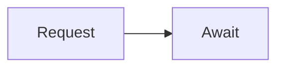

# Tutor Pedagogy, Visualization, and YouTube Contract Addendum

## Executive Summary

This addendum extends the accepted API freeze without redoing endpoint inventory. Tutor chat remains `READY_FOR_FRONTEND`; this document freezes how the frontend should treat pedagogy-focused output: Mermaid diagrams, image/visual markdown, YouTube teaching references, tool banners, fallback banners, and source confidence.

Backend behavior is intentionally conservative:

- Mermaid and image markdown are rendered from `ChatMessageResponse.content`.
- Structured metadata is advisory and frontend-safe; prose is not the source of truth for tool/provider state.
- YouTube is a pedagogy reference by default, not factual grounding.
- User documents remain the highest-priority factual source and keep inline `[doc:sourceId:pN]` citations.

## Mermaid Contract

Tutor may return Mermaid when the user asks for a diagram, flowchart, schema, map, architecture, lifecycle, dependency, comparison, or process explanation. Mermaid blocks must remain fenced in `content`:

````

````

Frontend behavior:

- Render fenced `mermaid` blocks with a Mermaid renderer.
- If Mermaid parsing fails, fall back to a normal code block.
- Mermaid is not a citation source.
- If metadata extraction detects a Mermaid block, `metadata.usedTools[]` can include:

```json
{
  "name": "mermaid",
  "status": "generated_text",
  "evidence": "mermaid_fenced_block",
  "fallbackReason": null
}
```

## Visual/Image Generation Contract

Tutor currently supports visual explanations through markdown image URLs, especially Pollinations-style educational diagram links:

```markdown

```

Frontend behavior:

- Render standard markdown images when URL allow-list policy permits.
- Provide a normal text fallback if the image fails to load.
- A future "Generate visual" CTA can be added by frontend if product wants user-controlled generation.

Current classification: `FRONTEND_DEPENDENT`. A dedicated callable visual generation endpoint/plugin was not proven in this addendum.

If metadata extraction detects a Pollinations image URL, `metadata.usedTools[]` can include:

```json
{
  "name": "pollinations",
  "status": "generated_image_url",
  "evidence": "embedded_image_markdown",
  "fallbackReason": null
}
```

## YouTube Pedagogy Reference Contract

YouTube is allowed for pedagogy/reference use:

- teaching sequence
- examples
- analogies
- common mistakes
- practice ideas
- video/playlist recommendation only when actual source evidence exists

YouTube is not factual grounding by default. It must not override user documents, Wiki, or source citations.

Allowed phrasing when YouTube teaching context exists:

- "Bu referanstaki anlatim akisi once X'i sezdiriyor, sonra Y ornegine geciyor."
- "Videodaki ogretim tarzina benzer sekilde once sezgi kurup sonra pratik yapalim."
- "Bu hoca burada ozellikle su hataya dikkat cekiyor..."

Those phrasings require actual YouTube teaching context. Without context, Tutor must teach from first principles and avoid implying it watched a teacher, channel, or video.

If YouTube markers appear in content, metadata can expose:

```json
{
  "name": "youtube",
  "status": "ready | degraded | disabled",
  "evidence": "youtube:<videoId-or-status>",
  "fallbackReason": null
}
```

For `disabled` or `degraded`, `providerWarnings[]` includes `youtube_disabled` or `youtube_degraded`.

## Safe Human Teacher Phrasing

Safe:

- "Bir ogretmen bunu genelde once sezgiyle, sonra ornekle anlatirdi."
- "YouTube referansi yukluyse onun akisini pedagojik iskelet olarak kullanirim."
- "Bende video referansi yoksa bunu ilk prensiplerden anlatayim."

Unsafe without YouTube context:

- "Bu hocanin videoda dedigi gibi..."
- "Su kanaldaki hoca once..."
- "Videoda gordugumuz ornekte..."
- "Bu YouTube videosu kanitliyor ki..."

## Metadata Mapping

Frontend must read structured metadata first:

- `citations[]`: factual source display. Document citations are authoritative when present.
- `usedTools[]`: Mermaid, Pollinations, YouTube, research, or other tool/reference hints.
- `groundingMode`: source/provider grounding state. Accepted values remain `source_grounded`, `model_fallback`, `degraded_fallback`, `degraded`, `unknown`.
- `fallbackReason`: optional single fallback reason.
- `providerWarnings[]`: warnings such as `youtube_disabled` or `youtube_degraded`.
- `sourceConfidence`: numeric confidence for source-backed claims, null when unknown.

Do not infer provider or source state from prose.

## Frontend Rendering Guidance

Mermaid block:

- Detect fenced code blocks with language `mermaid`.
- Lazy-render and sandbox errors.
- Show code fallback if invalid.

Video/reference card:

- Render only when `usedTools.name == "youtube"` and status/evidence indicates a real reference.
- Do not create a video card from prose alone.
- For `disabled`/`degraded`, show a small fallback banner instead of a card.

Fallback banner:

- Show non-blocking banner from `fallbackReason` and `providerWarnings[]`.
- YouTube unavailable should not block Tutor answer display.

Source/citation chips:

- Prefer `metadata.citations[]`.
- Inline `[doc:sourceId:pN]` remains visible and is a backup parsing source.

Visual generation CTA:

- Safe as a frontend UI decision when content contains Pollinations/image markdown or a diagram prompt.
- Backend does not currently require a visual job lifecycle for Tutor chat.

## Empty and Degraded States

No YouTube context:

- Tutor may teach normally.
- Frontend should show no video/reference card.
- No YouTube `usedTools` entry is acceptable.

YouTube unavailable:

- `usedTools.youtube.status` may be `disabled` or `degraded`.
- `providerWarnings[]` may include `youtube_disabled` or `youtube_degraded`.

Visual tool unavailable:

- Render Mermaid/text fallback.
- Treat image generation as `FRONTEND_DEPENDENT` until a backend job/tool endpoint exists.

Mermaid invalid:

- Display the fenced block as code.
- Do not treat invalid Mermaid as an app error.

## Runtime Probe Summary

Bounded probes used one unique user/topic and did not print tokens.

| Probe | Status | Evidence | Classification | Notes |
|---|---|---|---|---|
| Mermaid diagram | PASS/PARTIAL | Chat returned 200 and Mermaid fenced content was preserved; metadata extraction is covered by unit test and final build validation | PASS | Live metadata depends on running updated build |
| YouTube teaching reference | PASS | Chat returned 200 with no seeded YouTube context and no named teacher/channel claim | EXPECTED_FALLBACK | No provider call was forced |
| No YouTube fallback | PASS | Tutor answered from first principles when reference was absent | EXPECTED_FALLBACK | No fake video evidence observed |
| Source vs YouTube priority | PARTIAL | Source upload passed; bounded Tutor answer did not reliably emit doc citation | AI_NONDETERMINISTIC | Existing source ask and earlier Tutor citation proofs remain accepted |
| Visual tool readiness | PARTIAL | Pollinations markdown contract exists; no callable visual plugin endpoint was proven | FRONTEND_DEPENDENT | Render content, hide job UX until beta |

## Classification

| Capability | Classification | Frontend readiness |
|---|---|---|
| Tutor Mermaid diagrams | IMPLEMENTED | READY_FOR_FRONTEND |
| Tutor YouTube teaching reference | CONNECTED | READY_WITH_UI_DECISION |
| Visual/image generation | PROMPT_ONLY | READY_WITH_UI_DECISION |
| YouTube/video reference card | METADATA_DEPENDENT | READY_WITH_UI_DECISION |
| Pedagogy/fallback banners | IMPLEMENTED | READY_FOR_FRONTEND |

Backend blockers before Full Backend Lifecycle Regression: none found.
